# Aviato — Requirements & Architecture

**Status:** Authoritative requirements (single source of truth).

This document has two parts:

- **Part I — Core (§1–§9):** language- and deployment-**agnostic**. It defines
  *what* the system must do, the *processes* it runs, and the *modular
  structure* it must have. The core contains no language- or
  deployment-specific logic; such capabilities are supplied as **plug-in
  modules** that conform to the interfaces defined here.
- **Part II — Day-Zero Plug-in Catalog (§10–§17):** the **concrete** set of
  language and deployment plug-ins required at day zero (Python, Node, Swift;
  PyPI, GHCR, GitHub Pages docs, Apple App Store Connect), each expressed purely
  as a composition of the generic module kinds from Part I. The core never
  changes to accommodate them.

§18 is the glossary. Part II realizes Part I; where Part II needs an
authorization or gating mechanism, that mechanism is defined as a Part I
principle first (§2) and merely *applied* in Part II.

**Day-zero scope boundaries (deliberate non-goals):** a single profile per
repository (no monorepo / multi-package / library-and-service-in-one-repo); a
single operator (no team/concurrent-operator/handoff model); a single
strictness level (no `standard`/`hardened` tier split). Each is called out where
relevant and may be revisited post-day-zero.

---

# Part I — Core (agnostic)

## 1. Purpose

Aviato is a reusable **GitOps conventions system**. It lets one operator define
release, branching, protection, scaffolding, documentation, and drift-handling
conventions **once**, in a central library, and apply them consistently across
many repositories — without copy-paste, without per-repository drift, and
without the central library needing any knowledge of the repositories that
consume it.

The system has three actors and one rule that governs all of them:

- **Library** — the central, publishable source of conventions and tooling.
- **Consumer** — a repository that adopts a convention set.
- **Operator** — the human who runs privileged actions from their workstation.
  Day zero assumes exactly **one** operator; multi-operator/team coordination is
  an explicit non-goal (§3.4).

The governing rule: **the Library never knows about Consumers, and privileged
mutation never happens automatically — with the single, explicitly-defined
exception of deployment (§2.12).**

---

## 2. Core Principles (non-negotiable)

These principles constrain every process and every module. A change that
violates one of these is wrong, regardless of how convenient it is.

### 2.1 Modularity (the central concept)

The system is a **composition of independent modules** around an
**agnostic core**. The core knows how to *resolve*, *compose*, *scaffold*,
*diagnose*, and *reconcile* — it knows nothing about any specific language or
deployment target.

- Every capability that is language-specific or deployment-specific lives in a
  **plug-in module**, never in the core.
- Adding a language, a documentation generator, a release mechanism, or a
  deployment target is done by **adding a module**, never by editing the core.
- Modules declare a typed interface (what they provide, what they require) and
  are composed — never hardcoded — by higher-level units.
- A profile is a **thin manifest that composes modules**; it contains no logic.

This is the single most important property of the architecture. See §4 for the
full model.

### 2.2 Zero downstream coupling

The Library has **no registry, no list, no record** of which repositories
consume it. It can be made public and forked freely. A Consumer self-declares
its relationship to the Library; the Library is inert with respect to Consumers.
(An operator may keep a *local, operator-side* list of repositories to scan —
§5.11 — but that list never lives in the Library.)

### 2.3 Privilege follows blast radius

Work is partitioned by how much damage it can do:

- **Low-privilege, automatable** work (reading state, opening pull requests,
  filing issues) runs unattended in Consumer automation.
- **High-privilege, mutating** work (changing protected settings) runs **only**
  when an authorized human initiates it, with their own credentials, after an
  explicit gate (§5.7/§5.8).
- **Deployment** is high-privilege and outward-facing but is authorized by a
  distinct, explicitly-defined mechanism (§2.12), not the §5.7 settings gate.

Automation may *propose*; mutation of a protected resource happens only through
an authorized path (§2.4, §2.12).

### 2.4 Report before mutate

Detected divergence is **reported** by automation and **applied** by a gated,
operator-initiated process (§5.7). Automation never silently changes a protected
*setting* to match a desired state. (Deployment publishes artifacts — a separate
action governed by §2.12 — and is not a settings mutation.)

### 2.5 Idempotency and managed-file safety

- Re-running any generative process on an unchanged input produces **no change**.
- Generated artifacts carry a **managed marker** (normative format: §6.2). The
  system refuses to overwrite a file that is **not** marked managed, and refuses
  to trust a file whose marker is malformed — unless the operator forces it.
- A file the operator hand-edited is never silently clobbered.
- Files that **cannot** carry an in-file marker (e.g. JSON without comments,
  legal text, lockfiles, binaries) and operator-owned source (build definitions,
  entrypoints) are handled by the **seed-once** rule (§6.3): scaffolded only when
  absent, never overwritten, and excluded from drift detection.

### 2.6 Version-pin compatibility

A Consumer pins the **version** of the Library it follows (an exact version or a
floating major reference). A process acting on a Consumer must honor that pin and
must **refuse** to act on a mismatch, unless explicitly overridden. The
**compatibility relation is defined**: the acting tool is *compatible* with a
Consumer's pin iff the acting tool's **major version equals the pinned major**
**and** the acting tool's version is **≥ the version recorded in that Consumer's
managed markers**. Anything else is incompatible → refuse (overridable only by an
explicit operator flag).

### 2.7 Fail-closed authorization

An authorization decision defaults to **deny**:

- A consent record must be re-validated against the **current** proposed change,
  not a stale one (§5.7, §5.8).
- A failed or ambiguous authorization lookup is treated as **not authorized**,
  never as authorized.
- Only a **real human actor** may grant consent. "Real human" is determined by
  the hosting platform's actor type on the authoritative event (actor type
  `User`, not `Bot`/`App`/service). If the actor type cannot be determined, the
  decision is **DENY**.

### 2.8 Apply-time recompute

A mutating apply never trusts a snapshot captured earlier. It **re-reads live
state at apply time**, recomputes the diff, and — if the recomputed diff differs
from what was proposed — **prompts the operator** before proceeding. If the
recomputed diff is **empty** (the change was already applied externally), it
**no-ops and records that on the tracking issue**, applying nothing. This
re-read covers **both** the live settings **and** the consent/issue channel
(§5.7): if the issue or its consent record changed since the granter was
identified, the apply aborts.

### 2.9 Clean boundaries with external systems

Data read from an external system (read-shaped) is **never replayed verbatim**
into a write to that system. Each write constructs a **purpose-built payload**
containing only the fields that write accepts.

### 2.10 Self-reference resolution (bootstrap)

The Library must be able to **consume its own conventions** and run its own
processes — **including its release pipeline** — **before** it has produced a
release. In the bootstrap state, every self-applied automation (scaffolding
**and** the release/verify pipelines) resolves its module/action references to
**self-contained local paths**, never to a not-yet-existing released reference.
The bootstrap state is detected by **structure**, not by name: a repository is
the Library iff it contains the Library's defining layout (its module-source
tree, profile/bundle definitions, and core package) — see §5.10 for the exact
predicate. Bootstrap is rejected anywhere that is not the Library (§5.4).

### 2.11 Safe provisioning order

When a process creates a new protected resource, it must **never** leave the
resource unprotected, and must **never** deadlock the resource's own first
operation by over-protecting it before that operation can occur. Provisioning is
**staged**: minimal protection that closes the exposure window first, full
protection after the first operation succeeds. The intermediate **partially
provisioned** state and its recovery are specified in §5.2.

### 2.12 Deployment authorization (the deployment gate)

Deployment is high-privilege and outward-facing, but it is **not** authorized by
the §5.7 settings gate. Its authorization model is:

- **The human gate is the release cut.** An operator merging the release
  proposal (§5.9) is the authorizing human action; the resulting version tag
  triggers deployment automatically.
- **Secret-bearing deploys add a second gate.** Any deploy that requires stored
  secrets (day zero: Apple App Store Connect) runs behind a **protected
  deployment environment with required reviewers** — a second human approval at
  deploy time.
- **Accepted risk:** there is a time-of-check/time-of-use window between the
  release cut and the tag-triggered deploy. This is accepted deliberately;
  deployment does **not** perform §2.8 apply-time recompute. This exemption is
  scoped to deployment alone and is stated here so it is a defined Part I
  principle, not a Part II improvisation. The exemption covers settings-state
  recompute only; it does **not** license a mutable published alias (e.g. a
  `latest` tag) to regress — concurrent tag-triggered deploys are ordered by a
  per-alias concurrency group and a monotonic-version guard (§13.2/§13.3, §8.14).

### 2.13 Security scanning is baseline

Security scanning is an **always-on baseline** of every profile — not a tier,
not opt-in. A repository cannot be Aviato-managed without it; there is no
composition that silently omits it. The baseline covers four categories:

- **SAST** (static analysis) per language;
- **Secret scanning with push protection**;
- **Dependency / supply-chain vulnerability scanning**;
- **Published-artifact security** (image vulnerability scan, SBOM, build
  provenance/attestation) for any profile that publishes an artifact.

**Gate policy:** **high/critical** findings **block**; **medium/low report** to the
platform's security surface without blocking; **secret-scanning push protection
always blocks**, regardless of severity. The gate is applied where each scan is
authoritative: **source scans (SAST, dependency) gate the verify pipeline on PRs
and are re-run on the release ref before any deploy** (so the deploy gate is
evaluated against the deployed code, not a stale PR head); **published-artifact
scans gate the publish itself** (§11.7). **Where each gate lives (GitHub binding):**
the **dependency** and **secret** scans gate **in-workflow** (the scanner's
exit-code fails the job on high/critical / any secret), and report **all severities**
as SARIF (medium/low surfaced, not blocked); the **SAST (CodeQL)** high/critical gate
is realized by the platform's **code-scanning check** evaluated against the uploaded
SARIF (CodeQL has no in-workflow fail-on-severity input), which the operator enables
at the high/critical threshold as a §17 prerequisite (probeable, §5.4) — the workflow
proves CodeQL **ran**, the platform check enforces the **severity gate**.
**Enforcement is fail-closed:** a scan
whose required upload privilege is absent at runtime, or that cannot run, **fails
the pipeline** — it never passes silently (§5.14, §5.4, §8.16). **No external
service, no stored secret:** scans run on the platform token plus the
security-findings upload scope (the GitHub binding, §2.14: `security-events: write`
→ SARIF on the Security surface) — preserving §2.3 and §6.6. The concrete engines
are plug-in modules (§12/§13); the baseline-ness and the gate policy are core.

### 2.14 Hosting-platform binding (platform specifics live behind an interface)

The core is platform-agnostic, but it must name *some* concrete platform mechanics
to be implementable. Every such specific — the declaration file's path, permission
/ scope names, the security-findings format (SARIF) and its upload scope, the
commit convention that drives versioning, and the tag/ref mechanics of release and
floating-major advancement — is defined as a **hosting-platform binding
interface**, not as a core identifier. **GitHub is the sole day-zero binding;**
another platform would supply its own binding without changing core logic. Where
Part I states a GitHub literal — `.github/aviato.yaml` (§6.1); `security-events:
write` + SARIF (§2.13); Conventional Commits + the tag/floating-ref mechanics
(§5.9) — read it as "the GitHub binding's realization of an abstract capability."
The §9 falsifiable-agnosticism check targets the core *code* (no import edge into
the plug-in tree, no enumerated target identifier), not these binding values, and
is unaffected by them.

---

## 3. System Structure

### 3.1 The three actors and the boundary between them

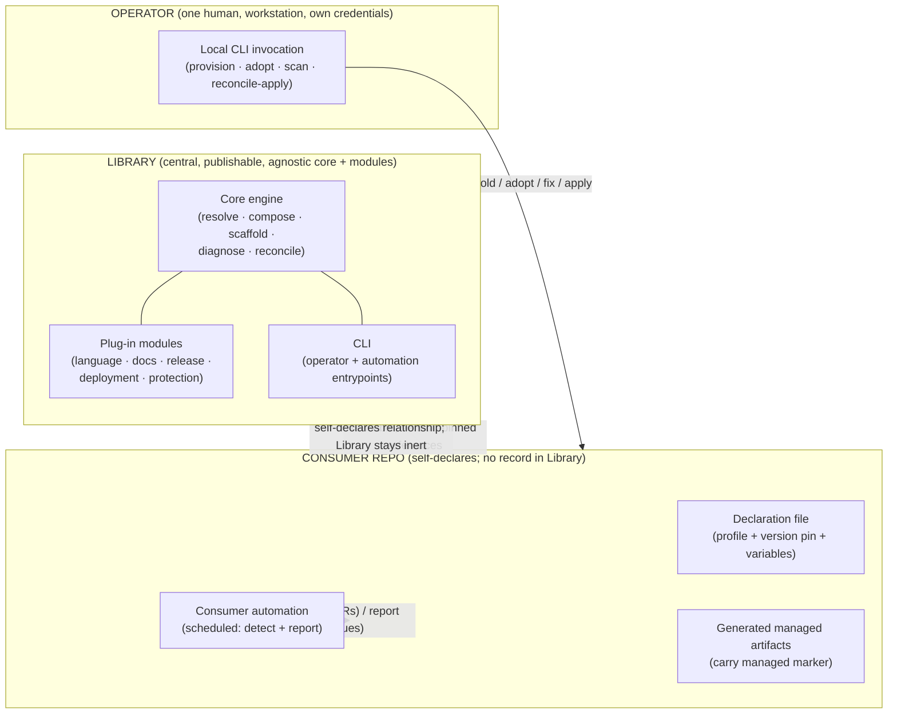
```mermaid
flowchart LR
    subgraph Library["LIBRARY (central, publishable, agnostic core + modules)"]
        core["Core engine<br/>(resolve · compose · scaffold ·<br/>diagnose · reconcile)"]
        mods["Plug-in modules<br/>(language · docs · release ·<br/>deployment · protection)"]
        cli["CLI<br/>(operator + automation entrypoints)"]
        core --- mods
        core --- cli
    end

    subgraph Consumer["CONSUMER REPO (self-declares; no record in Library)"]
        decl["Declaration file<br/>(profile + version pin + variables)"]
        gen["Generated managed artifacts<br/>(carry managed marker)"]
        auto["Consumer automation<br/>(scheduled: detect + report)"]
    end

    subgraph Operator["OPERATOR (one human, workstation, own credentials)"]
        local["Local CLI invocation<br/>(provision · adopt · scan · reconcile-apply)"]
    end

    Library -- "reusable, version-pinned references" --> Consumer
    local -- "scaffold / adopt / fix / apply" --> Consumer
    auto -- "propose (PRs) / report (issues)" --> Consumer
    Consumer -. "self-declares relationship; Library stays inert" .-> Library
```

### 3.2 Module taxonomy

Everything in the Library is one of a small number of module kinds. Each kind has
a single responsibility and a defined interface.

| Module kind | Responsibility | Provides | Requires |
|---|---|---|---|
| **Core engine** | Resolution, composition, scaffolding, diagnosis, reconciliation logic. Agnostic. | The processes in §5 | Conforming modules |
| **Profile** | Thin manifest naming one bundle of each kind. No logic. | A named, resolvable convention set | Bundles |
| **Workflows bundle** | The set of automation pipelines a profile attaches. | Ordered list of pipeline references | Pipeline modules |
| **Scaffold bundle** | The set of managed files a profile materializes. | Ordered list of template references | Template modules |
| **Settings bundle** | The desired protected-resource settings a profile enforces. | Declarative settings map | — |
| **Template module** | One generated artifact's content + render inputs. | A renderable artifact + its required variables | Variable values |
| **Action/step module** | One reusable automation unit. | A callable automation unit | Inputs it declares |
| **Pipeline module** | One reusable automation pipeline composed of action/step modules. | A callable pipeline + typed inputs/outputs | Action modules; declared privileges |
| **Version-source module** | Where and how a language records its version. | Read/write of the version location(s) | — |
| **Language plug-in** | Everything specific to one language, expressed only as the bundles/templates/pipelines/version-source above. | A language's bundles/templates/pipelines/version-source | Core interfaces only |
| **Deployment plug-in** | Everything specific to one deployment target, expressed only as pipeline + settings modules. | A target's pipeline + required privileges/inputs/secrets | Core interfaces only |
| **Docs** | Human-facing description of conventions and processes. | Convention/process reference | — |

### 3.3 Structural rules

- The **core engine has no dependency on any language or deployment plug-in.**
  Dependencies point inward (plug-ins depend on core interfaces), never outward.
  This is falsifiable — see the core-level Definition of Done (§9).
- A **profile** depends only on bundles. A **bundle** depends only on the modules
  of its kind.
- **Version bumping is core orchestration over a plug-in interface.** The core
  Release process (§5.9) does not know any language's version location; it calls
  the language plug-in's **version-source module** (§3.2) to read/write the
  version. Version locations are plug-in data, never core logic.
- A **language plug-in** and a **deployment plug-in** are *just* collections of
  the generic module kinds — they introduce no new core concept.
- The **Consumer contract** (§6) is the only interface between Library and
  Consumer, and it is declarative.

### 3.4 Single-operator scope (day-zero non-goal)

The "Operator" is one human. Concurrent operators, an operator-as-role/team
model, operator handoff/offboarding, and arbitration between two humans applying
to the same Consumer are **explicit non-goals** at day zero. The consent model
(§5.7) binds to a single granter accordingly. This limitation is documented so it
is a known boundary, not an accidental gap.

---

## 4. The Modularity Model

### 4.1 Composition: a profile is an assembly of modules

A profile composes exactly one workflows-bundle, one scaffold-bundle, and one
settings-bundle. There is **one profile per Consumer** (§3 scope) and **one
baseline strictness level** (no tiers).

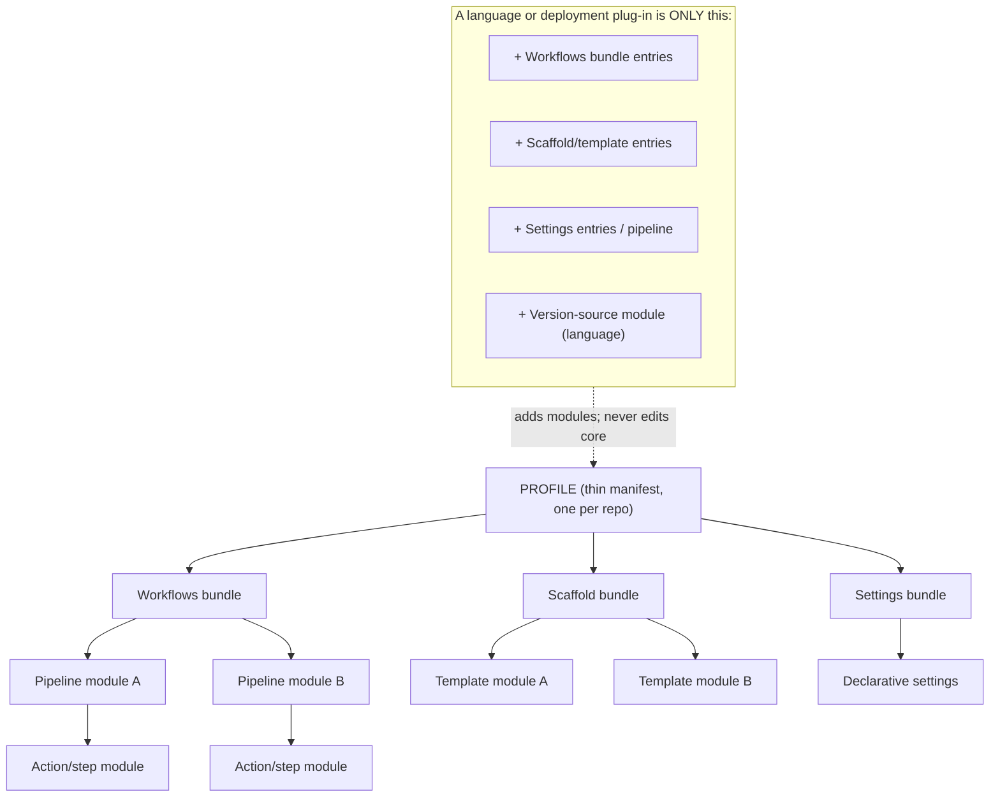
```mermaid
flowchart TD
    P["PROFILE (thin manifest, one per repo)"]
    P --> WB["Workflows bundle"]
    P --> SB["Scaffold bundle"]
    P --> GB["Settings bundle"]

    WB --> PL1["Pipeline module A"]
    WB --> PL2["Pipeline module B"]
    SB --> T1["Template module A"]
    SB --> T2["Template module B"]
    GB --> SET["Declarative settings"]

    PL1 --> A1["Action/step module"]
    PL2 --> A2["Action/step module"]

    subgraph Plugin["A language or deployment plug-in is ONLY this:"]
        WBx["+ Workflows bundle entries"]
        SBx["+ Scaffold/template entries"]
        GBx["+ Settings entries / pipeline"]
        VSx["+ Version-source module (language)"]
    end
    Plugin -. "adds modules; never edits core" .-> P
```

### 4.2 Inheritance and override semantics (explicit, never silent)

Bundles and profiles may inherit from a base of the same kind. The semantics are
strict because the common failure is a child **silently losing** something it
should have kept.

- A module may `extend` another module of the same kind.
- **List-valued** properties (the set of pipelines, templates, required checks)
  are modified with **explicit `add` / `remove` operations only**. A child never
  restates a bare list (which would silently replace).
- **Map-valued** properties are merged by **deep merge** at the leaf — a child
  overriding one nested key must not drop sibling keys.
- **Edge-case rules (normative):**
  - `remove` of an element **not present** in the resolved base → **hard error**
    (it signals a stale assumption; fail loud).
  - `add` of an element **already present** → **hard error** (signals a redundant
    or conflicting intent).
  - `add` and `remove` of the **same element in the same layer** → **hard error**.
  - **Ordering is deterministic:** ancestors resolve before descendants;
    list membership uses **set semantics** (no duplicates).
  - **Same-output-path collisions** in the scaffold set are resolved by overlay
    order (§5.3): the later/overriding source wins; ties at the same level are an
    error, not a silent pick.
    **Day-zero behavior (conservative):** the implementation treats **every**
    same-output-path collision in the applicable set as a **hard error**
    (`onboarding.check_output_collisions`), not just same-level ties. Cross-level
    overlay *resolution* (a descendant template deliberately overriding an ancestor's
    output) is **deferred**: silently letting a later source win is exactly the §8.1
    "child silently loses an inherited entry" failure mode, so day-zero fails loud
    rather than resolve. Day-zero profiles compose **no** two applicable templates at
    one path (variant-exclusive templates are filtered by `when` before this check),
    so the resolution branch is never legitimately exercised; implementing an explicit,
    reviewable cross-level override is a post-day-zero refinement.

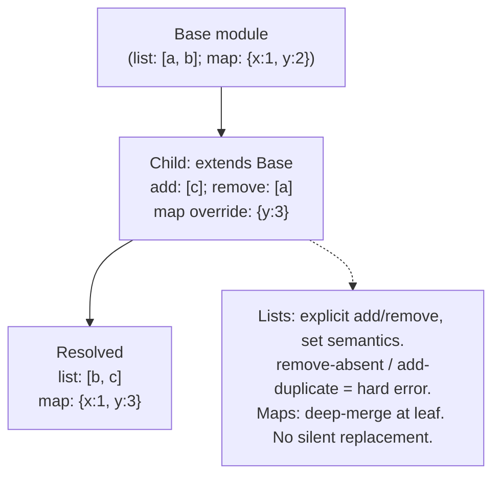
```mermaid
flowchart TD
    Base["Base module<br/>(list: [a, b]; map: {x:1, y:2})"]
    Child["Child: extends Base<br/>add: [c]; remove: [a]<br/>map override: {y:3}"]
    Result["Resolved<br/>list: [b, c]<br/>map: {x:1, y:3}"]
    Base --> Child --> Result
    note["Lists: explicit add/remove, set semantics.<br/>remove-absent / add-duplicate = hard error.<br/>Maps: deep-merge at leaf. No silent replacement."]
    Child -.-> note
```

### 4.3 Adding a capability = adding a module

To support a new language, documentation generator, release mechanism, or
deployment target, the **only** permitted change is to **add modules** that
conform to §3.2 and to reference them from a profile. The core engine is not
touched. If a new capability seems to require editing the core, that is a signal
the core abstraction is wrong and must be revisited — not a license to
special-case.

---

## 5. Process Flows

Each subsection states trigger, actor, preconditions, steps, outputs, and failure
handling, followed by a diagram. All flows are language- and
deployment-agnostic; where a flow would call a language- or deployment-specific
unit, it calls it **through a module reference**, never by name.

### 5.1 Profile resolution & composition (pure)

**Trigger:** any process needing a concrete convention set.
**Actor:** core engine.
**Steps:** load the named profile → resolve each referenced bundle, applying
`extends` + `add`/`remove` for lists (with §4.2 edge-case rules) and deep-merge
for maps → apply Consumer overrides under the same rules → produce a
fully-resolved convention set (pipelines, templates, settings, required
variables, version-source).
**Purity:** *profile/bundle composition is pure and deterministic* (no side
effects). **Variable resolution (§5.2) is a separate, impure step** — it reads
host state — and its results are captured into the declaration so downstream
composition stays reproducible.
**Failure handling:** a bare list under `extends`/override is rejected; a missing
referenced module is a hard error; §4.2 edge-case violations are hard errors.

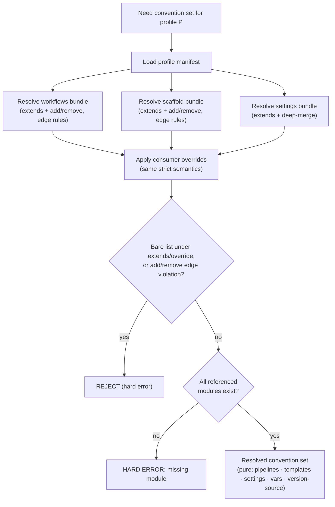
```mermaid
flowchart TD
    A["Need convention set for profile P"] --> B["Load profile manifest"]
    B --> C["Resolve workflows bundle<br/>(extends + add/remove, edge rules)"]
    B --> D["Resolve scaffold bundle<br/>(extends + add/remove, edge rules)"]
    B --> E["Resolve settings bundle<br/>(extends + deep-merge)"]
    C --> F["Apply consumer overrides<br/>(same strict semantics)"]
    D --> F
    E --> F
    F --> G{"Bare list under extends/override,<br/>or add/remove edge violation?"}
    G -- yes --> H["REJECT (hard error)"]
    G -- no --> I{"All referenced<br/>modules exist?"}
    I -- no --> J["HARD ERROR: missing module"]
    I -- yes --> K["Resolved convention set<br/>(pure; pipelines · templates · settings · vars · version-source)"]
```

### 5.2 Repository onboarding (provision-new and adopt-existing)

**Trigger:** operator wants a repository to follow a convention set.
**Actor:** operator (local CLI), own credentials.
**Variable resolution (impure):** required variables resolve by precedence
**flags > declaration file > environment > auto-detection**, then the resolved
set is **written into the declaration** for reproducibility — **except variables
typed `secret` (§6.6), which are NEVER written to the declaration**; resolving a
secret-typed variable into the persisted set is a **hard error** (§8.15), so the
declaration carries no secrets (§6.6/§11.4). "Auto-detection"
derives from a **defined, enumerated** set of host sources (e.g. repository
name, the platform's repository metadata, the operator's configured identity);
nothing outside that enumerated set is auto-detected. **Day-zero scope:** the
resolution honors the auto-detection tier (it is the lowest-precedence source in
`resolve_variables`), but **day-zero profiles deliberately auto-map no
identity-bearing variable** (distribution / import / image / project / bundle
names). Because a resolved variable is **persisted into the declaration** (above),
auto-detecting one would silently write a *guess* — and these identifiers need
language-specific normalization (a directory name is not a PyPI distribution name),
so a wrong guess is worse than failing closed. Day-zero therefore resolves these
from flag / declaration / environment and **fails closed** (lists the missing
variable) when unset; populating the auto-detection tier with safe, normalized
sources is a post-day-zero refinement.
**Preconditions:** every *required* variable resolves; for adopt, the working
tree is clean unless overridden. A fresh provision/adopt **must** record an
explicit Library pin supplied by the operator; the process never fabricates a
default pin. That pin must resolve to a published Library tag/branch before
write/provision proceeds. A dedicated unresolved-pin escape hatch is permitted
only for intentional offline/test scaffolds and must be named as such.
**Two paths, one shape:**
- *Provision-new*: create the repository, apply **minimal** protection (§2.11),
  scaffold, first commit, then apply **full** protection.
- *Adopt-existing*: write/merge the declaration, scaffold onto a branch, open a
  proposal for review.
**Guards:** never change an already-declared profile to a different one without
an explicit migrate override; enumerate files left untouched (seed-once,
unmanaged) in the proposal.
**Partially-provisioned state & recovery (normative):** between minimal and full
protection the repo is in a defined **partially-provisioned** state. Minimal
protection (no force-push, no deletion; no PR-required gate that would block the
first commit) is **safe to persist** indefinitely. If full protection fails after
the first commit, the process reports the partial state and exposes an
**idempotent `complete-protection` recovery operation** that re-applies full
protection and is safe to re-run any number of times.

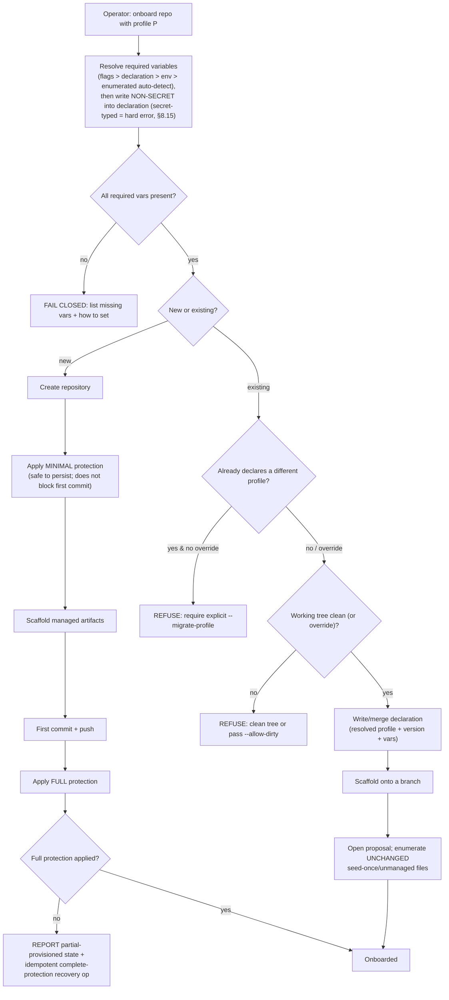
```mermaid
flowchart TD
    Start["Operator: onboard repo with profile P"] --> Vars["Resolve required variables<br/>(flags > declaration > env > enumerated auto-detect),<br/>then write NON-SECRET into declaration (secret-typed = hard error, §8.15)"]
    Vars --> V{"All required vars present?"}
    V -- no --> Vfail["FAIL CLOSED: list missing vars + how to set"]
    V -- yes --> Mode{"New or existing?"}

    Mode -- new --> N1["Create repository"]
    N1 --> N2["Apply MINIMAL protection<br/>(safe to persist; does not block first commit)"]
    N2 --> N3["Scaffold managed artifacts"]
    N3 --> N4["First commit + push"]
    N4 --> N5["Apply FULL protection"]
    N5 --> N6{"Full protection applied?"}
    N6 -- no --> N7["REPORT partial-provisioned state +<br/>idempotent complete-protection recovery op"]
    N6 -- yes --> Done["Onboarded"]

    Mode -- existing --> E0{"Already declares a different profile?"}
    E0 -- "yes & no override" --> Emig["REFUSE: require explicit --migrate-profile"]
    E0 -- "no / override" --> E1{"Working tree clean (or override)?"}
    E1 -- no --> Edirty["REFUSE: clean tree or pass --allow-dirty"]
    E1 -- yes --> E2["Write/merge declaration<br/>(resolved profile + version + vars)"]
    E2 --> E3["Scaffold onto a branch"]
    E3 --> E4["Open proposal; enumerate UNCHANGED<br/>seed-once/unmanaged files"]
    E4 --> Done
```

### 5.3 Scaffolding / sync

**Trigger:** onboarding, an explicit sync, or drift remediation.
**Actor:** core engine.
**Steps:** from the resolved set, build a map of *output path → source template*,
where later/overlay sources override earlier ones for the same output (operating
on the fully-§4.2-resolved set) → render each template with the resolved
variables → stamp the **managed marker** (§6.2) → write **atomically** (render to
a temporary file, then atomic swap) so a crash never leaves a half-written file →
refusing to overwrite an **unmanaged** or **malformed-marker** file unless forced.
**Seed-once files (§6.3):** files that cannot host a marker, and operator-owned
build definitions/entrypoints, are written **only when absent** and never
overwritten or drift-checked.
**Determinism:** rendered output depends on the resolved toolchain (template
engine + any formatter). The toolchain identity is **part of the resolved set**
(pinned), and comparison normalizes line endings, so the same input yields
byte-identical output across runs.
**Self-reference (§2.10):** in bootstrap state, generated automation references
the Library by **self-contained local path**, not by a released reference.
**Failure handling:** a template whose required variables are missing fails
loudly (no silent placeholder); idempotent on a clean tree; atomic per file.
When an operator explicitly forces a managed rewrite, the marker is restamped
even if the rendered body is otherwise unchanged, so profile migrations and
re-pins cannot leave a valid body carrying stale management metadata.

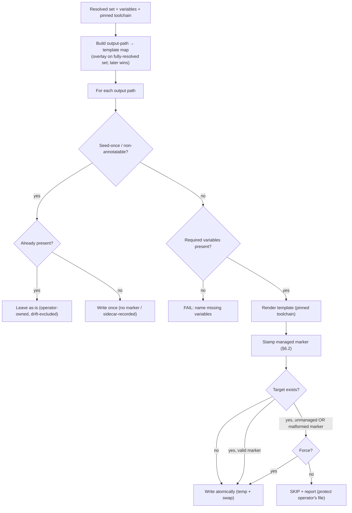
```mermaid
flowchart TD
    A["Resolved set + variables + pinned toolchain"] --> B["Build output-path → template map<br/>(overlay on fully-resolved set; later wins)"]
    B --> C["For each output path"]
    C --> S0{"Seed-once / non-annotatable?"}
    S0 -- yes --> S1{"Already present?"}
    S1 -- yes --> Skip2["Leave as-is (operator-owned, drift-excluded)"]
    S1 -- no --> Seed["Write once (no marker / sidecar-recorded)"]
    S0 -- no --> D{"Required variables present?"}
    D -- no --> Dfail["FAIL: name missing variables"]
    D -- yes --> E["Render template (pinned toolchain)"]
    E --> F["Stamp managed marker (§6.2)"]
    F --> G{"Target exists?"}
    G -- "no" --> W["Write atomically (temp + swap)"]
    G -- "yes, valid marker" --> W
    G -- "yes, unmanaged OR malformed marker" --> Sforce{"Force?"}
    Sforce -- no --> Skip["SKIP + report (protect operator's file)"]
    Sforce -- yes --> W
```

### 5.4 Diagnosis (doctor)

**Trigger:** operator or automation wants a Consumer's health.
**Actor:** core engine.
**Steps:** for each managed artifact the resolved set expects, classify:
**clean** (matches expected render, marker version comparison excluded per §5.5),
**mergeable-drift** (valid marker, known version, body diverged — safe to
regenerate), **dirty-drift** (no/invalid marker, hand-edited, or recorded version
unknown — needs human review), or **missing**. **Malformed marker is classified
dirty-drift consistently** with §5.3 refusing to overwrite it (one posture: a
malformed marker is never silently regenerated; remediating it requires
operator force). Also probe: whether the Consumer's drift automation is present
and enabled; whether the **issue channel is available** (required for §5.6
reporting); which **machine-checkable §17 prerequisites** are satisfied (surfacing
the rest as adoption warnings); whether each **baseline scan actually ran** (a
per-run heartbeat is present — its **absence reads as *broken*, never *clean***,
§5.14); whether any **`secret`-typed variable** appears in the declaration (a
confinement violation, §6.6/§8.15); and whether any **seed-once file** diverges
from its recorded report-only integrity hash (§6.3 — reported, never overwritten).
Reject a bootstrap declaration in any repository that is not the Library itself
(detected by structure, §5.10).

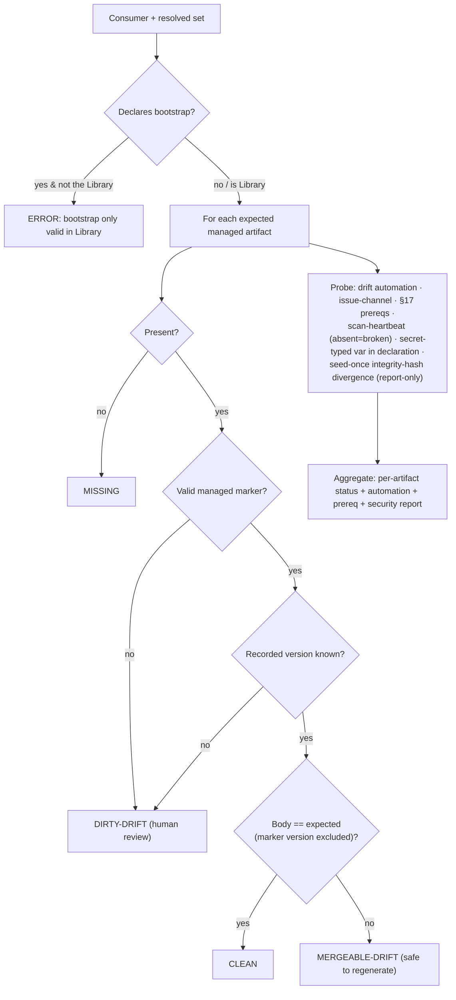
```mermaid
flowchart TD
    A["Consumer + resolved set"] --> Bz{"Declares bootstrap?"}
    Bz -- "yes & not the Library" --> Bzf["ERROR: bootstrap only valid in Library"]
    Bz -- "no / is Library" --> C["For each expected managed artifact"]
    C --> D{"Present?"}
    D -- no --> M["MISSING"]
    D -- yes --> E{"Valid managed marker?"}
    E -- no --> DD["DIRTY-DRIFT (human review)"]
    E -- yes --> Fv{"Recorded version known?"}
    Fv -- no --> DD
    Fv -- yes --> G{"Body == expected<br/>(marker version excluded)?"}
    G -- yes --> CL["CLEAN"]
    G -- no --> MD["MERGEABLE-DRIFT (safe to regenerate)"]
    C --> P["Probe: drift automation · issue-channel · §17 prereqs ·<br/>scan-heartbeat (absent=broken) · secret-typed var in declaration ·<br/>seed-once integrity-hash divergence (report-only)"]
    P --> R["Aggregate: per-artifact status + automation + prereq + security report"]
```

### 5.5 File drift detection (automated, propose-only)

**Trigger:** schedule (or manual dispatch) inside the Consumer's automation, with
**jitter** so a fleet on the same cron does not stampede the platform; rate-limit
responses are tolerated and retried, and a persistent failure is surfaced (so a
silently-throttled job is visible in §5.4, not invisibly absent).
**Actor:** Consumer automation, low privilege (may open proposals; may not mutate
protected settings). Required read/report privileges are declared in §11.3.
**Comparison rule (normative):** drift is the change of `hash(rendered template
body, EXCLUDING the managed-marker version field, after line-ending
normalization)` **or** `hash(resolved variable inputs)`. The marker's *version*
field is reconciled **only** by §5.12 upgrade — so a release/tag movement that
changes nothing but the version is provably a **no-op**, never a churn PR.
**Proposal identity (concurrency):** the proposal (PR) has a **deterministic
identity** (a stable branch/PR key derived from profile + output set), so the
scheduled job and an operator's `scan --fix` (§5.11) **converge on the same
proposal** instead of racing into duplicates.
**Steps:** resolve at the pinned version → regenerate → if **mergeable** content
changed, open/update the identity-keyed proposal with per-file rationale.
**dirty-drift** is reported, never auto-changed. Skipped entirely in bootstrap.

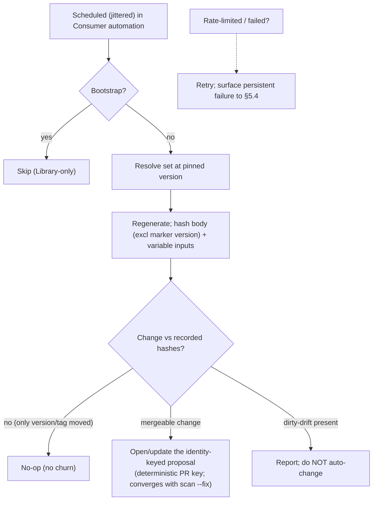
```mermaid
flowchart TD
    A["Scheduled (jittered) in Consumer automation"] --> Bz{"Bootstrap?"}
    Bz -- yes --> Skip["Skip (Library-only)"]
    Bz -- no --> B["Resolve set at pinned version"]
    B --> C["Regenerate; hash body (excl marker version) + variable inputs"]
    C --> D{"Change vs recorded hashes?"}
    D -- "no (only version/tag moved)" --> N["No-op (no churn)"]
    D -- "mergeable change" --> E["Open/update the identity-keyed proposal<br/>(deterministic PR key; converges with scan --fix)"]
    D -- "dirty-drift present" --> F["Report; do NOT auto-change"]
    R["Rate-limited / failed?"] -.-> Surf["Retry; surface persistent failure to §5.4"]
```

### 5.6 Settings drift detection (automated, report-only)

**Trigger:** schedule inside the Consumer's automation (jittered, §5.5).
**Actor:** Consumer automation, **read-only on settings** (declared privileges,
§11.3).
**Steps:** read **live** protected settings → diff against the resolved desired
settings → classify each change **additive** vs **destructive** by the rule
below → on a non-empty diff, open/update a **tracking issue** describing the
diff, the classification, and the exact operator reconcile command. If the diff
is empty and a tracking issue is open, post a "drift resolved — verify before
closing" comment (do **not** auto-close). **If a previously-reported diff has
changed, any prior consent record on the issue is voided with a comment** (the
authoritative gate is still §5.7's apply-time recompute, but this surfaces
staleness at report time). **If the issue channel is unavailable** (issues
disabled), the automation **fails loud** in its log and §5.4 flags it — it never
silently drops the report. **If live settings cannot be read** (the platform token
lacks the admin/read scope branch-protection and rulesets require), the automation
**skips settings drift fail-closed** — it never computes a diff from a falsely
"unprotected" read — and reports the skip; by default this is not a hard failure (so
a scheduled run is not failed by a missing admin token), but an operator gating CI on
settings drift can opt to treat the skip as a failure (`drift-report --require-settings`).
The automation performs **no** settings mutation.
**Rulesets (presence + content):** the desired **named rulesets** (§3.2 settings bundle)
are also protected settings, so drift detection covers them: a desired ruleset that is
**missing**, **disabled** (enforcement no longer `active`), or **content-weakened** (e.g. a
permissive `tag_name_pattern`, a lowered required-approval count, a dropped required check, a
removed rule) is reported on the same tracking issue. The live ruleset is compared to the
**rendered desired payload** (the GitHub-specific comparison lives in the binding, not the
agnostic flow); GitHub-added metadata and benign live additions are ignored (no false drift),
the ref-name scope is conservatively not compared (the platform may normalize `~DEFAULT_BRANCH`).
**Ruleset remediation is the operator-direct `apply-rulesets` path, NOT the §5.7 consent gate**
(see §5.7) — so the report directs the operator to `apply-rulesets … --apply --profile 
`.
**additive vs destructive (normative):** a change is **destructive** if it
removes, weakens, or replaces an existing protection or any operator-relied-upon
value (e.g. lowering a required-review count, removing a required check,
disabling a protection). It is **additive** only if it introduces a new
constraint with no loss. **Ambiguous or unrecognized changes classify as
destructive** (fail-safe).

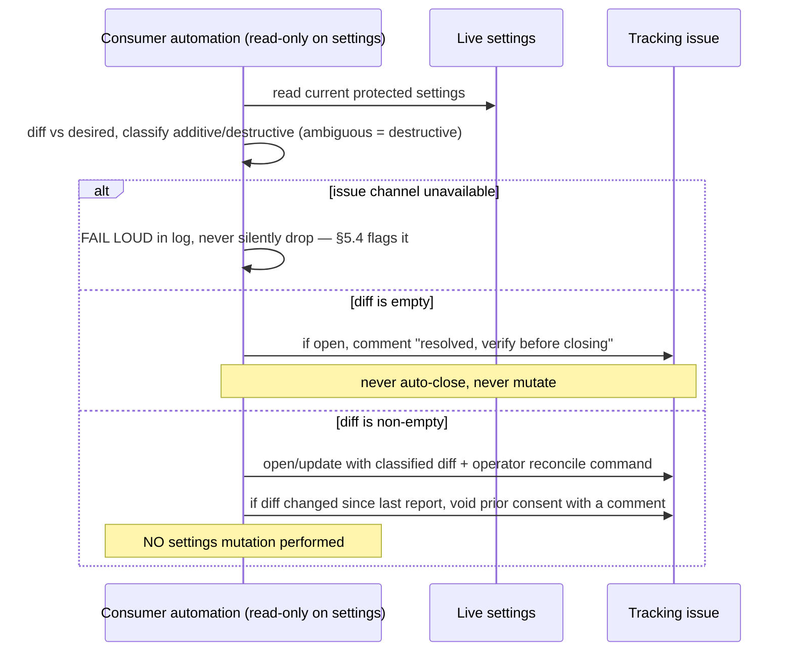
```mermaid
sequenceDiagram
    participant Auto as Consumer automation (read-only on settings)
    participant Live as Live settings
    participant Issue as Tracking issue
    Auto->>Live: read current protected settings
    Auto->>Auto: diff vs desired, classify additive/destructive (ambiguous = destructive)
    alt issue channel unavailable
        Auto->>Auto: FAIL LOUD in log, never silently drop — §5.4 flags it
    else diff is empty
        Auto->>Issue: if open, comment "resolved, verify before closing"
        Note over Auto,Issue: never auto-close, never mutate
    else diff is non-empty
        Auto->>Issue: open/update with classified diff + operator reconcile command
        Auto->>Issue: if diff changed since last report, void prior consent with a comment
        Note over Auto: NO settings mutation performed
    end
```

### 5.7 Settings reconciliation (operator-gated apply)

**Trigger:** operator runs the reconcile command against a tracking issue.
**Actor:** operator, own elevated credentials.
**Scope (branch protection + repo security toggles):** this consent-gated path reconciles the
**flat default-branch protection and repo security toggles** only. **Named rulesets are
reconciled by the distinct operator-direct `apply-rulesets` command** — itself operator-gated
(§2.3: the operator runs it with their own credentials, with a dry-run preview before `--apply`),
and **idempotent** (it re-asserts the rendered desired payload, so it fixes both missing and
content-drifted rulesets). Rulesets are deliberately **not** folded into this consent-issue flow:
the two use different platform write surfaces (a wholesale branch-protection `PUT` vs a ruleset
upsert), and the dry-run-reviewed `apply-rulesets` is the sanctioned operator gate for them
(the same way provisioning/`complete-protection` apply protection operator-direct, outside the
consent-issue mechanism). §5.6 detects ruleset drift (presence + content) and directs the operator
to `apply-rulesets … --apply --profile 
`.
**Steps:** fetch the issue; refuse if closed → confirm the consent record is
present and **bound to the current diff** (§6.4) → identify the human who granted
consent via the issue's authoritative event history (most recent grant not later
revoked) → **fail-closed authorize** (real human, §2.7; admin role; ambiguous or
failed lookup → DENY) → **re-read live state AND the issue/consent channel and
recompute the diff at apply time** (§2.8) → **render the locally-recomputed diff to
the operator and require explicit confirmation of *that* diff** — never the
bot-authored issue body (§6.4); if the recomputed diff is empty, no-op + comment;
if the issue or its consent record was edited by a non-`User` actor since the
granter was identified, **void consent and abort** → check **version-pin
compatibility** (§2.6) and refuse on mismatch unless overridden → construct a **purpose-built
write payload** (§2.9) and apply → comment the result on the issue (leave open
for audit).
**Concurrency:** the apply takes the same deterministic issue identity and
**re-validates the consent and diff at apply time** so a §5.6 update landing
mid-apply is detected, not silently overwritten.

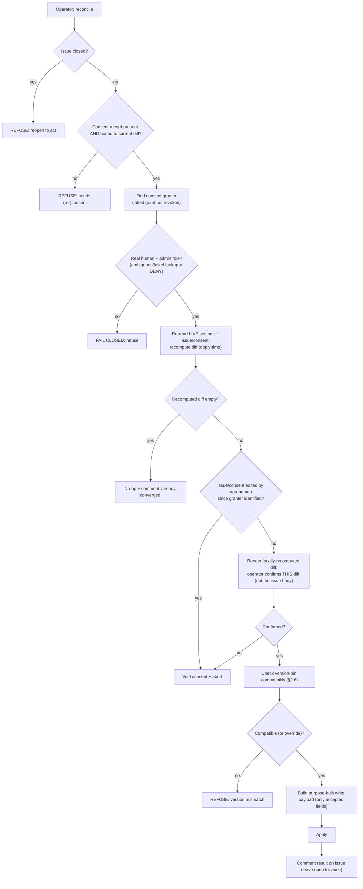
```mermaid
flowchart TD
    A["Operator: reconcile <issue>"] --> B{"Issue closed?"}
    B -- yes --> Bf["REFUSE: reopen to act"]
    B -- no --> C{"Consent record present AND bound to current diff?"}
    C -- no --> Cf["REFUSE: needs (re-)consent"]
    C -- yes --> D["Find consent granter<br/>(latest grant not revoked)"]
    D --> E{"Real human + admin role?<br/>(ambiguous/failed lookup = DENY)"}
    E -- "no" --> Ef["FAIL CLOSED: refuse"]
    E -- yes --> F["Re-read LIVE settings + issue/consent;<br/>recompute diff (apply-time)"]
    F --> G2{"Recomputed diff empty?"}
    G2 -- yes --> Gno["No-op + comment 'already converged'"]
    G2 -- no --> Gx{"Issue/consent edited by non-human<br/>since granter identified?"}
    Gx -- yes --> Habort["Void consent + abort"]
    Gx -- no --> H["Render locally-recomputed diff;<br/>operator confirms THIS diff (not the issue body)"]
    H --> Hc{"Confirmed?"}
    Hc -- no --> Habort
    Hc -- yes --> I["Check version-pin compatibility (§2.6)"]
    I --> J{"Compatible (or override)?"}
    J -- no --> Jf["REFUSE: version mismatch"]
    J -- yes --> K["Build purpose-built write payload (only accepted fields)"]
    K --> L["Apply"]
    L --> Mc["Comment result on issue (leave open for audit)"]
```

### 5.8 Authorization gate (reused by §5.7 and any settings mutation)

**Rule:** deny by default (§2.7). A reusable decision, not duplicated per call
site.

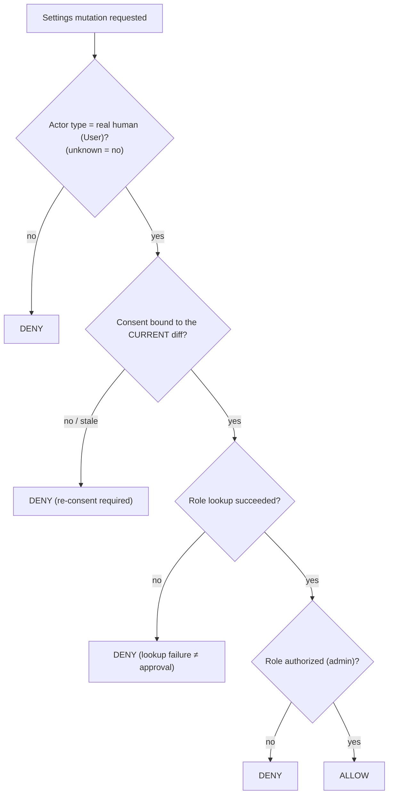
```mermaid
flowchart TD
    A["Settings mutation requested"] --> B{"Actor type = real human (User)?<br/>(unknown = no)"}
    B -- no --> D1["DENY"]
    B -- yes --> C{"Consent bound to the CURRENT diff?"}
    C -- "no / stale" --> D2["DENY (re-consent required)"]
    C -- yes --> E{"Role lookup succeeded?"}
    E -- no --> D3["DENY (lookup failure ≠ approval)"]
    E -- yes --> F{"Role authorized (admin)?"}
    F -- no --> D4["DENY"]
    F -- yes --> G["ALLOW"]
```

### 5.9 Library versioning & release

**Trigger:** changes merged to the Library's mainline.
**Actor:** the Library's own automation + Conventional Commit history (the commit
convention and the tag/floating-ref mechanics are part of the hosting-platform
binding, §2.14).
**Steps:** derive the next semantic version from Conventional Commit history
(patch / minor / major) → write the version via each affected language plug-in's
**version-source module** (§3.3) — the core never hardcodes a version location →
produce release artifacts (version bump, changelog, tagged release) → **advance
the floating major reference to the new release unconditionally** (it is a
published pointer; the Library cannot and does not query who consumes it, per
§2.2). The release process must not depend on a not-yet-existing release (§2.10):
in bootstrap, the release pipeline resolves its own module/action references
locally.

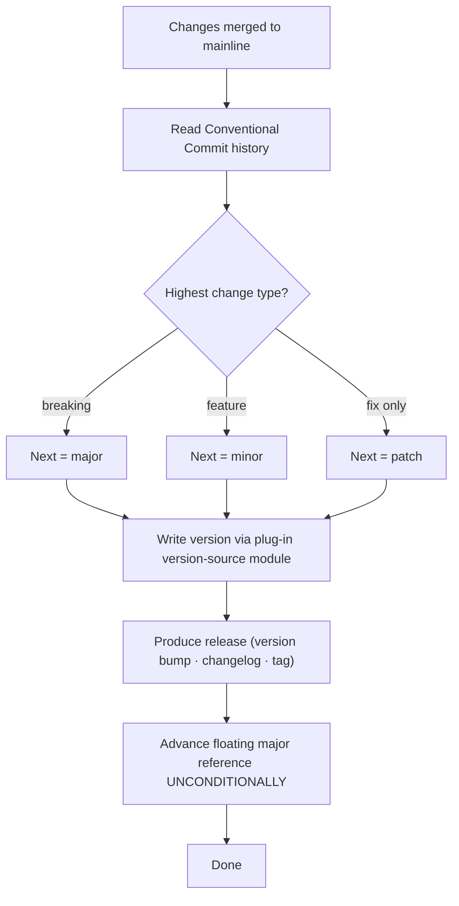
```mermaid
flowchart TD
    A["Changes merged to mainline"] --> B["Read Conventional Commit history"]
    B --> C{"Highest change type?"}
    C -- "breaking" --> Maj["Next = major"]
    C -- "feature" --> Min["Next = minor"]
    C -- "fix only" --> Pat["Next = patch"]
    Maj --> D["Write version via plug-in version-source module"]
    Min --> D
    Pat --> D
    D --> E["Produce release (version bump · changelog · tag)"]
    E --> F["Advance floating major reference UNCONDITIONALLY"]
    F --> G["Done"]
```

### 5.10 Bootstrap / self-reference resolution

**Trigger:** the Library applies its own conventions and runs its own
pipelines before it has a release.
**Structural predicate (normative):** a repository is *the Library* iff it
contains all of: the core engine's source package (`aviato/core/`), the
module-source tree under `aviato/library/` (its `bundles/` and `scaffold/`
definition trees), and the packaged `policy.yml` (`aviato/library/policy.yml`) —
which serves as the manifest anchor *agnostically* (a language-specific build
manifest cannot be named in the agnostic core, §9b; `policy.yml` is the
distinctive Library artifact). `policy.yml` and the ruleset manifest/templates
live **inside** `aviato/library/` (not the repo root) so they ship in the wheel
for installed ruleset rendering (§5.6/§11.3). Detection is by this structure,
never by repository name (so forks/renames are unaffected): a **Consumer**
repository never vendors the `aviato/` package tree, so the predicate is false
for it. (The predicate is only ever evaluated against the operated-on repository
root — never the installed package in site-packages — so the fact that a
site-packages copy also contains `aviato/library/policy.yml` is immaterial.)
**Rule:** in bootstrap state, **all** self-applied automation — scaffolding,
verify, **and the release pipeline** — resolves its module/action references to
self-contained local paths. The first release the pipeline produces is what makes
released references exist; nothing in the bootstrap path may require one to
pre-exist.
The workflow-level `local-install` path is part of this bootstrap exception only:
it is valid only when the operated-on checkout satisfies the structural Library
predicate **and** its declaration sets `bootstrap: true`. If either condition is
false, the workflow fails before installing from the local checkout. This prevents
a Consumer from hand-editing `local-install: true` and executing unreviewed local
code in place of the pinned Library reference.

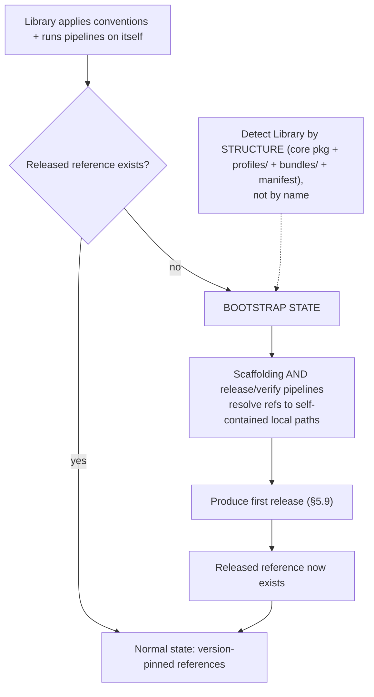
```mermaid
flowchart TD
    A["Library applies conventions + runs pipelines on itself"] --> B{"Released reference exists?"}
    B -- no --> C["BOOTSTRAP STATE"]
    C --> D["Scaffolding AND release/verify pipelines<br/>resolve refs to self-contained local paths"]
    D --> E["Produce first release (§5.9)"]
    E --> F["Released reference now exists"]
    B -- yes --> G["Normal state: version-pinned references"]
    F --> G
    H["Detect Library by STRUCTURE (core pkg + profiles/ + bundles/ + manifest),<br/>not by name"] -.-> C
```

### 5.11 Local fleet scan

**Trigger:** operator wants the status of many repositories at once.
**Actor:** operator (local CLI), read-only by default.
**Steps:** resolve a repository list from a **local, operator-side, ephemeral**
source (a local config, a live listing, or explicit arguments — this is never a
Library-held registry, §2.2); skip archived unless asked → for each, run
diagnosis (§5.4) and collect status → present a consolidated report → optionally,
for **mergeable** file drift only, open the identity-keyed proposal (§5.5);
**dirty-drift** and settings mutation are never auto-fixed by scan.
**Audit:** the operator aggregates, read-only, the per-Consumer audit trail that
already lives on each Consumer's tracking issues (§5.6/§5.7 leave issues open for
audit). This preserves §2.2 while giving fleet-level visibility.

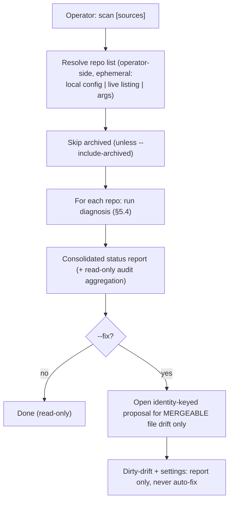
```mermaid
flowchart TD
    A["Operator: scan [sources]"] --> B["Resolve repo list (operator-side, ephemeral:<br/>local config | live listing | args)"]
    B --> C["Skip archived (unless --include-archived)"]
    C --> D["For each repo: run diagnosis (§5.4)"]
    D --> E["Consolidated status report (+ read-only audit aggregation)"]
    E --> F{"--fix?"}
    F -- no --> G["Done (read-only)"]
    F -- yes --> H["Open identity-keyed proposal for MERGEABLE file drift only"]
    H --> I["Dirty-drift + settings: report only, never auto-fix"]
```

### 5.12 Version upgrade / downgrade (re-pin)

**Trigger:** operator moves a Consumer to a different Library version.
**Actor:** operator (local CLI).
**Steps:** read the current pin → confirm the **profile exists and has the same
identity** at the target version (a profile name is a stable public identity;
§6.5) → set the new pin → re-resolve at the target version → **migrate variables
and overrides**: detect newly-**required** variables and prompt/fail with
guidance, detect **orphaned** overrides (keys no longer meaningful) and report
them → re-scaffold (§5.3, updating markers) → surface changes as a reviewable
proposal.
**Downgrade:** moving to a **lower** version is allowed but routed through this
same propose/review path **with an explicit "you are moving backward — protection
or behavior may be reduced" warning**.
**Failure handling:** if the target profile no longer exists, **or its name has
been repurposed to a different composition** (identity change), refuse and report.
The upgrade/downgrade path is the **only** sanctioned way a pin moves; drift
(§5.5) never advances it.
**Day-zero limitation:** the repurpose (identity-change) refusal requires resolving
the profile **at the target version**, which needs that version's definitions
present. The operator's installed CLI carries **one** Library version, so the
shipped re-pin confirms the profile still **resolves** but cannot compare its
identity *across* versions; cross-version repurpose detection (fetching the target
version's registry) is a post-day-zero refinement. The decision logic is implemented
and tested against a second registry; it is dormant in the single-installed-CLI flow.

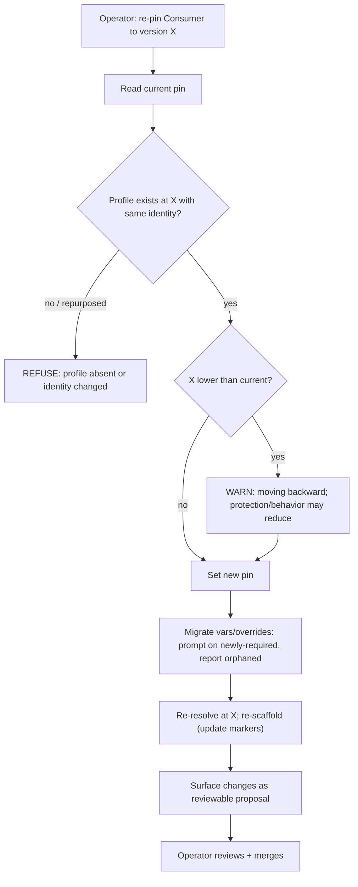
```mermaid
flowchart TD
    A["Operator: re-pin Consumer to version X"] --> B["Read current pin"]
    B --> C{"Profile exists at X with same identity?"}
    C -- "no / repurposed" --> Cf["REFUSE: profile absent or identity changed"]
    C -- yes --> Dn{"X lower than current?"}
    Dn -- yes --> Warn["WARN: moving backward; protection/behavior may reduce"]
    Dn -- no --> Set
    Warn --> Set["Set new pin"]
    Set --> Mig["Migrate vars/overrides: prompt on newly-required, report orphaned"]
    Mig --> Res["Re-resolve at X; re-scaffold (update markers)"]
    Res --> Prop["Surface changes as reviewable proposal"]
    Prop --> Done["Operator reviews + merges"]
```

### 5.13 Offboarding (leave Aviato)

**Trigger:** operator removes a Consumer from Aviato management.
**Actor:** operator (local CLI).
**Steps:** strip managed markers from managed files (converting them to plain
operator-owned files) **or** remove them per operator choice → remove the
Consumer automation (the scheduled drift/report workflows) → delete the
declaration file. The change may be applied to a local checkout (`--write`) or
surfaced as a reviewable removal proposal (`--open-pr`), mirroring onboarding.
**The result must carry an explicit warning that offboarding removes the
always-on §2.13 security-baseline automation and stops Aviato managing this
repository's protection** — mirroring the §5.12 backward-movement warning, since
offboarding is the *maximal* protection reduction. Note the scope precisely: any
GitHub branch protection and rulesets Aviato applied **remain in place but become
unmanaged**; offboarding does **not** tear them down (an unattended privileged
teardown is out of scope, §2.x) — the operator removes them manually if full
protection removal is desired. After offboarding, no Aviato automation runs and
no markers remain to drift-check.

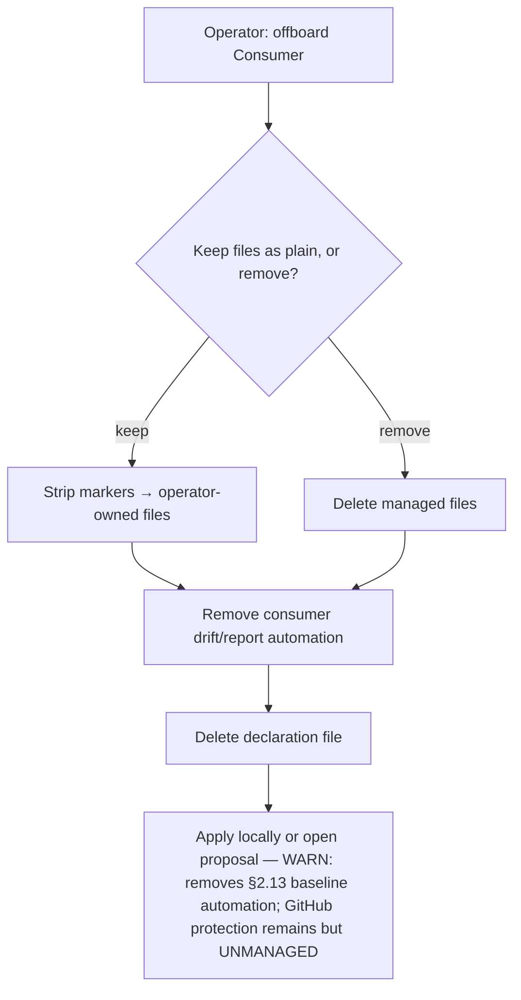
```mermaid
flowchart TD
    A["Operator: offboard Consumer"] --> B{"Keep files as plain, or remove?"}
    B -- keep --> C["Strip markers → operator-owned files"]
    B -- remove --> D["Delete managed files"]
    C --> E["Remove consumer drift/report automation"]
    D --> E
    E --> F["Delete declaration file"]
    F --> G["Apply locally or open proposal — WARN: removes §2.13 baseline automation; GitHub protection remains but UNMANAGED"]
```

### 5.14 Security scanning (baseline)

**Trigger:** SAST, secret, and dependency scans run on **pull requests**, on a
**jittered schedule** (§5.5), **and on the release ref immediately before any
deploy** (so the deploy gate is evaluated against the deployed code, not a stale PR
head); published-artifact security (image scan, SBOM, provenance) runs at **deploy
time** (§11.1) as a gate.
**Actor:** Consumer automation, read scope + `security-events: write`; **no stored
secret** (§2.13).
**Steps:** **probe the required findings-upload privilege at runtime — hard-fail if
absent** (a caller that did not grant it fails loudly, never silently passes;
§8.9/§8.16) → run each category's engine (supplied by the language/deploy plug-in,
§12/§13) → emit a **per-run heartbeat** (tool identity + completion marker) **even
on zero findings**, so §5.4 can distinguish *ran-clean* from *never-ran* → upload
findings as **SARIF to the platform Security surface** → apply the §2.13 gate:
**fail verify / gate deploy on high+critical**, report medium/low. Secret-scanning
**push protection** blocks at push regardless.
**Failure handling:** a scan that **cannot run** is a **failure surfaced in §5.4
diagnosis**, never a silent skip — a repo must not read "clean" while its
scanning is broken. **Absence of the per-run heartbeat reads as *broken*, not
*clean*** (§5.4), and a missing upload privilege is a hard pipeline failure (§8.16).

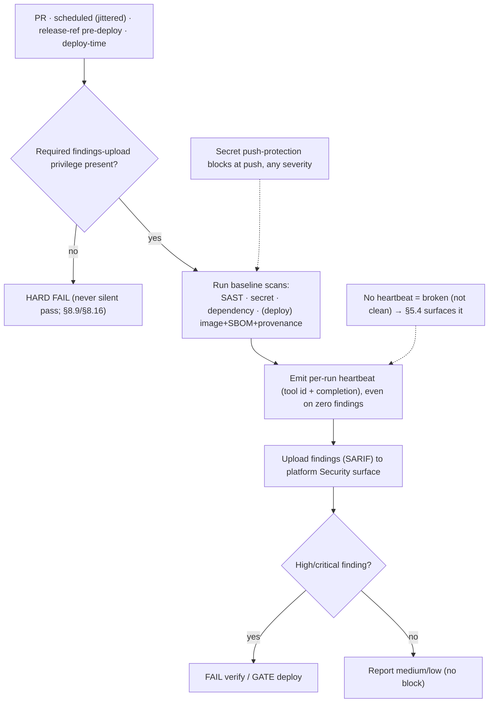
```mermaid
flowchart TD
    A["PR · scheduled (jittered) · release-ref pre-deploy · deploy-time"] --> Priv{"Required findings-upload privilege present?"}
    Priv -- no --> Pf["HARD FAIL (never silent pass; §8.9/§8.16)"]
    Priv -- yes --> B["Run baseline scans:<br/>SAST · secret · dependency · (deploy) image+SBOM+provenance"]
    B --> HB["Emit per-run heartbeat (tool id + completion), even on zero findings"]
    HB --> C["Upload findings (SARIF) to platform Security surface"]
    C --> D{"High/critical finding?"}
    D -- yes --> E["FAIL verify / GATE deploy"]
    D -- no --> F["Report medium/low (no block)"]
    G["Secret push-protection blocks at push, any severity"] -.-> B
    H["No heartbeat = broken (not clean) → §5.4 surfaces it"] -.-> HB
```

---

## 6. The Consumer Contract

The **only** interface between Library and Consumer is a small, declarative
surface, specified normatively below.

### 6.1 Declaration file

- **Name & location:** a single file at `.github/aviato.yaml` in the Consumer (the
  path is the GitHub binding's realization, §2.14; another platform binding could
  place it elsewhere).
- **Format:** YAML.
- **Versioned schema** with these fields:
  - `profile` (string) — the profile name (a stable public identity, §6.5).
  - `version` (string) — the Library version pin: an exact version (`X.Y.Z`) or
    a floating major reference (`X`). Bare SemVer is canonical (matching `policy.yml`
    and the CLI); a legacy leading `v` is tolerated on read but never emitted.
  - `docs` (boolean, optional, default `false`) — opt-in to building and
    publishing the multi-version documentation site (§13.3). When `true`, the
    language plug-in's docs step emits API/reference material as md/mdx (§12) and
    the docs deploy consumes it; when `false` (default), no docs site is built or
    published and no docs step runs.
  - `bootstrap` (boolean, optional, default `false`) — valid only for the Library
    repository itself (§5.10). It enables local self-reference during bootstrap
    and is rejected for non-Library repositories.
  - `variables` (map) — resolved variable values (§6.6), written by onboarding.
  - `overrides` (map, optional) — convention overrides under the §4.2 semantics.
- It is **declarative** (the Consumer states intent; the engine realizes it),
  **self-contained** (everything the Consumer needs is in its own repo plus the
  version-pinned Library reference), and carries **no secrets** for
  read/propose/report automation (§6.6).

### 6.2 Managed-marker format (normative)

- A managed file's **first non-blank line** is a marker using the file's native
  comment syntax, of the canonical form:
  `aviato:managed profile=<name> version=<pin> hash=<content-hash>`
  (e.g. `# aviato:managed profile=python-library version=1 hash=…` for
  hash-comment files; the equivalent block/line comment for other syntaxes).
- The marker records **profile**, **version**, and a **content-hash** of the
  rendered body (excluding the marker line) for drift comparison (§5.5).
- A line that contains the `aviato:managed` token but does not parse to this exact
  grammar is **malformed** → treated per §5.4 (dirty-drift; never silently
  overwritten).
- A per-filetype comment-syntax mapping defines how the marker is rendered/parsed
  for each supported file type.

### 6.3 Non-annotatable & operator-owned files (seed-once)

Files that cannot carry an in-file marker (JSON-family configs, legal text such
as LICENSE, lockfiles, binaries) and operator-owned source (container build
definitions, application entrypoints) are **seed-once**: the scaffolder writes
them only when **absent** and **never overwrites them**. After seeding, the
operator owns them, and they are **excluded from drift *remediation*** (Aviato
never regenerates or clobbers them). However, at seed time the scaffolder
**records a content-hash for each seeded file in a report-only sidecar**;
diagnosis (§5.4) compares the live file to that recorded hash and **reports**
divergence — **report-only, never an overwrite** — so security-relevant seed-once
files (e.g. Dockerfiles, entrypoints) are not invisible to integrity checks. The
sidecar is advisory: it gives tamper *visibility* without fighting the required
operator edits that make these files operator-owned. (This replaces the earlier
"no sidecar at all" stance, which left these files with zero integrity tracking.)

### 6.4 Consent record (normative)

- Consent to a settings reconcile is expressed by an explicit, defined record on
  the tracking issue (a designated label/marker added by a human), and is
  **bound to the diff it authorizes** (it carries the diff's content identity).
  The authoritative content identity is the **diff the operator's apply-time client
  recomputes from live state** (§5.7), **not** the human-readable diff the reporting
  automation rendered into the issue body — so an automation actor with issue-write
  access cannot bind a human's consent to content it authored. The operator
  confirms the locally-recomputed diff at apply time (§5.7).
- **Grant** and **revoke** are recorded as the platform's authoritative
  issue-event entries; "current consent" is the most recent grant for the current
  diff identity not later revoked.
- A consent record whose bound diff identity does not match the current diff is
  **stale** → DENY (§5.8).
- Because the record is carried as a hosting-platform label a **human must be able
  to create**, the diff identity is constrained to fit the platform's label-name
  limit (GitHub: 50 chars, including the binding's `aviato-consent:` prefix). The
  identity is a truncated content hash (`settingsdrift.CONSENT_ID_HEX_LEN` hex
  chars) — short enough to label, long enough to keep the content binding
  collision-resistant. The binding guards this invariant at import.

### 6.5 Profile name stability

A profile **name** is a stable public identity. Renaming or repurposing a name to
a different composition is a breaking change handled like "profile no longer
exists" (§5.12 refuses), and requires an alias/deprecation path if continuity is
desired.

### 6.6 Variable schema

- Variables are **typed** (string, boolean, enum with a declared domain — e.g.
  the Node `language-variant` enum `typescript | javascript`).
- Each variable is marked **secret** or **non-secret**. Read/propose/report
  automation receives **no secret** variables. Secrets required by a deployment
  plug-in are supplied only at deploy time, in the protected environment (§11.4),
  **never via the declaration** — this invariant is *enforced*, not merely stated:
  onboarding (§5.2) excludes `secret`-typed variables from the declaration
  write-back as a **hard error** (§8.15), and diagnosis (§5.4) flags any
  `secret`-typed key found in a declaration.

---

## 7. State & Sources of Truth

| Concern | Single source of truth |
|---|---|
| Desired conventions | The Library's profiles/bundles/modules at the pinned version |
| A Consumer's chosen conventions | The Consumer's `.github/aviato.yaml` declaration (§6.1) |
| Whether a file is managed | The managed marker in the file (§6.2); seed-once files (§6.3) are operator-owned |
| Live protected settings | The hosting platform (read at diagnosis/apply time) |
| Consent to mutate settings | The tracking issue's authoritative event history (§6.4) |
| Per-Consumer audit of actions taken | That Consumer's tracking issues (left open, §5.6/§5.7) |
| The Library's version | The Library's own version record + release tags |
| Which repos an operator manages | The operator's **local, ephemeral** scan input (§5.11) — never the Library |

There is no central registry of Consumers anywhere in the Library (§2.2).

---

## 8. Failure Modes the Structure Must Prevent

Each maps to a principle and must be designed out, not patched later.

- **§8.1** A child/override silently loses an inherited entry → prevented by
  explicit `add`/`remove` list semantics with edge-case hard-errors and deep map
  merge (§4.2).
- **§8.2** Automation silently reverts a human's emergency change → prevented by
  report-before-mutate and operator-gated apply (§2.4, §5.6, §5.7).
- **§8.3** Stale consent authorizes a changed mutation → prevented by binding
  consent to the current diff (§6.4) and apply-time recompute over settings **and**
  the consent channel (§2.8, §5.7).
- **§8.4** A lookup failure or unknown actor is treated as approval → prevented by
  fail-closed authorization (§2.7, §5.8).
- **§8.5** A hand-edited or seed-once file is clobbered → prevented by the
  managed-marker guard and the seed-once rule (§2.5, §6.2, §6.3).
- **§8.6** Read-shaped data replayed into a write is rejected by the platform →
  prevented by purpose-built write payloads (§2.9).
- **§8.7** A new resource sits unprotected, or its first operation deadlocks on its
  own protection → prevented by staged provisioning with a specified
  partially-provisioned state and idempotent recovery (§2.11, §5.2).
- **§8.8** The Library cannot build itself because its automation (including the
  release pipeline) references a release that does not yet exist → prevented by
  self-reference resolution covering all self-applied pipelines (§2.10, §5.10).
- **§8.9** Automation is granted privileges it cannot obtain (a caller that does
  not grant a callee's needed privileges) → prevented by requiring each pipeline
  to **declare** its privileges (read/report and deploy alike, §11.3) and each
  caller to **grant** them, validated as part of the module interface.
- **§8.10** Validation that only checks shape, not behavior → the Definition of
  Done (§9) requires a real end-to-end run, not static/string checks.
- **§8.11** Concurrent actors race on the same output → prevented by deterministic
  proposal identity and apply-time re-validation of the consent/issue channel
  (§5.5, §5.7).
- **§8.12** Benign release/tag movement causes churn, or a real marker corruption
  is missed → prevented by hashing the body excluding the marker version, with the
  version reconciled only via upgrade (§5.5, §5.12).
- **§8.13** A vulnerability ships because scanning was skipped, disabled, or
  silently broken → prevented by always-on baseline security scanning with a
  high/critical gate, and by §5.4 surfacing a scan that cannot run rather than
  reading "clean" (§2.13, §5.14).
- **§8.14** A slower, older release's deploy finishes last and moves a mutable
  published alias (e.g. a `latest` image tag or docs alias) **backward** →
  prevented by a **per-alias deploy concurrency group** plus a **monotonic-version
  guard** that moves the alias only if the deploying tag is the highest released
  version (§13.2, §13.3); the §2.12 recompute exemption does not cover this. The
  guard is inlined into the deploy workflows (to avoid a self-reference install) but
  is **validation-checked against the core `is_highest` comparator** so the hand-copied
  copy cannot silently drift from the tested implementation.
- **§8.15** A `secret`-typed variable is persisted into the declaration → prevented
  by onboarding excluding secret-typed variables from the write-back as a hard
  error, and diagnosis flagging any present (§5.2, §5.4, §6.6).
- **§8.16** The always-on security baseline fails **open** (a caller did not grant
  the findings-upload scope, or a scan never ran, leaving the repo reading
  "clean") → prevented by a runtime privilege probe that hard-fails and a per-run
  heartbeat whose absence reads as broken, not clean (§5.14, §5.4, §8.9).

---

## 9. Definition of Done (process-level, agnostic)

A capability is "done" only when **all** hold:

1. It is expressed entirely as modules (§3.2) composed by a profile — the core
   engine was not edited to accommodate it.
2. Resolution, scaffolding, diagnosis, and (where applicable) reconciliation pass
   on a **real, non-mocked** end-to-end exercise (§8.10).
3. Its automation **actually starts and runs** on the real hosting platform (a
   real pipeline run reaching a real result), not merely validated for syntax or
   string content.
4. Every privilege it needs is **declared** by the unit that needs it and
   **granted** by the unit that calls it (§8.9).
5. It honors every applicable core principle in §2 — verified, not assumed.
6. The bootstrap/self-reference path (§5.10) is satisfied where the capability
   touches the Library itself.
7. Any credential it requires is part of its declared module interface and is
   surfaced explicitly; it never weakens the no-secrets posture of
   read/propose/report automation (§2.3, §6.6).
8. **Baseline security scanning runs and gates** (§2.13, §5.14): the four scan
   categories execute on the real platform, upload SARIF, and the high/critical
   gate is demonstrated to fail verify / gate deploy — not asserted.
9. **Author-unverifiable exception:** where a capability cannot be verified by the
   system author (day zero: Apple App Store Connect, §13.4), its done-state is an
   **operator-performed** real run on the operator's own account (§13.4.7) — this
   substitutes for criteria 2–3 for that capability only.

### 9b. Core-level Definition of Done (falsifiable agnosticism)

_(Referenced throughout as "§9b" — the core-level, falsifiable agnosticism DoD.)_

**Core-level Definition of Done (falsifiable agnosticism):** beyond per-capability
DoD, the **core itself** is done only when: (a) the core loads and all core tests
pass with **zero plug-ins present**; (b) a static check confirms the core has **no
import/dependency edge into the plug-in module tree** *and* its source contains
**none of the enumerated day-zero target/tool identifiers** — the denylist
(`python`, `node`, `swift`, `pypi`, `ghcr`, `pages`, `docusaurus`, `apple`/`app
store`, `ruff`, `eslint`, `swiftlint`, `codeql`, …), maintained alongside the
day-zero catalog (§10), is **part of the check**, so (b) is falsifiable rather than
depending on an unstated word list; and (c) the same unmodified core drives **at
least two unrelated plug-ins** in the end-to-end exercise. Clauses (a) and (c)
falsify outward coupling **behaviorally** even if the denylist is incomplete; the
import-edge half of (b) needs no list at all.

**Precedence:** §9 applies **in full** to every plug-in; §16 *adds*
plug-in-specific criteria and relaxes nothing in §9.

---

# Part II — Day-Zero Plug-in Catalog

Part II specifies the concrete day-zero plug-ins, expressed entirely through the
Part I module interfaces. Nothing is built here. The core (§1–§9) never changes
to accommodate anything below. **Completeness mandate:** every plug-in is fully
specified — interface, privileges, credentials, runner, prerequisites, and
definition of done — including those the author cannot verify (Apple).

---

## 10. Day-Zero Scope

### 10.1 Languages and deployment targets

| Plug-in | Kind | Realizes |
|---|---|---|
| **Python** | Language | lint/format, type-check, test+coverage, build, API-docs emission (md/mdx) |
| **Node (TypeScript + JavaScript)** | Language | lint/format, type-check (TS), test+coverage, build, API-docs emission (md/mdx, TypeDoc) |
| **Swift** | Language | lint/format, build, test (macOS), narrative-docs emission (md/mdx) |
| **PyPI** | Deployment | publish distributions via OIDC Trusted Publishing (no stored secret) |
| **GHCR** | Deployment | build + push container images via the platform token (no stored secret) |
| **Docs site (GitHub Pages / Docusaurus)** | Deployment | build a multi-version Docusaurus site from emitted md/mdx and publish to Pages on a release tag via the platform token (no stored secret); opt-in via `docs: true` |
| **Apple App Store Connect** | Deployment | sign + archive + upload to TestFlight/App Store (stored Apple secrets, macOS) |

Out of day-zero scope: npm/library publishing for Node; **static-site Node hosting**
(Node deploys only as a GHCR container day-zero; static export → Pages/CDN is a
noted future target, not built); tiers (`standard`/`hardened`); monorepo/
multi-profile/library-and-service-in-one-repo; multi-operator; Aviato-driven
deployment rollback (manual per target, §13.5).

### 10.2 Language → target mapping

| Language | Produces | Deploys to |
|---|---|---|
| Python | importable library **xor** containerized service **xor** no-publish component (one per repo, §3 scope) | **PyPI** (library) / **GHCR** (service) / **none** (component — GitHub release only) |
| Node (TS/JS) | containerized service | **GHCR** |
| Swift | application | **Apple App Store Connect** |

Any profile may enable the **multi-version Docusaurus docs** deploy by setting
`docs: true` in the declaration (§6.1, §13.3). It is **opt-in** (default off); when
enabled, the language plug-in emits md/mdx (§12) and the tag-gated docs deploy
builds and publishes it. The docs deploy is language-agnostic — it consumes md/mdx
and never inspects source.

### 10.3 Composition (one profile per repo, no tiers)

A profile composes one language plug-in + **zero or more** deployment plug-ins,
with no tier overlay (single baseline). The day-zero profiles:

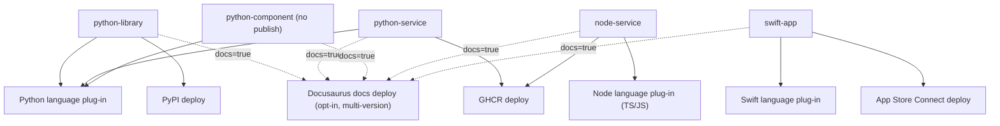
```mermaid
flowchart TD
    PL["python-library"] --> PY["Python language plug-in"]
    PL --> PYPI["PyPI deploy"]
    PS["python-service"] --> PY
    PS --> GHCR["GHCR deploy"]
    PC["python-component (no publish)"] --> PY
    NS["node-service"] --> NODE["Node language plug-in (TS/JS)"]
    NS --> GHCR
    SA["swift-app"] --> SW["Swift language plug-in"]
    SA --> ASC["App Store Connect deploy"]
    PL -. "docs=true" .-> DOCS["Docusaurus docs deploy (opt-in, multi-version)"]
    PS -. "docs=true" .-> DOCS
    PC -. "docs=true" .-> DOCS
    NS -. "docs=true" .-> DOCS
    SA -. "docs=true" .-> DOCS
```

**Day-zero profiles:** `python-library`, `python-service`, `python-component`,
`node-service`, `swift-app` — one strictness level each, one profile per repo.
`python-component` is the **zero-deploy** profile: Python verify + release
(GitHub release/tag) + security baseline + opt-in docs, with **no deployment
plug-in** (publishes to no index/registry; the GitHub release is the only output,
which is also what a HACS integration or a not-yet-published library consumes).
Its GitHub-release **source assets** (no built distribution or image) are **not** a
published artifact in the §11.7 sense, so image-scan/SBOM/provenance do not apply;
the source is still covered by SAST + dependency + secret scanning (§2.13). If a
component later attaches a **built** asset, the §11.7 artifact-security gate applies
to that asset. Pure composition; no core change, no logic in the profile.

---

## 11. Cross-Cutting Deployment Requirements

### 11.1 The release is the human gate

Per §2.12, the authorizing human action is **cutting the release** (§5.9); the
resulting tag triggers deployment automatically. Deployments do **not** run on
arbitrary pushes, pull requests, or fork events. Secret-bearing deploys add a
protected-environment reviewer gate (§11.4).

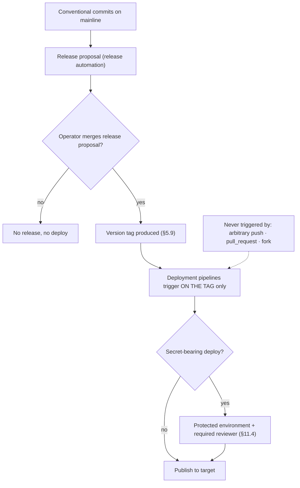
```mermaid
flowchart TD
    A["Conventional commits on mainline"] --> B["Release proposal (release automation)"]
    B --> C{"Operator merges release proposal?"}
    C -- no --> Wait["No release, no deploy"]
    C -- yes --> D["Version tag produced (§5.9)"]
    D --> E["Deployment pipelines trigger ON THE TAG only"]
    E --> Sec{"Secret-bearing deploy?"}
    Sec -- yes --> Env["Protected environment + required reviewer (§11.4)"]
    Sec -- no --> Pub["Publish to target"]
    Env --> Pub
    G["Never triggered by: arbitrary push · pull_request · fork"] -.-> E
```

**Trigger mechanism (platform constraint).** The conceptual trigger is the version
tag. GitHub, however, does **not** start a new workflow run for a tag (or any event)
pushed with the platform `GITHUB_TOKEN` — this is an anti-recursion guarantee, not an
Aviato choice — and §11.2 forbids a stored PAT/App token to work around it. Two
sanctioned mechanisms therefore realize "deploy on the tag" without a stored secret:

- **Automated release (default):** the release job tags the merged release-bump
  commit and then runs the deployment pipelines as **in-run downstream jobs of the
  same run**, passing the just-created tag as `release-tag`. The deploy still builds
  from the tag ref and is still gated by the release gate (merged-PR check) and the
  release-ref security baseline. Docs publish, which is a separate workflow, is
  triggered via `workflow_run` on the main pipeline's completion (not subject to the
  token suppression) and likewise deploys only when the head commit carries a fresh
  release tag.
- **Manual tag push:** an operator pushing the tag with their own credentials (or via
  out-of-band automation, §17) triggers the deploy workflows directly in the classic
  tag-ref context. The same workflows accept this path with no `release-tag` input.

Both paths converge on the same gated, tag-pinned deploy; deployments still never run
on arbitrary push, pull_request, or fork events.

### 11.2 Credential posture: OIDC-first, stored secrets only where unavoidable

- Prefer keyless/OIDC or the platform token for every target that supports it.
  PyPI uses OIDC Trusted Publishing; GHCR and Pages use the platform token. None
  store a long-lived secret.
- Stored secrets for **deployment** are permitted **only** where the platform offers
  no OIDC path. Day zero, that is **Apple App Store Connect alone**.
- The zero-stored-secret posture of all read/propose/report automation (§6.6) is
  never weakened **on the write side**: no read/propose/report automation carries a
  stored secret that can *mutate* anything. The platform-issued workflow token is
  **not** a stored secret — it is ephemeral — so read automation that needs an
  elevated *read* scope it can obtain from the workflow token carries no stored secret.
- **One narrow read-side exception (settings-drift, §5.6/§11.3).** Reading branch
  protection and rulesets requires the `administration` scope, which the platform's
  ephemeral workflow token **does not and cannot** carry — so settings-drift detection
  is the single place an operator may supply a stored **admin-scoped READ token**. This
  exception is tightly bounded and does **not** weaken the posture above: the token is
  **optional** (settings-drift skips fail-closed without it, §5.6), **read-only** (it
  performs no mutation — apply is the separate operator-gated §5.7 path under the
  operator's own credentials, never this automation), **scoped to its own step alone**
  (§11.3 — never visible to the file-drift writes, the install step, or any deploy/PR/
  fork-triggered workflow), and supplied by the operator, not embedded by the Library.
  It is a read credential of last resort, not a deploy secret.

### 11.3 Privileges are declared and granted (read and deploy alike)

Every pipeline **declares** the privileges it needs; every profile that attaches
it **grants** exactly those (§8.9).

**Read / propose / report automation (Consumer-side):**

| Automation | Required job privileges | Stored secrets |
|---|---|---|
| File-drift detection (§5.5) | `contents: write`, `pull-requests: write` | none (platform token) |
| Settings-drift detection (§5.6) | settings **read** scope, `issues: write` | none (platform token) |
| Security scanning (§5.14) | `contents: read`, `security-events: write`, `actions: read` | none (platform token) |

File-drift proposes via a pull request, which requires **pushing an identity-keyed
proposal branch** — hence `contents: write`, not `contents: read` (it never mutates
the default branch directly; the PR remains the human gate). The two automations run
as **separate steps under separate tokens** (§11.2): file-drift uses the platform
token; settings-drift uses **two** tokens in distinct roles — the ambient platform token
for its tracking-issue **writes** (open/comment/revoke), and an operator-supplied admin
**read** token, scoped to the branch-protection/ruleset **reads** alone, for the reads the
platform token cannot perform. The admin token mutates nothing (read-only *in use*),
preserving the §11.2/§14 "no write-capable stored secret" posture; both are confined to that step.

**Deployment:**

| Target | Required job privileges | Stored secrets |
|---|---|---|
| PyPI | `id-token: write`, `contents: read` | none (OIDC) |
| GHCR | `packages: write`, `contents: read` | none (platform token) |
| Pages docs | `pages: write`, `id-token: write`, `contents: read` | none (platform token) |
| App Store Connect | `contents: read` | **yes** — §13.4 |

Third-party actions/tools invoked by any pipeline are **pinned to an immutable
reference**, by the strongest pin the delivery channel supports: GitHub Actions and
container images are **commit-digest / image-digest** pinned; a binary fetched over
the network is **checksum-verified** before execution; and a tool installed from a
package index that exposes no digest (e.g. a `pip`/`npm` package) is pinned to an
**exact version**, never a floating latest. (Distro packages installed via the
runner's system package manager inherit the pinned runner-image snapshot.) The
checker (`aviato.plugins.actionpins`, surfaced as `aviato lint-actions`) and the in-CI
gate enforce the digest-pinned classes and unsafe `npx` registry fetches; exact-version
tool pins are carried as workflow inputs (e.g. `actionlint-version`, `yamllint-version`)
or explicit exact package specs.
**Enforcement is delegated + fail-closed (and runs as ONE implementation).** Action and
container-image pinning (`uses:` clauses, `container:`/`services:` images) are enforced by
**zizmor** (`unpinned-uses`/`unpinned-images`) via a bundled policy config
(`aviato/library/zizmor.yml`: `actions/*`, `github/*`, and the `amattas/aviato/*` self-ref are
ref-pinnable, everything else SHA-required). zizmor is invoked
`--offline --persona=auditor --no-ignores`: offline because the gated audits are syntactic and must
not be coupled to GitHub-API availability (R10-3); auditor persona because `unpinned-images` is
silent at the default persona (R10-4); and `--no-ignores` so a consumer's inline
`# zizmor: ignore[…]` cannot waive the Library-mandated gate (R10-8).
Fetch-and-execute (`curl … | bash`) is enforced by a **fail-closed taint** rule (NOT a checksum-word
or sink allowlist — those fail open, cycle-10 R10-1/R10-2): over each command sequence (split on
`;`/`&&`/`||`/`&`), a `curl`/`wget` is a violation if its output streams into an executing
substitution or a non-pure-sink pipe target; a download to a file is **tainted**, and any later use
of a tainted file is a violation **unless a real verify *command*** (`sha256sum -c`, `cosign verify`,
`gpg --verify`, …) has cleared it. Only two shapes are clean: a pure data pipeline (`curl … | jq`)
and **download → verify → use**. **Do NOT re-introduce interpreter enumeration — it fails open and
flapped for eight commits (cycle-9 R9-1…R9-5);** the taint rule enumerates only obviously-safe data
sinks, so new executors are caught by default. The in-CI gate runs the *same* `aviato lint-actions`
(no grep mirror — the two-implementation drift was R9-5), installing the pinned Aviato Library
(which carries the pinned zizmor) at the caller's `aviato-ref`.
**Scope note:** `docker run`/`docker pull`/`docker image pull`/`docker container run` of a mutable
`img:tag` inside a shell `run:` block is intentionally **not** gated (use a `container:`/`services:`
image, which zizmor pins, or pin the tag in the Dockerfile); the old shell-`docker` token checks were
dropped with the enumeration machinery (R9-4 / R10-N2).
For npm install paths, Aviato adds an additional supply-chain guard: Node and
Docusaurus installs must run with npm **11 or newer**, because older npm rejects
the `min-release-age` option. The reusable Node and docs workflows fail closed on
npm <11 before any install command runs, set `ignore-scripts=true`, and set
`engine-strict=true` and `min-release-age=7`. Managed Node and docs scaffolds
include `.npmrc` with the same values, and package manifests declare
`node >=24` / `npm >=11`, so local project installs inherit and enforce the
posture. Node tool invocations that use `npx` must pass `--no-install` unless
they are explicitly exact-version tool fetches documented as such; the npx gate
runs inside `aviato lint-actions` (and therefore in both `aviato validate` and
the common lint workflow).
**Day-zero exception (macOS Homebrew tools, deferred):** the Swift verify install
(`brew install swift-format swiftlint`, §12.3) is **not** version/checksum-pinned —
neither tool ships a versioned Homebrew formula, and unlike a Linux distro package a
`brew install` fetches the latest formula rather than the runner-image snapshot, so it
does not cleanly fit either pinning class above. This is a **known day-zero gap**:
the Swift toolchain path is operator-verified only (§13.4.7), and pinning these to
checksum-verified release binaries is a post-day-zero hardening. It is called out so
the gap is an explicit, traceable boundary, not a silent omission.
**Scope boundary (seeded consumer manifests vs. Aviato's pipeline tooling):** this exact/digest
pinning rule governs **Aviato's own pipeline supply chain** — the actions, container images,
fetched binaries, and pip/npm tools the reusable workflows invoke (all pinned). It does **not**
dictate the version ranges in a **seeded consumer project manifest** (`pyproject.toml`'s
`[project.optional-dependencies]`, `package.json` deps): those are **seed-once, operator-owned**
(§6.3) — the consumer's own project dependencies, conventionally expressed as ranges and kept
current by Dependabot, which the operator owns and tunes after seeding. Aviato pins the *tools it
runs*, not the *consumer's project deps*.
**First-party GitHub-owned actions** (the `actions/*` and `github/*` namespaces —
e.g. `actions/checkout`, `actions/attest-build-provenance`, `github/codeql-action`)
are exempt from the digest requirement and pinned at **major-tag** granularity: they
share the same trust root as the runner image itself (GitHub maintains both), so a
digest pin buys no additional supply-chain isolation while costing constant churn.
**Third-party actions carry no such exemption** and are commit-digest pinned. The
checker encodes this carve-out (`actionpins._FIRST_PARTY_OWNERS`); changing it is a
deliberate policy decision, not a bug.
For the Library reference a Consumer pulls, **digest-level verifiability holds only
for exact-version pins** (`X.Y.Z`, resolved to a recorded digest / signed tag) —
those **close the supply-chain delivery path**. A **floating major pin** (`X`,
§6.1) is deliberately **mutable**: it is advanced on every release (§5.9) and may
be hand-de-advanced on rollback (§13.5), so an `X` consumer gets **tag-trust, not
content-digest immutability**. Operators who require a closed delivery path pin an
**exact version**; `X` is convenience with an explicit mutable-reference
trade-off. (The apply path is closed regardless; this is about the delivery path.)

### 11.4 Stored-secret confinement (App Store Connect)

- Secrets are exposed **only** to the deploy job, **only** on a tag trigger,
  behind a **protected deployment environment with required reviewers**.
- They are **never** available to PR-, fork-, or schedule-triggered workflows, nor
  to any read/propose/report automation.
- The **primary** confinement guarantee is **ephemeral runner isolation** (the
  runner and its storage are destroyed at job end); explicit in-job wipe of secret
  material is best-effort defense-in-depth (it does not hold on crash/cancel, so it
  is not the guarantee).
- Each secret is **declared in the plug-in's module interface** (§6.6) so a
  Consumer adopting that profile is told exactly what to supply.

### 11.5 Runner requirements

| Plug-in | Runner |
|---|---|
| Python, Node, PyPI, GHCR, Docusaurus docs | Linux |
| Swift, App Store Connect | **macOS** |

A profile composing a macOS-only plug-in requires macOS runners; this is a
declared profile requirement.

### 11.6 Definition of done for a deployment plug-in

Per §9, a deployment plug-in is done only on a **real, non-mocked publish** to a
real target — **except** App Store Connect (operator-verified, §13.4.7).
**Test-artifact hygiene:** verification publishes use a **unique/throwaway or
dev-suffixed version** and a **dedicated test namespace/package** so the DoD is
re-runnable without colliding on immutable indexes (e.g. PyPI forbids re-uploading
a version); test artifacts have a stated cleanup expectation.

### 11.7 Published-artifact security gate

Every deploy that publishes an artifact runs, **before publishing**, the
published-artifact security set (§2.13): a **container image vulnerability scan**
(for image publishers), **SBOM generation**, and **build provenance/attestation**
(keyless OIDC). A **high/critical** image vulnerability **gates the publish**
(fails the deploy); the SBOM and provenance are attached to the published
artifact. Runs on the platform token / OIDC — no stored secret. (App Store
Connect, §13.4, is exempt from image scan; its signing is platform-side.)

**Severity-filtered vs strict gates (scanner capability note).** The "high/critical
blocks, medium/low reports" policy assumes the scanner exposes per-vuln severity
inline. The GHCR pipeline uses Trivy, which supports `--severity HIGH,CRITICAL`,
so it filters as specified. The PyPI pipeline uses `pip-audit` against the OSV/PyPA
service, which does NOT emit severity in its `--format json` output (each vuln carries
only `id`/`fix_versions`/`aliases`/`description`). For the PyPI gate the pessimistic
fail-closed posture is therefore `pip-audit --strict` — any reported finding blocks
the publish (medium/low are still reported in the run log, just not separately gated).
A future severity-aware PyPI gate would require switching scanners (osv-scanner) or
doing a separate OSV/NVD lookup per vuln id.

---

## 12. Language Plug-ins

Each language plug-in is **only** a collection of generic module kinds. One
baseline strictness level (no tiers). For each: what it must **provide**, what it
**requires**, its **runner**, and its **definition of done**.

**Verify posture — opinionated and strict (all profiles).** Aviato names **one
canonical toolchain per language** (below), not "bring your own," and **every
code-quality gate blocks** the verify pipeline: lint, format-check, and
type-check are hard failures, never advisories. Coverage is the single
measured-but-not-gated exception (threshold opt-in, §12.1).

**Common lint — language-agnostic, every profile, all blocking:**
- **actionlint** — `.github/workflows/*` (catches the reusable-workflow
  privilege/syntax errors of the §8.9 class).
- **yamllint** — YAML files.
- **hadolint** — every discovered Dockerfile, where any exist (GHCR publishers,
  §13.2).
- **shellcheck** — shell scripts, where any exist.
- **helm lint** — Helm charts, where a `Chart.yaml` exists. (This lints charts
  that are present; k8s/Helm *deployment* stays out of day-zero scope, §10.1.)

actionlint and yamllint apply to every repo; hadolint, shellcheck, and helm lint
are no-ops when their files are absent. These run as a common verify step shared
by all profiles (independent of language).

### 12.1 Python

**Scaffold bundle (managed files):** lint+format config, static type-check
config, test+coverage config, language ignore rules, editor config, and a
project-manifest fragment. (Shared common files — license, contributing, code
owners, issue/PR templates — come from the common scaffold; LICENSE and any
JSON/lockfile are seed-once per §6.3.)

**Required tooling/standards (named, all gates blocking):** **Ruff** for linting
**and** formatting — `ruff format` is black-compatible, so it provides black's
formatting in one fast tool (no separate black); **mypy `--strict`** type-checking
as a **blocking** gate; **pytest** with **coverage measured in CI** (threshold
opt-in, measure-only by default, no external coverage service); a standards-based
build backend producing source and wheel distributions; Conventional Commits
enforced.

**Version-source module:** declares the project-manifest version field (and any
in-code version constant) so the core release process (§5.9) bumps both in sync
without the core knowing the location.

**Workflows bundle (pipelines):**
- **Verify** (Linux): Ruff lint + `ruff format --check` + mypy `--strict` +
  pytest+coverage (lint/format/type blocking), plus the common lint (§12 intro).
- **Docs** (only when `docs: true`, §6.1): emit API reference from docstrings as
  **md/mdx** into the docs source tree for the Docusaurus site; the docs deploy
  (§13.3) builds and publishes it. No docs step runs when `docs: false`.
- **Release** (§5.9): SemVer from Conventional Commits; version via version-source.
- **Deploy**: **PyPI** for `python-library`, **GHCR** for `python-service`,
  **none** for `python-component` (GitHub release only — zero deployment plug-ins, §13).
- **Security (baseline, §2.13/§5.14):** CodeQL (Python) SAST; **bandit** security
  linting (Ruff's `S`/flake8-bandit rules cover much of it; bandit adds depth);
  dependency/supply-chain scanning (pip-audit / OSV + Dependabot); secret scanning
  + push protection (platform-native); SARIF to the Security tab; high/critical
  gates verify.

**Required variables:** for the **library** model (`python-library`/`python-component`),
the distribution name and import/package name (typed, non-secret). For the **container
service** model (`python-service`, below), only the GHCR image name.

**Container-service model (`python-service`).** A Python *service* whose build artifact
is its **Dockerfile image** (§13.2), not a wheel — so it follows the same packaging-free
shape as `node-service`, **not** the library model above:
- declares **no** distribution/import name (only the GHCR `image-name`);
- versions via a plain **`VERSION`** file (the release flow bumps the bare SemVer), not a
  `pyproject.toml` — there is no wheel/package metadata;
- CI installs from **`requirements.txt`** (the same file the Dockerfile uses) plus a seeded
  **`requirements-dev.txt`** for tools — it never installs the project as an editable package
  and **builds no wheel** (`run-build: false`); type-checking is **non-strict** `mypy` (lower
  adoption friction than the library default's `mypy --strict`);
- docs (when `docs: true`) are **narrative-only** (no docstring API reference — a service has
  no importable library API), mirroring `swift-app`.
The Dockerfile remains a §17 seed-once prerequisite the developer owns; the GHCR deploy
(§13.2) builds it. This keeps "service = container" symmetric across Python and Node.

**Runner:** Linux. **Definition of done:** verify + release green in real CI (plus
the docs build when `docs: true`); the attached deploy plug-in meets its DoD.

### 12.2 Node (TypeScript + JavaScript)

A **single** plug-in covers both. Type-checking is **required for TypeScript** and
**omitted for JavaScript**, selected by the `language-variant` enum variable
(§6.6), not by forking the plug-in.

**Scaffold bundle (managed files):** npm install-hardening config (`.npmrc`),
lint config, format config, TypeScript
compiler config (TS), language ignore rules, editor config, package-manifest
fragment (scripts + engines requiring Node >=24 and npm >=11). Lockfiles and
JSON-only files are seed-once (§6.3).

**Required tooling/standards (named, all gates blocking):** **ESLint** (flat
config) for linting; **Prettier** for formatting; **`tsc --noEmit`** type-checking
(**TS only**, blocking); a standard test runner with coverage in CI; a production
build/bundle suitable for a containerized service; Conventional Commits enforced.

**Version-source module:** the package-manifest version field.

**Workflows bundle (pipelines):**
- **Verify** (Linux): ESLint + Prettier `--check` + `tsc --noEmit` (TS) +
  tests+coverage (lint/format/type blocking), plus the common lint (§12 intro).
  The reusable workflow defaults to Node 24 and refuses npm <11 before install so
  `min-release-age=7` can be enforced; ESLint/Prettier/TypeScript are invoked
  through local package binaries (`npx --no-install`).
- **Docs** (only when `docs: true`, §6.1): emit API reference as **md/mdx** via
  TypeDoc (markdown output) into the docs source tree for the Docusaurus site
  (§13.3). No docs step runs when `docs: false`.
- **Release** (§5.9): SemVer; version via version-source.
- **Deploy**: **GHCR** (§13.2). **No npm/library publishing.**
- **Security (baseline, §2.13/§5.14):** CodeQL (JavaScript/TypeScript) SAST;
  **eslint-plugin-security** lint rules; dependency/supply-chain scanning (npm
  audit / OSV + Dependabot); secret scanning + push protection; SARIF to the
  Security tab; high/critical gates verify.

**Required variables:** project name, `language-variant` enum
(`typescript | javascript`), shared metadata variables.

**Runner:** Linux. **Definition of done:** verify + release green in real CI (plus
the docs build when `docs: true`); GHCR deploy meets its DoD.

### 12.3 Swift

**Scaffold bundle (managed files):** format config, lint config, language ignore
rules, editor config, package/project-manifest fragment. The Xcode project and app
entrypoints are seed-once operator-owned (§6.3).

**Required tooling/standards (named, all gates blocking):** **swift-format**
(Apple) for formatting; **SwiftLint `--strict`** for linting (blocking);
Swift/Xcode toolchain build + test (macOS); Conventional Commits enforced. (DocC
exists for Swift API reference but produces an *archive*, not md/mdx — see Docs.)

**Version-source module:** the marketing version **and** a monotonic build number
(see deploy, §13.4) — the release process derives marketing version from SemVer
and ensures the build number is strictly increasing. The day-zero `swift-app`
version-source `locations` are a **placeholder** (`project.pbxproj`/`Info.plist` at
the root); a real Xcode project keeps these in `<Scheme>.xcodeproj/project.pbxproj`,
whose path varies, so the operator **overrides `version_source.locations`** in the
declaration to point at their actual file(s). `bump-version` names the expected
locations and exits non-zero if none exist (it never silently no-ops), so a wrong
default fails loud — consistent with the §13.4.7 operator-verified Swift DoD.

**Workflows bundle (pipelines):**
- **Verify** (**macOS**): swift-format `--lint` + SwiftLint `--strict` + build +
  test (format/lint blocking), plus the common lint (§12 intro).
- **Docs** (only when `docs: true`, §6.1): emit **narrative md/mdx** into the docs
  source tree for the Docusaurus site (§13.3). DocC API-reference emission to
  md/mdx is **deferred** (DocC produces an archive Docusaurus cannot consume); a
  linked DocC archive is a possible later addition. No docs step when `docs: false`.
- **Release** (§5.9): SemVer; marketing version + monotonic build number.
- **Deploy**: **App Store Connect** (§13.4).
- **Security (baseline, §2.13/§5.14):** CodeQL (Swift) SAST (no mature dedicated
  Swift security-linter exists beyond CodeQL); dependency scanning + dependency
  review (SwiftPM / OSV where available); secret scanning + push protection; SARIF
  to the Security tab; high/critical gates verify.

**Required variables:** product/scheme identifiers, bundle identifier, shared
metadata variables. (App-Store signing inputs are declared by the deploy plug-in,
§13.4.)

**Runner:** **macOS.** **Definition of done:** verify + release green in real CI on
macOS (plus the docs build when `docs: true`); App Store Connect deploy meets its
operator-verified DoD (§13.4.7).

---

## 13. Deployment Plug-ins

Each is a pipeline module (plus declared privileges, inputs, prerequisites, and —
only where unavoidable — secrets), triggered on a release tag (§11.1).

### 13.1 PyPI (OIDC Trusted Publishing)

**Applies to:** `python-library`. **Trigger:** version tag. **Runner:** Linux.
**Stages:** build source + wheel → verify metadata → **generate SBOM + build
provenance/attestation, scan dependencies (gate on high/critical, §11.7)** →
publish via **OIDC Trusted Publishing** with SBOM/provenance attached → confirm
the version is resolvable.
**Resolvability confirmation is best-effort, not a gate (deliberate):** the publish itself is
the authoritative success; the post-publish "version resolvable on the index" check retries and
then **warns rather than fails**, because PyPI index propagation has a real, unbounded delay and
failing the run on propagation latency would falsely mark a *successful* publish as failed (and a
re-run cannot re-upload an immutable version, §11.6). The DoD (§11.6) is operator-verified, which
is where resolvability is actually confirmed; the in-run check is an advisory signal.
**Auth:** OIDC; `id-token: write` + `contents: read`; **no stored secret**.
**Prerequisite (out-of-band):** register the repo + workflow as a trusted
publisher on PyPI (and TestPyPI for verification).
**DoD:** a real publish to TestPyPI (dev-suffixed version, §11.6) and a real PyPI
publish on a production release.

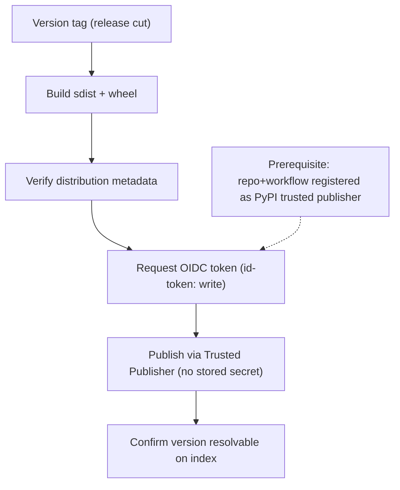
```mermaid
flowchart TD
    A["Version tag (release cut)"] --> B["Build sdist + wheel"]
    B --> C["Verify distribution metadata"]
    C --> D["Request OIDC token (id-token: write)"]
    D --> E["Publish via Trusted Publisher (no stored secret)"]
    E --> F["Confirm version resolvable on index"]
    P["Prerequisite: repo+workflow registered as PyPI trusted publisher"] -.-> D
```

### 13.2 GHCR (GitHub Container Registry)

**Applies to:** `python-service`, `node-service`. **Trigger:** version tag only.
**Runner:** Linux.
**Stages:** build the container image (multi-architecture where required) →
**scan the image for vulnerabilities (gate on high/critical, §11.7) + generate
SBOM + build provenance/attestation (keyless OIDC)** → authenticate to the
registry with the platform token → push the **immutable `semver` tag** with SBOM/
provenance attached → **move the mutable `latest` tag only if this release is the
highest released version** (monotonic guard), under a **per-alias deploy
concurrency group** so a slower older-release deploy cannot regress `latest`
(§8.14).
**Auth:** platform token, `packages: write` + `contents: read`; **no stored
secret**.
**Prerequisites:** a container build definition present (seed-once, §6.3, so the
operator owns it after seeding); package visibility/permissions set so the package
links to the repository.
**DoD:** a real push of a test image (dedicated test namespace, §11.6) and a real
release image on a production tag.

```mermaid
flowchart TD
    A["Version tag (release cut)"] --> B["Build container image (multi-arch if required)"]
    B --> S["Scan image (gate on high/critical) + SBOM + provenance (§11.7)"]
    S --> C["Login to registry with platform token (packages: write)"]
    C --> D["Push immutable semver tag + attach SBOM/provenance"]
    D --> D2["Move latest ONLY if highest released version<br/>(per-alias concurrency group; §8.14)"]
    P["Prerequisite: seed-once container build definition; package linked to repo"] -.-> B
```

### 13.3 Documentation site (Docusaurus → GitHub Pages, multi-version)

**Applies to:** any profile with `docs: true` (§6.1); **opt-in, default off**. The
docs site is built with **Docusaurus** and published to **GitHub Pages**.
**Trigger:** version tag only — each release **adds a new docs version** and moves
the **`latest` alias** to it. **Runner:** Linux (Docusaurus is a Node build; it
runs on Linux even for Python/Swift profiles).

**Inputs (the producer/consumer boundary, §2.9):** the deploy consumes **md/mdx
only** — both the repo's **authored** narrative docs and the **language-emitted**
md/mdx (§12). It never inspects source, never runs a language toolchain, and is
therefore language-agnostic. A language plug-in that emits no md/mdx still yields a
valid narrative-only site.

**Configuration (day-zero, fixed baseline):**
- **Versioning & retention:** Docusaurus native versioning — a **version dropdown**
  and a **`latest` alias** at the newest release. Each cut copies the full docs tree
  into `versioned_docs/version-X/`. **Retention (operator decision, 2026-06): every
  released version's docs are KEPT** — `docs-retention` defaults to 0 (unlimited);
  an operator may set N>0 to cap to the newest N versions, in which case older
  snapshots are pruned on each release. Versioned snapshots live on the published
  **`gh-pages` artifact**, not the source branch. (Replaces the previous mkdocs +
  `mike` setup; append-only and reviewable.)
- **Search:** Algolia DocSearch via `@docusaurus/theme-search-algolia`, **opt-in**
  through the `algolia` profile variable (default off — a fresh docs scaffold builds
  with no search config rather than dead placeholder credentials). When enabled, the
  public application ID, public search API key, and index name thread from the
  `algolia-*` variables (not stored secrets); the operator must provision the
  Algolia index before publishing (§17).
- **Theme/features:** `@docusaurus/preset-classic`, **docs-first** (no blog), with
  the version dropdown and a light/dark toggle; `@docusaurus/theme-mermaid` with
  `markdown.mermaid: true`; sitemap configuration through the classic preset; and
  the first-party Docusaurus ESLint plugin as a blocking docs-site lint.
- **Install hardening:** docs scaffolds include `website/.npmrc` with
  `ignore-scripts=true`, `min-release-age=7`, and `engine-strict=true`; the docs
  package manifest declares Node >=24 and npm >=11, and the docs workflow
  defaults to Node 24 and refuses npm <11 before install.

**Stages:** gather authored + emitted md/mdx → install hardened npm dependencies →
lint the docs site → `docusaurus docs:version` for the release tag (cut a new
version) → **prune only if a retention cap is set (default: keep all)** → build the static site (versioning,
Algolia search UI, Mermaid diagrams, sitemap) → publish to Pages via the platform token →
**move the `latest` alias only if this release is the highest released version**
(monotonic guard), under a **per-alias deploy concurrency group** so a slower
older-release deploy cannot regress `latest`/docs (§8.14).
**Day-zero limitation (conservative monotonic gate):** the implementation gates the
**entire** docs job — version-cut, build, and publish — on the monotonic
"highest-released-version" guard, not just the `latest`-alias move. Consequence: a
release that is **not** the highest (e.g. a backport patch to an older line published
after a newer major already shipped) does **not** retroactively add its own docs
version. This is deliberately conservative: publishing an older release's site without
correctly merging it into the newer published version set risks regressing live docs,
which has no apply-time recompute (§2.12) and is operator-verified only (§9.9). Adding
a non-highest version *without* moving `latest` (a true §13.3 "every release adds a
version") requires merging into the existing `gh-pages` version set and is a
post-day-zero refinement. Likewise the version sources read forward between releases
are persisted as a **time-bounded build artifact** rather than durably from the
published `gh-pages` artifact; a release gap exceeding that window would lose prior
snapshots — also a post-day-zero hardening. Day-zero releases are monotonic, so
neither edge is exercised by the normal release cadence.
**Auth:** platform token, `pages: write` + `id-token: write` + `contents: read`;
**no stored secret**.
**Why a deployment plug-in:** publishing to Pages is a privileged outward publish;
modeling it under §13 (tag-gated, declared privileges) keeps it consistent with
"deployment runs only on a release tag" rather than escaping the deployment
interface.
**Operator prerequisite:** GitHub Pages enabled with the **GitHub Actions** source
(§17).
**DoD:** a real multi-version Pages publish on a tag — the new version is
reachable, the **version dropdown lists it**, the **`latest` alias resolves** to
it, **Algolia search returns results**, Mermaid diagrams render, and
`/sitemap.xml` is present on the published site.

```mermaid
flowchart TD
    A["Version tag (release cut), docs=true"] --> B["Gather md/mdx: authored + language-emitted (§12)"]
    B --> C["docs:version (new version) + prune to retention cap"]
    C --> D["Build Docusaurus site (versioning + Algolia search + Mermaid + sitemap)"]
    D --> E["Publish to Pages (pages: write, no stored secret)"]
    E --> G["Move 'latest' ONLY if highest released version<br/>(per-alias concurrency group; §8.14)"]
    G --> F["Confirm: version in dropdown, 'latest' resolves, search works"]
```

### 13.4 Apple App Store Connect

**Applies to:** `swift-app`. **Trigger:** version tag. **Runner:** **macOS.**
The only day-zero target requiring stored secrets and the only one the system
author cannot verify; specified in full so it can be built and operator-verified.

#### 13.4.1 Pipeline stages
resolve signing assets → build + archive (Xcode) → export a signed distributable →
upload to App Store Connect / TestFlight → optionally submit for review.
(Notarization is **not** a pipeline step for App Store distribution: App Store
builds are notarized **server-side by Apple on ingest**. Notarization would only
apply to Developer-ID/direct distribution, which is out of scope.)

#### 13.4.2 Required stored secrets (declared in the module interface)
App Store Connect API key (issuer ID, key ID, `.p8`); distribution signing
certificate + private key (`.p12`); provisioning profile.

#### 13.4.3 Secret handling
Per §11.4: deploy-job-only, tag-only, protected environment with required
reviewers, ephemeral-runner isolation as the primary guarantee, never reachable by
non-deploy automation. Within the deploy job, stored Apple secrets are scoped to
the individual steps that need them. Caller-controlled version/build-number logic
runs **before** signing assets or App Store Connect private-key material are
installed, so arbitrary versioning commands cannot read Apple credentials.

#### 13.4.4 Required privileges
`contents: read`; all platform authority comes from the App Store Connect API key.

#### 13.4.5 Operator prerequisites (out-of-band)
Enrolled Apple Developer account; app record; registered bundle identifier;
distribution certificate (+ key); provisioning profile; App Store Connect API key
with upload authority; **export-compliance configuration** (encryption
declaration) set in App Store Connect / the app's metadata so uploads/review are
not blocked; a protected deployment environment with required reviewers.

#### 13.4.6 Required inputs
bundle identifier, app/scheme identifiers, export method, team/app identifiers,
and the **monotonic build number** (distinct from the marketing version, §12.3) —
App Store Connect rejects duplicate/non-increasing build numbers.
**Where the build number is set and enforced.** The build number is written into the
version-source (`CURRENT_PROJECT_VERSION`/`CFBundleVersion`) at the **release-proposal**
step (§5.9). For a build-number-bearing version-source format (Swift `.pbxproj`/`.plist`),
the bump **fails loud** if a build number is supplied but no concrete field is found (so a
Swift release can never tag with an un-bumped build number). For non-app version-source
formats that have no build-number field by construction (`pyproject.toml`, `package.json`,
plain `VERSION`), the supplied build number is best-effort: it is **silently ignored** —
the agnostic release workflow passes `--build-number` uniformly without knowing which
version-source the profile uses, so the no-op is intentional and not an error.
The agnostic release process derives the marketing version from SemVer and
re-proves *that* at the tag step; the build number's value is supplied per-run (the run
number, strictly increasing) and its **strict-increase invariant is enforced
authoritatively by App Store Connect at upload** (it rejects duplicate/non-increasing
build numbers). The agnostic tag step deliberately does **not** re-prove monotonicity
(it would require language-specific knowledge of the build-number location and the prior
value — neither belongs in the agnostic core, §9b); Apple is the authoritative gate.

#### 13.4.7 Definition of done (operator-verified exception, §9.9)
The system author cannot verify this. It is "done" only when the **operator**
performs a **real upload to TestFlight** on their Apple account from the pipeline
and confirms the build appears in App Store Connect. The verification must record a
**checkable artifact** — the App Store Connect **build ID / upload receipt** (with
the version + monotonic build number) into the release notes or declaration — so
"operator-verified" is **evidenced**, not a bare attestation.

```mermaid
flowchart TD
    A["Version tag (release cut)"] --> Env{"Protected environment approval (required reviewer)?"}
    Env -- no --> Stop["Halt: not approved"]
    Env -- yes --> B["Load Apple secrets (ephemeral runner; never logged)"]
    B --> C["Build + archive (Xcode, macOS)"]
    C --> D["Export signed distributable"]
    D --> E["Upload to App Store Connect / TestFlight (API key)"]
    E --> F{"Submit for review?"}
    F -- optional --> G["Submit"]
    F -- no --> H["Stop at TestFlight"]
    P["Prereqs: account · app record · bundle id · cert · profile · API key ·<br/>export compliance · monotonic build number"] -.-> B
    V["DoD: operator verifies a real TestFlight upload + records the<br/>App Store Connect build ID / upload receipt"] -.-> E
```

### 13.5 Rollback / yank (manual, day-zero)

Aviato does **not** drive deployment rollback at day zero. A bad release is
handled by the operator using each platform's native mechanism — PyPI **yank**,
GHCR image **delete/retag**, App Store **reject/remove**, and a manual
**de-advance of the floating major reference** — documented per target. An
Aviato-driven, operator-gated rollback flow is a candidate for a later version.

---

## 14. Secret & Credential Model (summary matrix)

| Target | Mechanism | Stored secret? | Job privileges | Runner | Author-verifiable? |
|---|---|---|---|---|---|
| PyPI | OIDC Trusted Publishing | **No** | `id-token: write`, `contents: read` | Linux | Yes (TestPyPI) |
| GHCR | platform token | **No** | `packages: write`, `contents: read` | Linux | Yes (test image) |
| Docusaurus docs (Pages) | platform token | **No** | `pages: write`, `id-token: write`, `contents: read` | Linux | Yes |
| App Store Connect | App Store Connect API key + signing assets | **Yes** | `contents: read` | macOS | **No — operator-verified** |
| File-drift / report automation | platform token (ephemeral) | **No** | read scope + `issues`/`pull-requests: write` | Linux | Yes |
| Settings-drift detection (§5.6) | operator-supplied admin **read** token | **Optional, read-only** | `administration: read` (read branch protection/rulesets) | Linux | Yes |
| Security scanning (baseline, §2.13) | platform token + OIDC | **No** | `security-events: write`, `contents: read` | Linux/macOS | Yes |

Read/propose/report automation carries **no write-capable stored secret** for any
target. The single read-side exception is the **optional, read-only** settings-drift
admin token (§11.2/§11.3): the platform's ephemeral workflow token cannot carry the
`administration` scope branch-protection reads require, so an operator may supply an
admin **read** token scoped to that step alone; it can mutate nothing (apply is the
separate §5.7 operator-gated path). Write/deploy stored secrets exist **only** in the
App Store Connect deploy job, behind a protected environment.

---

## 15. Profile Composition Matrix (day-zero)

Each profile is pure composition of plug-in modules (one strictness level, one
profile per repo).

| Profile | Language plug-in | Deploy plug-ins | Runner | Stored secrets |
|---|---|---|---|---|
| `python-library` | Python | PyPI (+ Docusaurus docs if `docs: true`) | Linux | none |
| `python-service` | Python | GHCR (+ Docusaurus docs if `docs: true`) | Linux | none |
| `python-component` | Python | none — GitHub release only (+ Docusaurus docs if `docs: true`) | Linux | none |
| `node-service` | Node (TS/JS) | GHCR (+ Docusaurus docs if `docs: true`) | Linux | none |
| `swift-app` | Swift | App Store Connect (+ Docusaurus docs if `docs: true`) | macOS | Apple signing/API secrets |

A Consumer adopting a profile receives: that language's scaffold + verify + release
pipelines, the deploy pipeline(s) for its target(s), **the always-on
security-scanning baseline (§2.13)**, baseline branch protection, and the declared
variable/secret requirements. **Documentation is opt-in** (`docs: true`, §6.1,
§13.3): when enabled the consumer also gets the language's md/mdx docs emission and
the multi-version Docusaurus deploy. There is no profile without the security
baseline.

---

## 16. Per-Plug-in Definition of Done

A plug-in is "done" only when **all** hold (these **add to** §9, which applies in
full and is not relaxed — §9 Precedence):

1. It is expressed entirely as generic module kinds, composed by a profile — the
   agnostic core was not edited.
2. Its verify and release pipelines **run green in real CI** on the required runner
   (Linux, or macOS for Swift) — not mocks, not string checks. When `docs: true`,
   the docs emission + Docusaurus build also run green. Verify includes the named
   per-language gates **and** the common lint (actionlint/yamllint/hadolint/
   shellcheck/helm-lint), all blocking.
3. Its deployment pipeline performs a **real publish** to a real target (TestPyPI
   for PyPI; a test image for GHCR; a real **multi-version Docusaurus** Pages
   publish when `docs: true` — new version reachable, `latest` alias resolves,
   Algolia search works, Mermaid renders, and `/sitemap.xml` exists)
   with test-artifact hygiene (§11.6) — **except** App Store Connect,
   operator-verified via a real TestFlight upload (§13.4.7). A **zero-deploy
   profile** (`python-component`) has no deployment pipeline; its DoD is verify +
   release + the security baseline (+ the docs build when `docs: true`) green in
   real CI.
4. Every privilege it needs is **declared** by the pipeline and **granted** by the
   profile; every stored secret it needs is **declared** in its interface and
   confined per §11.4.
5. Deployment runs **only** on a release tag (§11.1), never on PR/fork/schedule.
6. The **baseline security scan set runs and gates** (§2.13, §5.14): SAST,
   secret scanning, dependency scanning, and — for publishers — image scan + SBOM
   + provenance, with the high/critical gate demonstrated on a real run.

---

## 17. Operator Prerequisite Checklist (out-of-band setup)

Required of the operator/consumer before a target can deploy; not produced by
Aviato. Items marked **(probeable)** are surfaced by diagnosis (§5.4); the rest are
adoption-time warnings.

- **PyPI:** register the repo + publishing workflow as a Trusted Publisher on PyPI
  and TestPyPI. **(probeable** that the workflow is configured; the PyPI-side
  registration is an adoption warning.**)**
- **GHCR:** ensure the seed-once container build definition exists **(probeable)**;
  set package visibility/permissions to link the package to the repository.
- **Docusaurus docs (only when `docs: true`):** enable GitHub Pages for the
  repository with the **GitHub Actions** source **(probeable)**. Configure the
  Algolia DocSearch application ID, public search API key, and index name in the
  scaffolded Docusaurus config, or consciously override the search integration.
  The Docusaurus/Node build runs on the standard Linux runner with Node 24/npm 11+.
- **Security baseline (§2.13):** enable code scanning, secret scanning + push
  protection, and Dependabot for the repository **(probeable)**. On private
  repositories these may require the relevant security features to be enabled at
  the org/repo level; surfaced as an adoption warning if unavailable.
- **App Store Connect:** enrolled Apple Developer account; app record; bundle
  identifier; distribution certificate (+ key); provisioning profile; App Store
  Connect API key (issuer ID, key ID, `.p8`); export-compliance configuration; a
  protected deployment environment with required reviewers **(environment
  existence is probeable; Apple-side assets are adoption warnings)**.

---

## 18. Glossary

- **Library** — the central, publishable repository of conventions, modules, and
  tooling. Agnostic core + plug-in modules.
- **Consumer** — a repository that adopts a convention set via the declaration
  contract (§6).
- **Operator** — the single human who initiates privileged actions with their own
  credentials (day-zero single-operator scope, §3.4).
- **Module** — an independently-defined unit of one kind (§3.2) with a declared
  interface.
- **Profile** — a thin manifest composing one bundle of each kind; one per repo;
  contains no logic. A profile **name** is a stable public identity (§6.5).
- **Bundle** — a composition of modules of a single kind (workflows / scaffold /
  settings).
- **Version-source module** — a language plug-in's declaration of where it records
  its version, read/written by the core release process (§3.3).
- **Convention set** — the fully-resolved output of profile resolution (§5.1):
  pipelines, templates, settings, required variables, and version-source.
- **Declaration file** — the Consumer's `.github/aviato.yaml` (§6.1); the only
  interface between Library and Consumer.
- **Managed marker** — the in-file annotation (normative format, §6.2) recording a
  generated file's profile, version, and content-hash.
- **Managed artifact** — a file produced by scaffolding that carries a managed
  marker.
- **Seed-once file** — a file scaffolded only when absent, never overwritten, and
  excluded from drift (§6.3): non-annotatable files and operator-owned source.
- **Overlay** — the §5.3 rule by which, when two templates target the same output
  path, the later/overriding source wins.
- **Drift** — divergence between a Consumer's actual state and its resolved desired
  state. For files, the status enum is **clean**, **mergeable-drift** (safe to
  regenerate), **dirty-drift** (needs human review), or **missing** (§5.4). For
  settings, a change is classified **additive** or **destructive** (§5.6).
- **Reconciliation** — the operator-gated, fail-closed application of desired
  settings to live settings (§5.7).
- **Consent record** — the diff-bound grant on a tracking issue authorizing a
  reconcile (§6.4); the single term for the grant (no "token"/"marker" synonyms).
- **Pin / floating major reference** — the version a Consumer follows: an exact
  version or a major reference that advances on each release (§5.9). **Compatible**
  is defined in §2.6.
- **Bootstrap state** — the Library applying its own conventions and running its
  own pipelines before a release exists, using self-contained local references;
  detected by structure (§5.10).
- **Deployment authorization** — the §2.12 model: release-cut is the human gate,
  plus a protected-environment reviewer gate for secret-bearing deploys.
- **Documentation site** — the Consumer's published docs: a **multi-version
  Docusaurus** site (version dropdown + `latest` alias, Algolia search, Mermaid
  rendering, sitemap, and the classic docs-first preset) built from authored
  md/mdx plus language-emitted API md/mdx (§12) and deployed to GitHub Pages on a
  release tag (§13.3). **Opt-in** via `docs: true` (§6.1); off by default. The
  docs deploy consumes md/mdx only — language-agnostic, never inspecting source
  (§2.9).
- **Security baseline** — the always-on security scanning every profile includes
  (§2.13, §5.14): SAST, secret scanning + push protection, dependency/
  supply-chain scanning, and published-artifact security (image scan + SBOM +
  provenance). Not a tier, not opt-in.
- **Verify baseline** — the opinionated, all-blocking code-quality gates every
  profile runs (§12): one named toolchain per language (Ruff / ESLint+Prettier /
  SwiftLint+swift-format, with strict type-checking) plus the common
  actionlint/yamllint/hadolint/shellcheck/helm-lint. Coverage is measured but not
  gated.
- **SAST** — static application security testing (e.g. CodeQL) run per language;
  results uploaded as SARIF to the platform Security surface.
- **SBOM** — software bill of materials generated for a published artifact.
- **Provenance / attestation** — a signed, verifiable record of how an artifact
  was built (keyless OIDC), attached at publish.
- **Gate (security)** — high/critical findings fail the verify pipeline or block
  the deploy; medium/low report without blocking; secret push-protection always
  blocks (§2.13).
- **Plug-in (language / deployment)** — a collection of generic modules that adds
  language or deployment support without touching the core.
