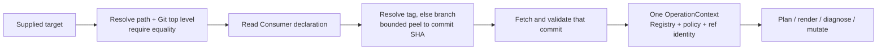
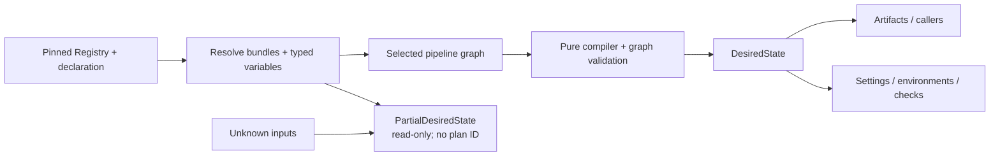
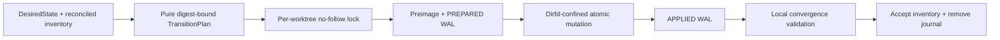

<!-- Split from ARCHITECTURE.md (2026-07-11). -->

## Policy Source

Policy constants should have one canonical source.

The release tag format is:

```text
^(0|[1-9][0-9]*)\.(0|[1-9][0-9]*)\.(0|[1-9][0-9]*)(-(alpha|beta)[0-9]+)?$
```

Accepted examples:

- `1.2.3`
- `1.2.3-alpha1`
- `1.2.3-beta2`

Rejected examples:

- `v1.2.3` (no `v` prefix allowed)
- `1.2.3-beta.1`
- `build-20260519.0215`

The canonical file is `aviato/library/policy.yml`. Ruleset rendering derives from it, and
validation checks any embedded copies needed by GitHub Actions defaults.
Documentation may describe policy, but documentation must not become the source
of truth.

## Consumer Operation Context

Every Consumer operation first resolves the supplied path, asks Git for its
top-level directory, and requires those paths to be equal. Declaration reads,
rendering, and writes happen only after this canonical-root check, so a nested
directory, nonexistent path, or non-repository path cannot become an alternate
operation target. Filesystem aliases such as macOS `/tmp` and `/private/tmp`,
`.` components, and directory symlinks collapse to the same canonical root.

The declaration's pin is then resolved exactly once. Resolution prefers an
exact tag and falls back to an exact branch; either outcome is peeled to a
commit SHA. Aviato downloads that commit, validates the archive and the fetched
policy's canonical Library repository identity, and constructs one immutable
operation context. Its Registry, policy root, requested pin, ref kind, commit
SHA, and repository identity all describe the same temporary snapshot. Every
consumer of Library data in that command uses this context; installed package
data is not a fallback for an unresolved pin.



Bootstrap is the sole alternate source. When both the structural Library
predicate and `bootstrap: true` hold, Aviato copies the operated checkout's
`aviato/library` tree to a temporary snapshot before hashing or reading it. The
context records the checkout Git HEAD and a deterministic digest of that same
copy, and owns removal of the copy when the operation ends.

## Desired-State Compilation

Within that immutable operation context, schema-v2 profiles have one compiler
boundary. Composition selects pipelines and the union of base plus
pipeline-owned template references. The compiler loads only confined data
descriptors and job fragments, validates workflow envelopes, dependencies,
triggers, checks, environments, inputs, secrets, paths, and privilege unions,
then emits deterministic managed callers and the rest of `DesiredState`.



Exact compilation requires complete typed variables. A fresh preview preserves
unknowns and labels definite versus conditional outputs; it has no applicable
plan ID or mutation path. Missing `workflow_schema` means legacy v1. Legacy
snapshots remain usable for read-only diagnosis/offboard and repin source reads,
but generation or graph mutation requires repinning to v2.

## Local Transition Boundary

Compiled state does not mutate a checkout directly. The engine first produces an
immutable `TransitionPlan` whose digest binds the canonical worktree, pinned
snapshot SHA, declaration identity, complete desired bytes and modes, expected
preimage fingerprints, conflicts, notices, and deterministic operation order.
Planning reads state but creates no directory, lock, journal, or consumer file.

Execution acquires a per-worktree no-follow lock in Git administrative storage.
It re-confines and re-fingerprints every path through directory file descriptors,
then records each mutation in a write-ahead log: fsynced preimage, fsynced
`PREPARED`, atomic dirfd-relative replace/delete, parent-directory fsync, and
fsynced `APPLIED`. Managed files and clean retirements precede seed additions,
the seed sidecar, the declaration, and finally the managed inventory. A local
convergence check runs while the journal is still present; only a successful
check accepts the inventory and removes the journal.



An ordinary exception rolls back and verifies every preimage. Interruption or
process death deliberately retains the Git-private journal. Inspection is
read-only; `aviato recover-transition PATH --resume|--rollback --confirm
JOURNAL_ID` is the only mutation path. Resume requires the recorded plan and
requires each target to match either its preimage or desired fingerprint. Any
third state is reported as indeterminate and remains untouched.

## Release Architecture

Release publishing is tag-driven only.

Release workflows must run from tags that match the canonical release format.
Branch-based release *publishing* (legacy `release/*` / `release/latest` publish
branches) is a migration artifact and is rejected by validation. This is distinct
from the release-PR *source* branch (`reusable-release.yml` opens its proposal on a
short-lived `release/<version>` branch and tags from the default branch) — that is
not branch-based publishing and is allowed.

If branch or pull request Docker builds are needed, they should be implemented
as a separate non-release workflow instead of weakening the release workflow.

Release workflows embed release reference validation inline (a `TAG_PATTERN` env
fed to the ref check) so the validation behavior is pinned to the same ref as the
reusable workflow.

Repository validation checks those embedded patterns against `policy.yml`.

### App Store Connect Releases

Apple App Store Connect is the day-zero deployment target for the `swift-app`
profile.

The reusable workflow:

- run only from validated release tags;
- run on a macOS runner;
- require a protected deployment environment with required reviewers;
- load Apple signing and App Store Connect API secrets only in the deploy job;
- scope Apple secrets to the specific steps that need them, after any
  caller-controlled version command has already run;
- build and archive with Xcode;
- export a signed distributable;
- upload to App Store Connect / TestFlight;
- optionally submit for review when explicitly configured;
- emit an upload receipt, then let a separate no-secret/no-consumer-code job
  persist it as a GitHub Release asset and idempotent release-note section.

The caller template collects repository-specific values such as
scheme, workspace or project path, bundle identifier, team ID, export method,
monotonic build number source, and protected environment name.

## Branch Protection Architecture

The architecture uses "default branch" terminology. `main` is only an example
default branch name.

Rulesets should target GitHub's `~DEFAULT_BRANCH` selector where possible.
Reports and command output should use names such as
`default_branch_requires_pr`, not `main_requires_pr`.
