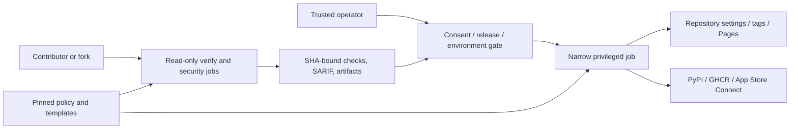

# Security architecture

The [`threat model`](../security/threat-model.md) defines risks, the
[`controls inventory`](../security/controls.md) defines mitigations, and the
[`traceability matrix`](../requirements/traceability.md) records evidence.

## Control placement

| Boundary | Threats | Controls |
|---|---|---|
| Consumer/fork code → workflow | THREAT-001, THREAT-002 | SEC-001, SEC-002, SEC-003 |
| Dependency/template → execution | THREAT-003, THREAT-008 | SEC-004, SEC-009 |
| Verify → publish | THREAT-004, THREAT-005, THREAT-010 | SEC-002, SEC-003, SEC-005 |
| Operator → protected mutation | THREAT-006 | SEC-006, SEC-007 |
| Credentials → job/filesystem | THREAT-007 | SEC-001, SEC-008 |
| Source/release → security gate | THREAT-009 | SEC-007, SEC-010 |

Privileged jobs do not trust read-shaped API responses as write payloads and do
not rebuild verified artifacts. External platforms remain outside Aviato's
control; their required reviewers, ruleset state, registry identity, and Pages
configuration therefore require explicit live evidence in traceability.
