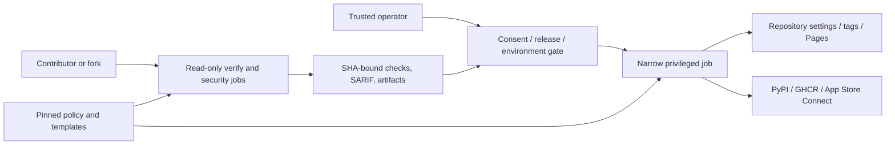

# Security architecture

The [`threat model`](../security/threat-model.md) defines risks, the
[`controls inventory`](../security/controls.md) defines mitigations, and the
[`traceability matrix`](../requirements/traceability.md) records evidence.

## Control placement

| Boundary | Threats | Controls |
|---|---|---|
| Consumer/fork code → workflow | THREAT-001, THREAT-002 | SEC-001, SEC-002, SEC-003 |
| Dependency/template → execution | THREAT-003, THREAT-008 | SEC-004, SEC-009 |
| Verify → publish | THREAT-004, THREAT-005, THREAT-010 | SEC-002, SEC-003, SEC-005 |
| Operator → protected mutation | THREAT-006 | SEC-006, SEC-007 |
| Credentials → job/filesystem | THREAT-007 | SEC-001, SEC-008 |
| Source/release → security gate | THREAT-009 | SEC-007, SEC-010 |

Privileged jobs do not trust read-shaped API responses as write payloads and do
not rebuild verified artifacts. External platforms remain outside Aviato's
control; their required reviewers, ruleset state, registry identity, and Pages
configuration therefore require explicit live evidence in traceability.

## Managed release authorization

Release proposal and promotion are separate trust phases. Default-branch
pushes may open or update a release proposal but cannot create tags, floating
tags, releases, OIDC tokens, or deployments. Closed promotion mode binds the
merged SHA, tag, actual actor, and one fresh signed checkpoint digest. The
checkpoint uses a concrete current user reviewer distinct from collector,
submitter, and release actor; team-membership assertions alone are rejected.
Each privileged job revalidates that checkpoint before environment secrets,
OIDC, or hosted mutation.

Authority revalidation uses a dedicated read-only GitHub App token, not an
ambient token whose effective Administration visibility is repository-policy
dependent. The required installation and two Actions secrets are documented in
the [release verifier App prerequisite](../security/release-verifier-app.md).
The token is repository-scoped and step-scoped; a capability probe proves the
required read surfaces before privilege. The signed checkpoint binds the
verifier's Git blob identity, and each hosted mutation executes locally
hash-verified verifier bytes in memory immediately before the write.

App Store Connect uses three runners: unsigned Consumer build and attestation
without secrets, trusted archive validation/sign/upload behind the protected
environment, and optional custom submission without secrets. No runner both
executes Consumer-controlled source and receives Apple signing material.

Composite confirmations bind the full before-state and exact ruleset payload
fingerprints. There is no degraded tag-rule flag or implied-safe fallback: a
platform rejection remains non-ready and requires a newly previewed supported
policy. Lost responses are resolved only by semantic readback; unreadable
state is indeterminate and is never blindly retried.

## Privileged manifest review trust root

The privileged execution manifest covers every job that can write, receives a
secret or protected environment, performs a hosted mutation or attestation, or
produces an authority value consumed by one of those jobs. Producer enrollment
is recursive. Each contract binds workflow and job defaults, environment,
permissions, dependencies, outputs, container, services, and every step.
Runtime/startup injection variables are forbidden at workflow, job, and step
scope.

Mechanical regeneration requires the protected pending review anchor. Every
activation or renewal must change both its UUIDv4 request ID and 32-byte nonce;
the collector rejects an unchanged or replayed anchor. Approved packaging never
promotes that source declaration. It overlays the separately signed, freshly
live-verified consumed envelope only in an outside-checkout Git-tree export. The
protected policy requires two distinct non-author
approvals, code-owner review, stale-review dismissal, and last-push approval.
`aviato validate` accepts a well-formed `pending` record because absent GitHub
identities are a declared manual prerequisite, not a source-schema defect.
Repository creation and every confirmation-bound protection write fail closed
while the packaged attestation remains pending.

Before onboarding repositories, an operator must populate real reviewer or
team database IDs in `privileged-review-policy.json`, add the corresponding
independent eligible code owner or team to every privileged CODEOWNERS route,
apply the default-branch ruleset with the declared two-approval policy, obtain
two distinct non-author approvals after the last push and no later than merge
for the exact manifest/policy/CODEOWNERS hashes, then collect, sign offline, and
verify the immutable approval envelope. The source anchor remains honestly pending.
Reviewer identities must come from GitHub; they must never be guessed or
synthesized.
