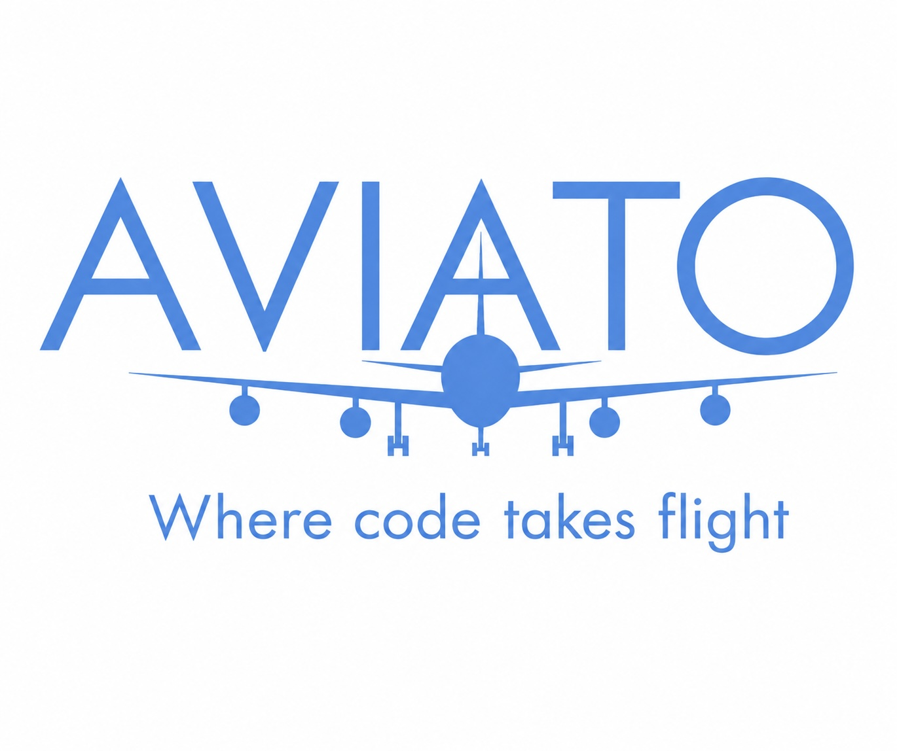

# Aviato

{ width="520" }

Aviato is a reusable GitHub policy, CI, release, and onboarding conventions
library. It centralizes shared workflows, rulesets, and operator tooling
without keeping a committed inventory of consumer repositories: it ships
reusable Actions workflows, ruleset payloads, caller templates, a copy-paste
starter kit, and an operator-run Python CLI (`aviato`).

## Where to start

- **[Architecture](architecture/overview.md)** — the agnostic core engine,
  plug-in module data, rendering pipeline, and validation gate.
- **[Requirements](requirements/README.md)** — the living record of what the
  system must do and why, with the § index used throughout the codebase.
- **[Specifications](specifications/README.md)** — precise, testable process
  flows for each module (onboarding, drift, reconcile, deployment, …).
- **[Security](security/threat-model.md)** — threat model and
  [controls](security/controls.md).

## Key conventions

- **Release publishing is tag-only.** Release tags must match the policy
  pattern (`1.2.3`, `1.2.3-alpha1`, `1.2.3-beta2`; no `v` prefix).
- **Policy lives in data.** `aviato/library/policy.yml` is the canonical source
  for policy constants; validation keeps every embedded copy in sync.
- **The core is agnostic.** Language- and deployment-specific knowledge lives
  as plug-in data under `aviato/library/`, never in `aviato/core/`.
