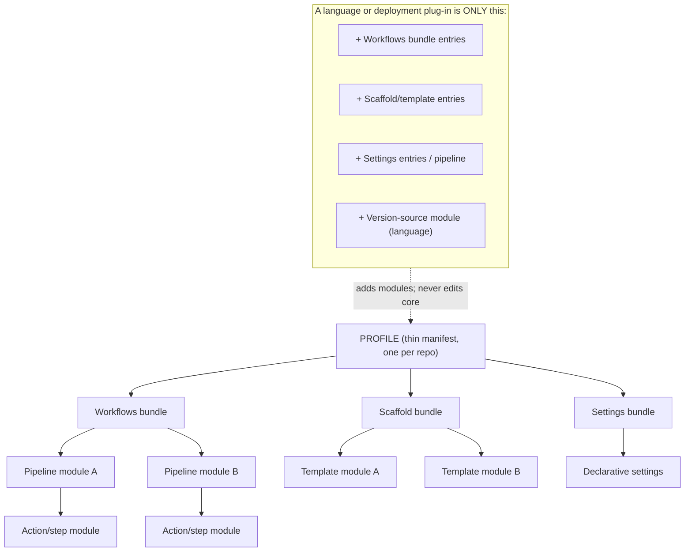
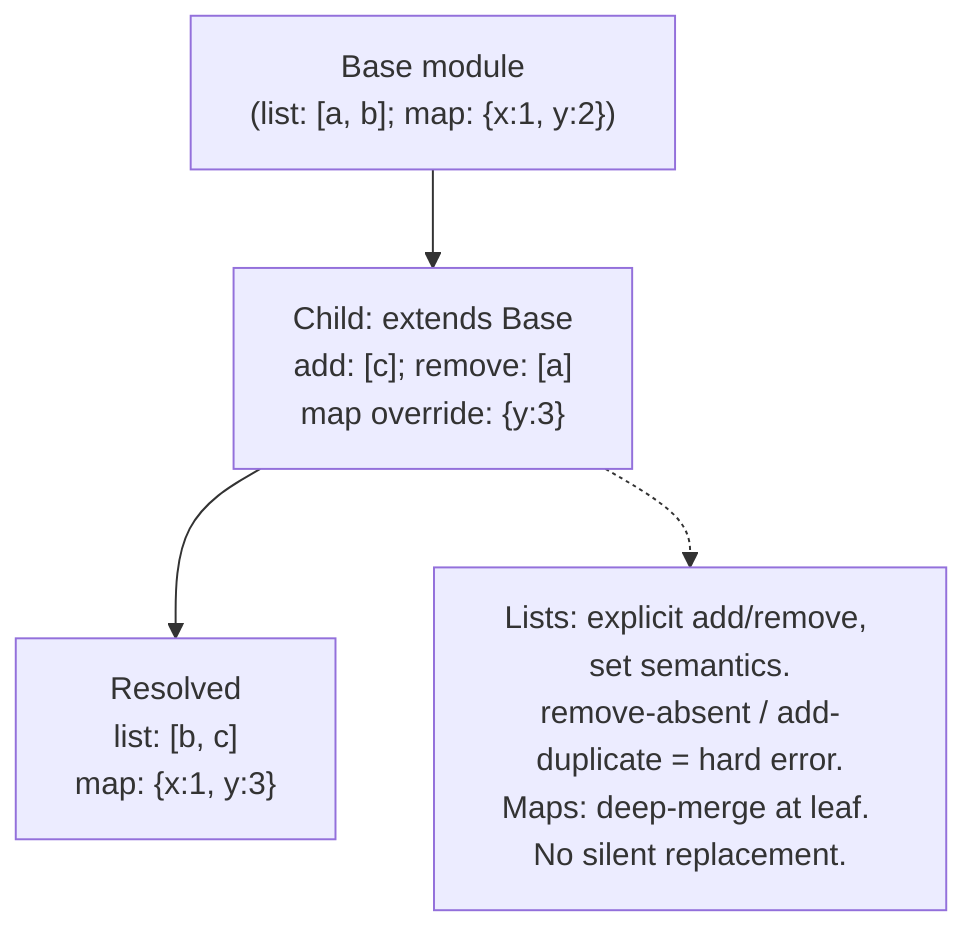
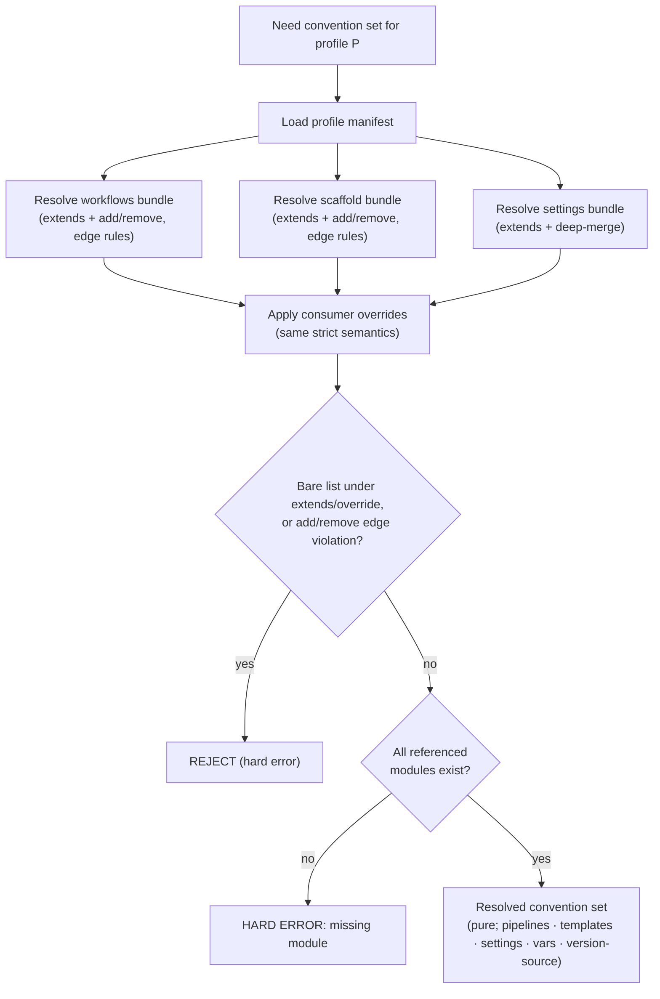

<!-- Split from REQUIREMENTS.md (2026-07-11) - section numbering preserved verbatim. Index: docs/requirements/README.md -->

## 4. The Modularity Model

### 4.1 Composition: a profile is an assembly of modules

A profile composes exactly one workflows-bundle, one scaffold-bundle, and one
settings-bundle. There is **one profile per Consumer** (§3 scope) and **one
baseline strictness level** (no tiers).

### 4.2 Inheritance and override semantics (explicit, never silent)

Bundles and profiles may inherit from a base of the same kind. The semantics are
strict because the common failure is a child **silently losing** something it
should have kept.

- A module may `extend` another module of the same kind.
- **List-valued** properties (the set of pipelines, templates, required checks)
  are modified with **explicit `add` / `remove` operations only**. A child never
  restates a bare list (which would silently replace).
- **Map-valued** properties are merged by **deep merge** at the leaf — a child
  overriding one nested key must not drop sibling keys.
- **Edge-case rules (normative):**
  - `remove` of an element **not present** in the resolved base → **hard error**
    (it signals a stale assumption; fail loud).
  - `add` of an element **already present** → **hard error** (signals a redundant
    or conflicting intent).
  - `add` and `remove` of the **same element in the same layer** → **hard error**.
  - **Ordering is deterministic:** ancestors resolve before descendants;
    list membership uses **set semantics** (no duplicates).
  - **Same-output-path collisions** in the scaffold set are resolved by overlay
    order (§5.3): the later/overriding source wins; ties at the same level are an
    error, not a silent pick.
    **Day-zero behavior (conservative):** the implementation treats **every**
    same-output-path collision in the applicable set as a **hard error**
    (`onboarding.check_output_collisions`), not just same-level ties. Cross-level
    overlay *resolution* (a descendant template deliberately overriding an ancestor's
    output) is **deferred**: silently letting a later source win is exactly the §8.1
    "child silently loses an inherited entry" failure mode, so day-zero fails loud
    rather than resolve. Day-zero profiles compose **no** two applicable templates at
    one path (variant-exclusive templates are filtered by `when` before this check),
    so the resolution branch is never legitimately exercised; implementing an explicit,
    reviewable cross-level override is a post-day-zero refinement.

### 4.3 Adding a capability = adding a module

To support a new language, documentation generator, release mechanism, or
deployment target, the **only** permitted change is to **add modules** that
conform to §3.2 and to reference them from a profile. The core engine is not
touched. If a new capability seems to require editing the core, that is a signal
the core abstraction is wrong and must be revisited — not a license to
special-case.

---

## 5. Process Flows

Each subsection states trigger, actor, preconditions, steps, outputs, and failure
handling, followed by a diagram. All flows are language- and
deployment-agnostic; where a flow would call a language- or deployment-specific
unit, it calls it **through a module reference**, never by name.

### 5.1 Profile resolution & composition (pure)

**Trigger:** any process needing a concrete convention set.
**Actor:** core engine.
**Steps:** load the named profile → resolve each referenced bundle, applying
`extends` + `add`/`remove` for lists (with §4.2 edge-case rules) and deep-merge
for maps → apply Consumer overrides under the same rules → produce a
fully-resolved convention set (pipelines, templates, settings, required
variables, version-source).
**Purity:** *profile/bundle composition is pure and deterministic* (no side
effects). **Variable resolution (§5.2) is a separate, impure step** — it reads
host state — and its results are captured into the declaration so downstream
composition stays reproducible.
**Failure handling:** a bare list under `extends`/override is rejected; a missing
referenced module is a hard error; §4.2 edge-case violations are hard errors.

