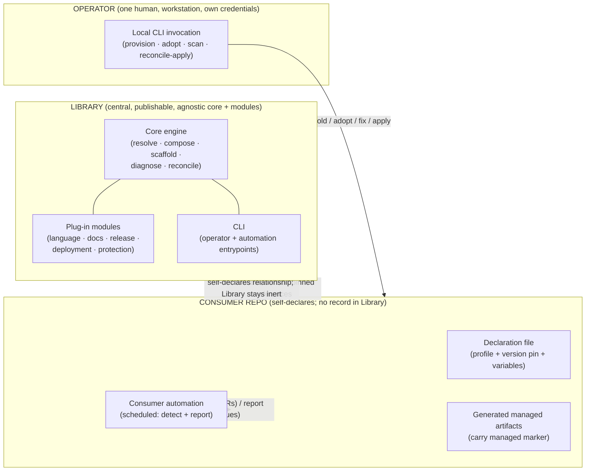

<!-- Split from REQUIREMENTS.md (2026-07-11) - section numbering preserved verbatim. Index: docs/requirements/README.md -->

## 3. System Structure

### 3.1 The three actors and the boundary between them

### 3.2 Module taxonomy

Everything in the Library is one of a small number of module kinds. Each kind has
a single responsibility and a defined interface.

| Module kind | Responsibility | Provides | Requires |
|---|---|---|---|
| **Core engine** | Resolution, composition, scaffolding, diagnosis, reconciliation logic. Agnostic. | The processes in §5 | Conforming modules |
| **Profile** | Thin manifest naming one bundle of each kind. No logic. | A named, resolvable convention set | Bundles |
| **Workflows bundle** | The set of automation pipelines a profile attaches. | Ordered list of pipeline references | Pipeline modules |
| **Scaffold bundle** | The set of managed files a profile materializes. | Ordered list of template references | Template modules |
| **Settings bundle** | The desired protected-resource settings a profile enforces. | Declarative settings map | — |
| **Template module** | One generated artifact's content + render inputs. | A renderable artifact + its required variables | Variable values |
| **Action/step module** | One reusable automation unit. | A callable automation unit | Inputs it declares |
| **Pipeline module** | One reusable automation pipeline composed of action/step modules. | A callable pipeline + typed inputs/outputs | Action modules; declared privileges |
| **Version-source module** | Where and how a language records its version. | Read/write of the version location(s) | — |
| **Language plug-in** | Everything specific to one language, expressed only as the bundles/templates/pipelines/version-source above. | A language's bundles/templates/pipelines/version-source | Core interfaces only |
| **Deployment plug-in** | Everything specific to one deployment target, expressed only as pipeline + settings modules. | A target's pipeline + required privileges/inputs/secrets | Core interfaces only |
| **Docs** | Human-facing description of conventions and processes. | Convention/process reference | — |

### 3.3 Structural rules

- The **core engine has no dependency on any language or deployment plug-in.**
  Dependencies point inward (plug-ins depend on core interfaces), never outward.
  This is falsifiable — see the core-level Definition of Done (§9).
- A **profile** depends only on bundles. A **bundle** depends only on the modules
  of its kind.
- **Version bumping is core orchestration over a plug-in interface.** The core
  Release process (§5.9) does not know any language's version location; it calls
  the language plug-in's **version-source module** (§3.2) to read/write the
  version. Version locations are plug-in data, never core logic.
- A **language plug-in** and a **deployment plug-in** are *just* collections of
  the generic module kinds — they introduce no new core concept.
- The **Consumer contract** (§6) is the only interface between Library and
  Consumer, and it is declarative.

### 3.4 Single-operator scope (day-zero non-goal)

The "Operator" is one human. Concurrent operators, an operator-as-role/team
model, operator handoff/offboarding, and arbitration between two humans applying
to the same Consumer are **explicit non-goals** at day zero. The consent model
(§5.7) binds to a single granter accordingly. This limitation is documented so it
is a known boundary, not an accidental gap.

---
