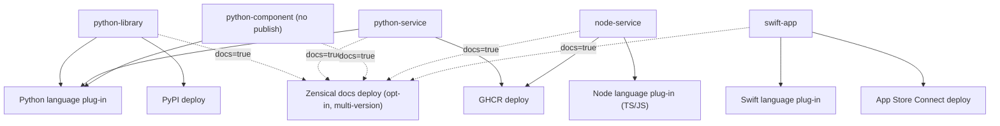

<!-- Split from REQUIREMENTS.md (2026-07-11) - section numbering preserved verbatim. Index: docs/requirements/README.md -->

## 10. Day-Zero Scope

### 10.1 Languages and deployment targets

| Plug-in | Kind | Realizes |
|---|---|---|
| **Python** | Language | lint/format, type-check, test+coverage, build, API-docs emission (md/mdx) |
| **Node (TypeScript + JavaScript)** | Language | lint/format, type-check (TS), test+coverage, build, API-docs emission (md/mdx, TypeDoc) |
| **Swift** | Language | lint/format, build, test (macOS), narrative-docs emission (md/mdx) |
| **PyPI** | Deployment | publish distributions via OIDC Trusted Publishing (no stored secret) |
| **GHCR** | Deployment | build + push container images via the platform token (no stored secret) |
| **Docs site (GitHub Pages / Zensical)** | Deployment | build a multi-version Zensical site from emitted md/mdx and publish to Pages on a release tag via the platform token (no stored secret); opt-in via `docs: true` |
| **Apple App Store Connect** | Deployment | sign + archive + upload to TestFlight/App Store (stored Apple secrets, macOS) |

Out of day-zero scope: npm/library publishing for Node; **static-site Node hosting**
(Node deploys only as a GHCR container day-zero; static export → Pages/CDN is a
noted future target, not built); tiers (`standard`/`hardened`); monorepo/
multi-profile/library-and-service-in-one-repo; multi-operator; Aviato-driven
deployment rollback (manual per target, §13.5).

### 10.3 Composition (one profile per repo, no tiers)

A profile composes one language plug-in + **zero or more** deployment plug-ins,
with no tier overlay (single baseline). The day-zero profiles:

**Day-zero profiles:** `python-library`, `python-service`, `python-component`,
`node-service`, `swift-app` — one strictness level each, one profile per repo.
`python-component` is the **zero-deploy** profile: Python verify + release
(GitHub release/tag) + security baseline + opt-in docs, with **no deployment
plug-in** (publishes to no index/registry; the GitHub release is the only output,
which is also what a HACS integration or a not-yet-published library consumes).
Its GitHub-release **source assets** (no built distribution or image) are **not** a
published artifact in the §11.7 sense, so image-scan/SBOM/provenance do not apply;
the source is still covered by SAST + dependency + secret scanning (§2.13). If a
component later attaches a **built** asset, the §11.7 artifact-security gate applies
to that asset. Pure composition; no core change, no logic in the profile.

---

## 15. Profile Composition Matrix (day-zero)

Each profile is pure composition of plug-in modules (one strictness level, one
profile per repo).

| Profile | Language plug-in | Deploy plug-ins | Runner | Stored secrets |
|---|---|---|---|---|
| `python-library` | Python | PyPI (+ Zensical docs if `docs: true`) | Linux | none |
| `python-service` | Python | GHCR (+ Zensical docs if `docs: true`) | Linux | none |
| `python-component` | Python | none — GitHub release only (+ Zensical docs if `docs: true`) | Linux | none |
| `node-service` | Node (TS/JS) | GHCR (+ Zensical docs if `docs: true`) | Linux | none |
| `swift-app` | Swift | App Store Connect (+ Zensical docs if `docs: true`) | macOS | Apple signing/API secrets |

A Consumer adopting a profile receives: that language's scaffold + verify + release
pipelines, the deploy pipeline(s) for its target(s), **the always-on
security-scanning baseline (§2.13)**, baseline branch protection, and the declared
variable/secret requirements. **Documentation is opt-in** (`docs: true`, §6.1,
§13.3): when enabled the consumer also gets the language's md/mdx docs emission and
the multi-version Zensical deploy. There is no profile without the security
baseline.

---

## 16. Per-Plug-in Definition of Done

A plug-in is "done" only when **all** hold (these **add to** §9, which applies in
full and is not relaxed — §9 Precedence):

1. It is expressed entirely as generic module kinds, composed by a profile — the
   agnostic core was not edited.
2. Its verify and release pipelines **run green in real CI** on the required runner
   (Linux, or macOS for Swift) — not mocks, not string checks. When `docs: true`,
   the docs emission + Zensical build also run green. Verify includes the named
   per-language gates **and** the common lint (actionlint/yamllint/hadolint/
   shellcheck/helm-lint), all blocking.
3. Its deployment pipeline performs a **real publish** to a real target (TestPyPI
   for PyPI; a test image for GHCR; a real **multi-version Zensical** Pages
   publish when `docs: true` — new version reachable, `latest` alias resolves,
   Zensical's built-in search works, Mermaid renders, and `/sitemap.xml` exists)
   with test-artifact hygiene (§11.6) — **except** App Store Connect,
   operator-verified via a real TestFlight upload (§13.4.7). A **zero-deploy
   profile** (`python-component`) has no deployment pipeline; its DoD is verify +
   release + the security baseline (+ the docs build when `docs: true`) green in
   real CI.
4. Every privilege it needs is **declared** by the pipeline and **granted** by the
   profile; every stored secret it needs is **declared** in its interface and
   confined per §11.4.
5. Deployment runs **only** on a release tag (§11.1), never on PR/fork/schedule.
6. The **baseline security scan set runs and gates** (§2.13, §5.14): SAST,
   secret scanning, dependency scanning, and — for publishers — image scan + SBOM
   + provenance, with the high/critical gate demonstrated on a real run.

---

## 17. Operator Prerequisite Checklist (out-of-band setup)

Required of the operator/consumer before a target can deploy; not produced by
Aviato. Items marked **(probeable)** are surfaced by diagnosis (§5.4); the rest are
adoption-time warnings.

- **PyPI:** register the repo + publishing workflow as a Trusted Publisher on PyPI
  and TestPyPI. **(probeable** that the workflow is configured; the PyPI-side
  registration is an adoption warning.**)**
- **GHCR:** provide the container build definition (operator-owned, probed — never seeded, R5-6) **(probeable)**;
  set package visibility/permissions to link the package to the repository.
- **Zensical docs (only when `docs: true`):** enable GitHub Pages for the
  repository with the **GitHub Actions** source **(probeable)**. Search is
  Zensical's built-in search — no external search service to configure.
  The Zensical build is a Python/pip toolchain and runs on the standard Linux runner.
- **Security baseline (§2.13):** enable code scanning, secret scanning + push
  protection, and Dependabot for the repository **(probeable)**. On private
  repositories these may require the relevant security features to be enabled at
  the org/repo level; surfaced as an adoption warning if unavailable.
- **App Store Connect:** enrolled Apple Developer account; app record; bundle
  identifier; distribution certificate (+ key); provisioning profile; App Store
  Connect API key (issuer ID, key ID, `.p8`); export-compliance configuration; a
  protected deployment environment with required reviewers **(environment
  existence is probeable; Apple-side assets are adoption warnings)**.

---
