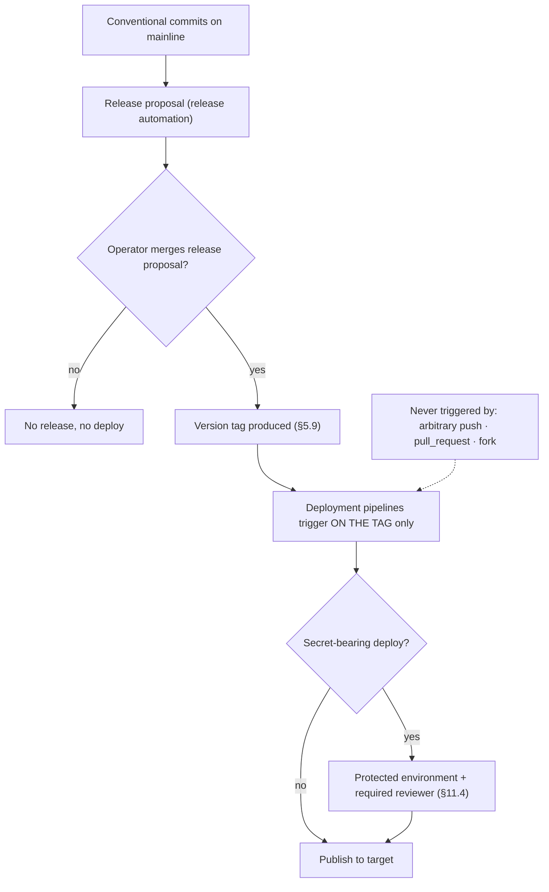

<!-- Split from REQUIREMENTS.md (2026-07-11) - section numbering preserved verbatim. Index: docs/requirements/README.md -->

## 11. Cross-Cutting Deployment Requirements

### 11.1 The release is the human gate

Per §2.12, the authorizing human action is **cutting the release** (§5.9); the
resulting tag triggers deployment automatically. Deployments do **not** run on
arbitrary pushes, pull requests, or fork events. Secret-bearing deploys add a
protected-environment reviewer gate (§11.4).

**Trigger mechanism (platform constraint).** The conceptual trigger is the version
tag. GitHub, however, does **not** start a new workflow run for a tag (or any event)
pushed with the platform `GITHUB_TOKEN` — this is an anti-recursion guarantee, not an
Aviato choice — and §11.2 forbids a stored PAT/App token to work around it. Two
sanctioned mechanisms therefore realize "deploy on the tag" without a stored secret:

- **Automated release (default):** the release job tags the merged release-bump
  commit and then runs the deployment pipelines as **in-run downstream jobs of the
  same run**, passing the just-created tag as `release-tag`. The deploy still builds
  from the tag ref and is still gated by the release gate (merged-PR check) and the
  release-ref security baseline. Docs publish, which is a separate workflow, is
  triggered via `workflow_run` on the main pipeline's completion (not subject to the
  token suppression) and likewise deploys only when the head commit carries a fresh
  release tag.
- **Manual tag push:** an operator pushing the tag with their own credentials (or via
  out-of-band automation, §17) triggers the deploy workflows directly in the classic
  tag-ref context. The same workflows accept this path with no `release-tag` input.

Both paths converge on the same gated, tag-pinned deploy; deployments still never run
on arbitrary push, pull_request, or fork events.

For callers that pass `release-tag`, the surrounding event SHA can be a descendant of
the release (notably after a `workflow_run`). The release gate therefore peels the
named tag to its commit and threads that resolved SHA through ancestry, tag-equality,
merged-PR, and required-workflow checks. In the classic tag-ref context it peels
`GITHUB_SHA` instead. The branch policy is reachability via
`git merge-base --is-ancestor`; it intentionally does not require the release commit
to remain the current default-branch tip.

### 11.2 Credential posture: OIDC-first, stored secrets only where unavoidable

- Prefer keyless/OIDC or the platform token for every target that supports it.
  PyPI uses OIDC Trusted Publishing; GHCR and Pages use the platform token. None
  store a long-lived secret.
- Stored secrets for **deployment** are permitted **only** where the platform offers
  no OIDC path. Day zero, that is **Apple App Store Connect alone**.
- The zero-stored-secret posture of all read/propose/report automation (§6.6) is
  never weakened **on the write side**: no read/propose/report automation carries a
  stored secret that can *mutate* anything. The platform-issued workflow token is
  **not** a stored secret — it is ephemeral — so read automation that needs an
  elevated *read* scope it can obtain from the workflow token carries no stored secret.
- **One narrow read-side exception (settings-drift, §5.6/§11.3).** Reading branch
  protection and rulesets requires the `administration` scope, which the platform's
  ephemeral workflow token **does not and cannot** carry — so settings-drift detection
  is the single place an operator may supply a stored **admin-scoped READ token**. This
  exception is tightly bounded and does **not** weaken the posture above: the token is
  **optional** (settings-drift skips fail-closed without it, §5.6), **read-only** (it
  performs no mutation — apply is the separate operator-gated §5.7 path under the
  operator's own credentials, never this automation), **scoped to its own step alone**
  (§11.3 — never visible to the file-drift writes, the install step, or any deploy/PR/
  fork-triggered workflow), and supplied by the operator, not embedded by the Library.
  It is a read credential of last resort, not a deploy secret.

### 11.5 Runner requirements

| Plug-in | Runner |
|---|---|
| Python, Node, PyPI, GHCR, Zensical docs | Linux |
| Swift, App Store Connect | **macOS** |

A profile composing a macOS-only plug-in requires macOS runners; this is a
declared profile requirement.

### 11.6 Definition of done for a deployment plug-in

Per §9, a deployment plug-in is done only on a **real, non-mocked publish** to a
real target — **except** App Store Connect (operator-verified, §13.4.7).
**Test-artifact hygiene:** verification publishes use a **unique/throwaway or
dev-suffixed version** and a **dedicated test namespace/package** so the DoD is
re-runnable without colliding on immutable indexes (e.g. PyPI forbids re-uploading
a version); test artifacts have a stated cleanup expectation.

### 11.7 Published-artifact security gate

Every deploy that publishes an artifact runs, **before publishing**, the
published-artifact security set (§2.13): a **container image vulnerability scan**
(for image publishers), **SBOM generation**, and **build provenance/attestation**
(keyless OIDC). A **high/critical** image vulnerability **gates the publish**
(fails the deploy); the SBOM and provenance are attached to the published
artifact. Runs on the platform token / OIDC — no stored secret. (App Store
Connect, §13.4, is exempt from image scan; its signing is platform-side.)

**Severity-filtered vs strict gates (scanner capability note).** The "high/critical
blocks, medium/low reports" policy assumes the scanner exposes per-vuln severity
inline. The GHCR pipeline uses Trivy, which supports `--severity HIGH,CRITICAL`,
so it filters as specified. The PyPI pipeline uses `pip-audit` against the OSV/PyPA
service, which does NOT emit severity in its `--format json` output (each vuln carries
only `id`/`fix_versions`/`aliases`/`description`). For the PyPI gate the pessimistic
fail-closed posture is therefore `pip-audit --strict` — any reported finding blocks
the publish (medium/low are still reported in the run log, just not separately gated).
A future severity-aware PyPI gate would require switching scanners (osv-scanner) or
doing a separate OSV/NVD lookup per vuln id.

---

## 13. Deployment Plug-ins

Each is a pipeline module (plus declared privileges, inputs, prerequisites, and —
only where unavoidable — secrets), triggered on a release tag (§11.1).

### 13.5 Rollback / yank (manual, day-zero)

Aviato does **not** drive deployment rollback at day zero. A bad release is
handled by the operator using each platform's native mechanism — PyPI **yank**,
GHCR image **delete/retag**, App Store **reject/remove**, and a manual
**de-advance of the floating major reference** — documented per target. An
Aviato-driven, operator-gated rollback flow is a candidate for a later version.

---

## 14. Secret & Credential Model (summary matrix)

| Target | Mechanism | Stored secret? | Job privileges | Runner | Author-verifiable? |
|---|---|---|---|---|---|
| PyPI | OIDC Trusted Publishing | **No** | `id-token: write`, `contents: read` | Linux | Yes (TestPyPI) |
| GHCR | platform token | **No** | `packages: write`, `contents: read` | Linux | Yes (test image) |
| Zensical docs (Pages) | platform token | **No** | `contents: write` (push job only; build job read-only) | Linux | Yes |
| App Store Connect | App Store Connect API key + signing assets | **Yes** | `contents: read` | macOS | **No — operator-verified** |
| File-drift / report automation | platform token (ephemeral) | **No** | read scope + `issues`/`pull-requests: write` | Linux | Yes |
| Settings-drift detection (§5.6) | operator-supplied admin **read** token | **Optional, read-only** | `administration: read` (read branch protection/rulesets) | Linux | Yes |
| Security scanning (baseline, §2.13) | platform token + OIDC | **No** | `security-events: write`, `contents: read` | Linux/macOS | Yes |

Read/propose/report automation carries **no write-capable stored secret** for any
target. The single read-side exception is the **optional, read-only** settings-drift
admin token (§11.2/§11.3): the platform's ephemeral workflow token cannot carry the
`administration` scope branch-protection reads require, so an operator may supply an
admin **read** token scoped to that step alone; it can mutate nothing (apply is the
separate §5.7 operator-gated path). Write/deploy stored secrets exist **only** in the
App Store Connect deploy job, behind a protected environment.

## Settled decisions — do not reopen

- §11.6/§13.5/SEC-005 rollback/yank proof PROVEN 2026-07-18 — all four deployment legs executed or documented: GHCR registry rollback demonstrated live (deleted the bad-release manifest/arch/attestation versions on amattas/aviato-proof-ghcr's package; registry rolled back to the prior good releases, `latest` removed alongside the bad manifest); floating-major tag hand-de-advanced from the bad release's commit back to the prior good commit; PyPI leg proven via the §13.1 TestPyPI yank (pending operator UI click); docs-site leg is git-revertable by design (documented mechanism, no live demo needed — reverting the `gh-pages` branch is a plain git revert). See [traceability §11.6, §13.5, SEC-005](../../traceability.md) and the [2026-07-18 evidence record](../../evidence/2026-07-18-deploy-proofs.md).

---
