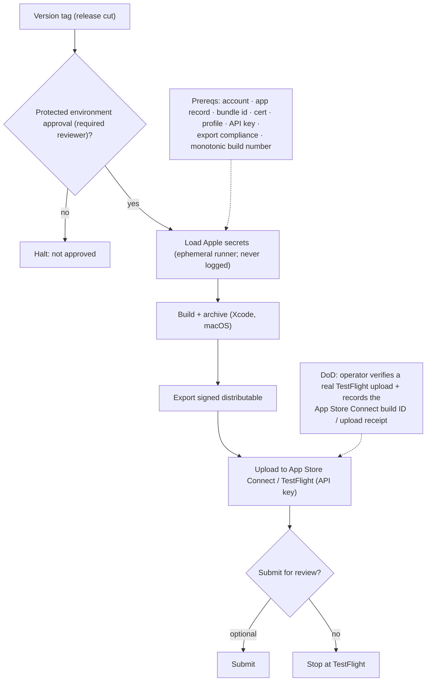

<!-- Split from REQUIREMENTS.md (2026-07-11) - section numbering preserved verbatim. Index: docs/requirements/README.md -->

### 13.4 Apple App Store Connect

**Applies to:** `swift-app`. **Trigger:** version tag. **Runner:** **macOS.**
The only day-zero target requiring stored secrets and the only one the system
author cannot verify; specified in full so it can be built and operator-verified.

#### 13.4.1 Pipeline stages
resolve signing assets → build + archive (Xcode) → export a signed distributable →
upload to App Store Connect / TestFlight → optionally submit for review.
(Notarization is **not** a pipeline step for App Store distribution: App Store
builds are notarized **server-side by Apple on ingest**. Notarization would only
apply to Developer-ID/direct distribution, which is out of scope.)

#### 13.4.2 Required stored secrets (declared in the module interface)
App Store Connect API key (issuer ID, key ID, `.p8`); distribution signing
certificate + private key (`.p12`); provisioning profile.

#### 13.4.3 Secret handling
Per §11.4: deploy-job-only, tag-only, protected environment with required
reviewers, ephemeral-runner isolation as the primary guarantee, never reachable by
non-deploy automation. Within the deploy job, stored Apple secrets are scoped to
the individual steps that need them. Caller-controlled version/build-number logic
runs **before** signing assets or App Store Connect private-key material are
installed, so arbitrary versioning commands cannot read Apple credentials.

#### 13.4.4 Required privileges
`contents: read`; all platform authority comes from the App Store Connect API key.

#### 13.4.5 Operator prerequisites (out-of-band)
Enrolled Apple Developer account; app record; registered bundle identifier;
distribution certificate (+ key); provisioning profile; App Store Connect API key
with upload authority; **export-compliance configuration** (encryption
declaration) set in App Store Connect / the app's metadata so uploads/review are
not blocked; a protected deployment environment with required reviewers.

#### 13.4.6 Required inputs
bundle identifier, app/scheme identifiers, export method, team/app identifiers,
and the **monotonic build number** (distinct from the marketing version, §12.3) —
App Store Connect rejects duplicate/non-increasing build numbers.
**Where the build number is set and enforced.** The build number is written into the
version-source (`CURRENT_PROJECT_VERSION`/`CFBundleVersion`) at the **release-proposal**
step (§5.9). For a build-number-bearing version-source format (Swift `.pbxproj`/`.plist`),
the bump **fails loud** if a build number is supplied but no concrete field is found (so a
Swift release can never tag with an un-bumped build number). For non-app version-source
formats that have no build-number field by construction (`pyproject.toml`, `package.json`,
plain `VERSION`), the supplied build number is best-effort: it is **silently ignored** —
the agnostic release workflow passes `--build-number` uniformly without knowing which
version-source the profile uses, so the no-op is intentional and not an error.
The agnostic release process derives the marketing version from SemVer and
re-proves *that* at the tag step; the build number's value is supplied per-run (the run
number, strictly increasing) and its **strict-increase invariant is enforced
authoritatively by App Store Connect at upload** (it rejects duplicate/non-increasing
build numbers). The agnostic tag step deliberately does **not** re-prove monotonicity
(it would require language-specific knowledge of the build-number location and the prior
value — neither belongs in the agnostic core, §9b); Apple is the authoritative gate.

#### 13.4.7 Definition of done (operator-verified exception, §9.9)
The system author cannot verify this. It is "done" only when the **operator**
performs a **real upload to TestFlight** on their Apple account from the pipeline
and confirms the build appears in App Store Connect. The verification must record a
**checkable artifact** — the App Store Connect **build ID / upload receipt** (with
the version + monotonic build number) into the release notes or declaration — so
"operator-verified" is **evidenced**, not a bare attestation.

### 11.4 Stored-secret confinement (App Store Connect)

- Secrets are exposed **only** to the deploy job, **only** on a tag trigger,
  behind a **protected deployment environment with required reviewers**.
- They are **never** available to PR-, fork-, or schedule-triggered workflows, nor
  to any read/propose/report automation.
- The **primary** confinement guarantee is **ephemeral runner isolation** (the
  runner and its storage are destroyed at job end); explicit in-job wipe of secret
  material is best-effort defense-in-depth (it does not hold on crash/cancel, so it
  is not the guarantee).
- Each secret is **declared in the plug-in's module interface** (§6.6) so a
  Consumer adopting that profile is told exactly what to supply.
