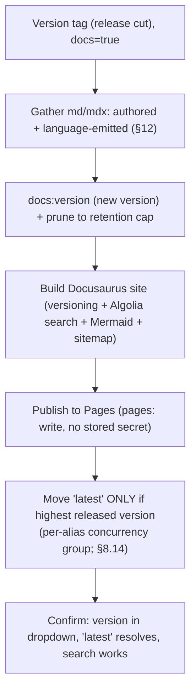

<!-- Split from REQUIREMENTS.md (2026-07-11) - section numbering preserved verbatim. Index: docs/requirements/README.md -->

### 13.3 Documentation site (Docusaurus → GitHub Pages, multi-version)

**Applies to:** any profile with `docs: true` (§6.1); **opt-in, default off**. The
docs site is built with **Docusaurus** and published to **GitHub Pages**.
**Trigger:** version tag only — each release **adds a new docs version** and moves
the **`latest` alias** to it. **Runner:** Linux (Docusaurus is a Node build; it
runs on Linux even for Python/Swift profiles).

**Inputs (the producer/consumer boundary, §2.9):** the deploy consumes **md/mdx
only** — both the repo's **authored** narrative docs and the **language-emitted**
md/mdx (§12). It never inspects source, never runs a language toolchain, and is
therefore language-agnostic. A language plug-in that emits no md/mdx still yields a
valid narrative-only site.

**Configuration (day-zero, fixed baseline):**
- **Versioning & retention:** Docusaurus native versioning — a **version dropdown**
  and a **`latest` alias** at the newest release. Each cut copies the full docs tree
  into `versioned_docs/version-X/`. **Retention (operator decision, 2026-06): every
  released version's docs are KEPT** — `docs-retention` defaults to 0 (unlimited);
  an operator may set N>0 to cap to the newest N versions, in which case older
  snapshots are pruned on each release. Versioned snapshots live on the published
  **`gh-pages` artifact**, not the source branch. (Replaces the previous mkdocs +
  `mike` setup; append-only and reviewable.)
- **Search:** Algolia DocSearch via `@docusaurus/theme-search-algolia`, **opt-in**
  through the `algolia` profile variable (default off — a fresh docs scaffold builds
  with no search config rather than dead placeholder credentials). When enabled, the
  public application ID, public search API key, and index name thread from the
  `algolia-*` variables (not stored secrets); the operator must provision the
  Algolia index before publishing (§17).
- **Theme/features:** `@docusaurus/preset-classic`, **docs-first** (no blog), with
  the version dropdown and a light/dark toggle; `@docusaurus/theme-mermaid` with
  `markdown.mermaid: true`; sitemap configuration through the classic preset; and
  the first-party Docusaurus ESLint plugin as a blocking docs-site lint.
- **Install hardening:** docs scaffolds include `website/.npmrc` with
  `ignore-scripts=true`, `min-release-age=7`, and `engine-strict=true`; the docs
  package manifest declares Node >=24 and npm >=11, and the docs workflow
  defaults to Node 24 and refuses npm <11 before install.

**Stages:** gather authored + emitted md/mdx → install hardened npm dependencies →
lint the docs site → `docusaurus docs:version` for the release tag (cut a new
version) → **prune only if a retention cap is set (default: keep all)** → build the static site (versioning,
Algolia search UI, Mermaid diagrams, sitemap) → publish to Pages via the platform token →
**move the `latest` alias only if this release is the highest released version**
(monotonic guard), under a **per-alias deploy concurrency group** so a slower
older-release deploy cannot regress `latest`/docs (§8.14).
**Day-zero limitation (conservative monotonic gate):** the implementation gates the
**entire** docs job — version-cut, build, and publish — on the monotonic
"highest-released-version" guard, not just the `latest`-alias move. Consequence: a
release that is **not** the highest (e.g. a backport patch to an older line published
after a newer major already shipped) does **not** retroactively add its own docs
version. This is deliberately conservative: publishing an older release's site without
correctly merging it into the newer published version set risks regressing live docs,
which has no apply-time recompute (§2.12) and is operator-verified only (§9.9). Adding
a non-highest version *without* moving `latest` (a true §13.3 "every release adds a
version") requires merging into the existing `gh-pages` version set and is a
post-day-zero refinement. Likewise the version sources read forward between releases
are persisted as a **time-bounded build artifact** rather than durably from the
published `gh-pages` artifact; a release gap exceeding that window would lose prior
snapshots — also a post-day-zero hardening. Day-zero releases are monotonic, so
neither edge is exercised by the normal release cadence.
**Auth:** platform token, `pages: write` + `id-token: write` + `contents: read`;
**no stored secret**.
**Why a deployment plug-in:** publishing to Pages is a privileged outward publish;
modeling it under §13 (tag-gated, declared privileges) keeps it consistent with
"deployment runs only on a release tag" rather than escaping the deployment
interface.
**Operator prerequisite:** GitHub Pages enabled with the **GitHub Actions** source
(§17).
**DoD:** a real multi-version Pages publish on a tag — the new version is
reachable, the **version dropdown lists it**, the **`latest` alias resolves** to
it, **Algolia search returns results**, Mermaid diagrams render, and
`/sitemap.xml` is present on the published site.

