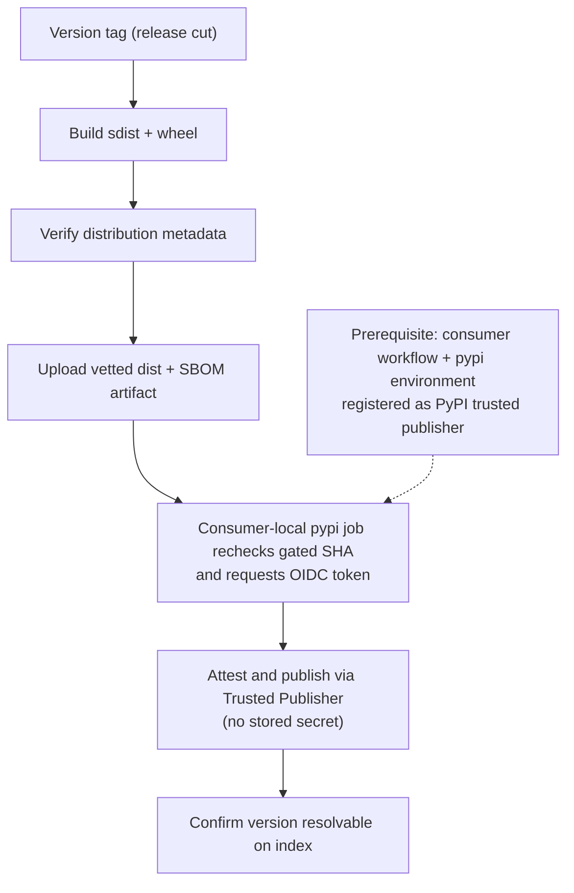

<!-- Split from REQUIREMENTS.md (2026-07-11) - section numbering preserved verbatim. Index: docs/requirements/README.md -->

### 13.1 PyPI (OIDC Trusted Publishing)

**Applies to:** `python-library`. **Trigger:** version tag. **Runner:** Linux.
**Stages:** the reusable workflow builds source + wheel → verifies metadata →
**generates an SBOM and scans dependencies (fail-closed gate, §11.7)** → uploads
the vetted distribution/SBOM artifact. A separate job in the generated consumer
workflow re-verifies the tag against the gated SHA, attaches provenance/SBOM
attestations, publishes via **OIDC Trusted Publishing**, and confirms the version
is resolvable.
**Resolvability confirmation is a GATE (C12-W7, deliberate):** a published version that never
becomes resolvable is a FAILED release, not a warning — a green run that left an uninstallable
upload is worse than a loud failure. The check retries generously (≈8 minutes) for real index
propagation delay, then **fails closed**. (An earlier draft of this section said "warns rather
than fails"; that wording predated the C12-W7 hardening and must not be restored — the workflow,
not this paragraph, was always the operative artifact.) The DoD (§11.6) remains operator-verified.
**Auth:** OIDC; only the consumer-local publish job has `id-token: write` and
`attestations: write`; the reusable build workflow has `contents: read` only.
There is **no stored secret**. PyPI validates the caller workflow identity, so
the publish job must not live inside the reusable workflow. A stale caller that
lacks the local publisher is rejected with an `aviato sync` instruction before
the build begins. An optional `PYPI_REPOSITORY_URL` repository variable selects
TestPyPI or another index; it is an endpoint, not a credential.
**Prerequisite (out-of-band):** register the consumer repo's
`.github/workflows/aviato-ci.yml` workflow and `pypi` environment as a trusted
publisher on PyPI (and TestPyPI for verification).
**DoD:** a real publish to TestPyPI (dev-suffixed version, §11.6) and a real PyPI
publish on a production release.

