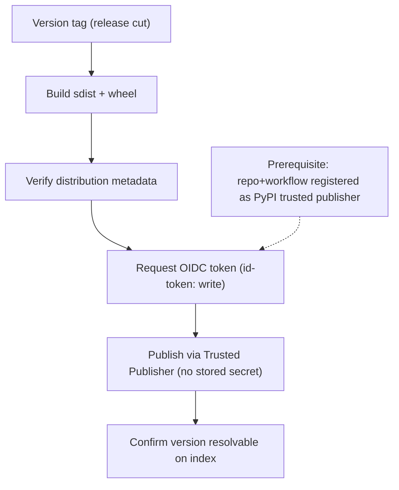

<!-- Split from REQUIREMENTS.md (2026-07-11) - section numbering preserved verbatim. Index: docs/requirements/README.md -->

### 13.1 PyPI (OIDC Trusted Publishing)

**Applies to:** `python-library`. **Trigger:** version tag. **Runner:** Linux.
**Stages:** build source + wheel → verify metadata → **generate SBOM + build
provenance/attestation, scan dependencies (gate on high/critical, §11.7)** →
publish via **OIDC Trusted Publishing** with SBOM/provenance attached → confirm
the version is resolvable.
**Resolvability confirmation is a GATE (C12-W7, deliberate):** a published version that never
becomes resolvable is a FAILED release, not a warning — a green run that left an uninstallable
upload is worse than a loud failure. The check retries generously (≈8 minutes) for real index
propagation delay, then **fails closed**. (An earlier draft of this section said "warns rather
than fails"; that wording predated the C12-W7 hardening and must not be restored — the workflow,
not this paragraph, was always the operative artifact.) The DoD (§11.6) remains operator-verified.
**Auth:** OIDC; `id-token: write` + `contents: read`; **no stored secret**.
**Prerequisite (out-of-band):** register the repo + workflow as a trusted
publisher on PyPI (and TestPyPI for verification).
**DoD:** a real publish to TestPyPI (dev-suffixed version, §11.6) and a real PyPI
publish on a production release.

