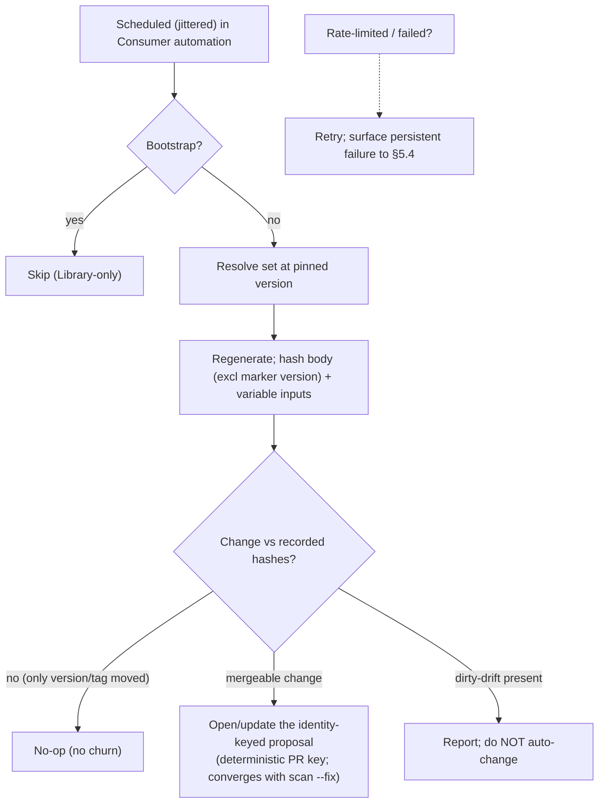

<!-- Split from REQUIREMENTS.md (2026-07-11) - section numbering preserved verbatim. Index: docs/requirements/README.md -->

### 5.5 File drift detection (automated, propose-only)

**Trigger:** schedule (or manual dispatch) inside the Consumer's automation, with
**jitter** so a fleet on the same cron does not stampede the platform; rate-limit
responses are tolerated and retried, and a persistent failure is surfaced (so a
silently-throttled job is visible in §5.4, not invisibly absent).
**Actor:** Consumer automation, low privilege (may open proposals; may not mutate
protected settings). Required read/report privileges are declared in §11.3.
**Comparison rule (normative):** drift is the change of `hash(rendered template
body, EXCLUDING the managed-marker version field, after line-ending
normalization)` **or** `hash(resolved variable inputs)`. The marker's *version*
field is reconciled **only** by §5.12 upgrade — so a release/tag movement that
changes nothing but the version is provably a **no-op**, never a churn PR.
**Proposal identity (concurrency):** the proposal (PR) has a **deterministic
identity** (a stable branch/PR key derived from profile + output set), so the
scheduled job and an operator's `scan --fix` (§5.11) **converge on the same
proposal** instead of racing into duplicates.
**Steps:** resolve at the pinned version → regenerate → if **mergeable** content
changed, open/update the identity-keyed proposal with per-file rationale.
**dirty-drift** is reported, never auto-changed. Skipped entirely in bootstrap.

