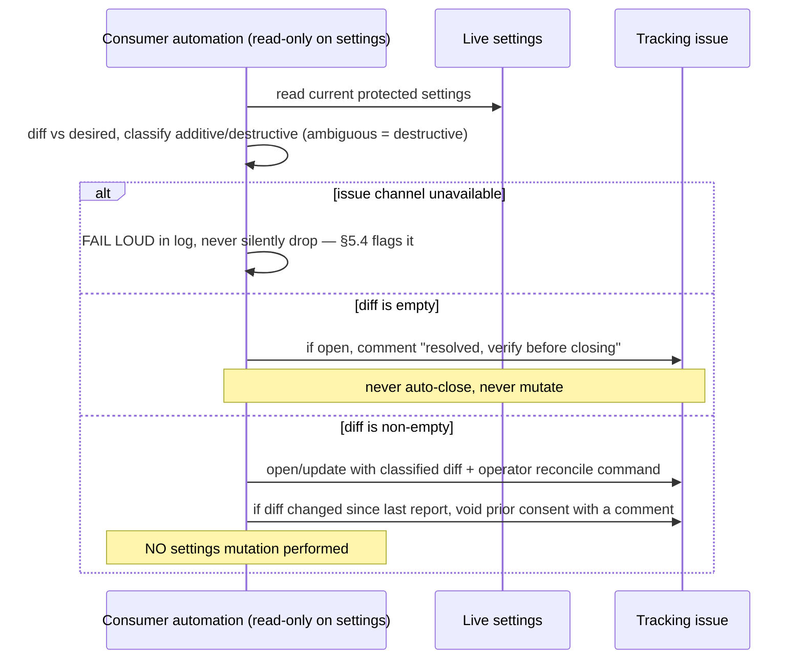

<!-- Split from REQUIREMENTS.md (2026-07-11) - section numbering preserved verbatim. Index: docs/requirements/README.md -->

### 5.6 Settings drift detection (automated, report-only)

**Trigger:** schedule inside the Consumer's automation (jittered, §5.5).
**Actor:** Consumer automation, **read-only on settings** (declared privileges,
§11.3).
**Steps:** read **live** protected settings → diff against the resolved desired
settings → classify each change **additive** vs **destructive** by the rule
below → on a non-empty diff, open/update a **tracking issue** describing the
diff, the classification, and the exact operator reconcile command. If the diff
is empty and a tracking issue is open, post a "drift resolved — verify before
closing" comment (do **not** auto-close). **If a previously-reported diff has
changed, any prior consent record on the issue is voided with a comment** (the
authoritative gate is still §5.7's apply-time recompute, but this surfaces
staleness at report time). **If the issue channel is unavailable** (issues
disabled), the automation **fails loud** in its log and §5.4 flags it — it never
silently drops the report. **If live settings cannot be read** (the platform token
lacks the admin/read scope branch-protection and rulesets require), the automation
**skips settings drift fail-closed** — it never computes a diff from a falsely
"unprotected" read — and reports the skip; by default this is not a hard failure (so
a scheduled run is not failed by a missing admin token), but an operator gating CI on
settings drift can opt to treat the skip as a failure (`drift-report --require-settings`).
The automation performs **no** settings mutation.
**Rulesets (presence + content):** the desired **named rulesets** (§3.2 settings bundle)
are also protected settings, so drift detection covers them: a desired ruleset that is
**missing**, **disabled** (enforcement no longer `active`), or **content-weakened** (e.g. a
permissive `tag_name_pattern`, a lowered required-approval count, a dropped required check, a
removed rule) is reported on the same tracking issue. The live ruleset is compared to the
**rendered desired payload** (the GitHub-specific comparison lives in the binding, not the
agnostic flow); GitHub-added metadata and benign live additions are ignored (no false drift),
the ref-name scope is conservatively not compared (the platform may normalize `~DEFAULT_BRANCH`).
**Ruleset remediation is the operator-direct `apply-rulesets` path, NOT the §5.7 consent gate**
(see §5.7) — so the report directs the operator to `apply-rulesets … --apply --profile 
`.
**additive vs destructive (normative):** a change is **destructive** if it
removes, weakens, or replaces an existing protection or any operator-relied-upon
value (e.g. lowering a required-review count, removing a required check,
disabling a protection). It is **additive** only if it introduces a new
constraint with no loss. **Ambiguous or unrecognized changes classify as
destructive** (fail-safe).

