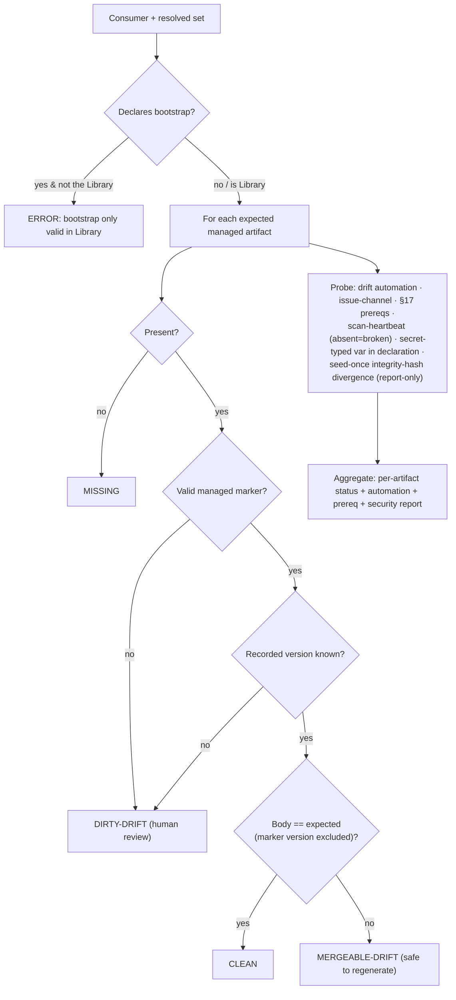

<!-- Split from REQUIREMENTS.md (2026-07-11) - section numbering preserved verbatim. Index: docs/requirements/README.md -->

### 5.4 Diagnosis (doctor)

**Trigger:** operator or automation wants a Consumer's health.
**Actor:** core engine.
**Steps:** for each managed artifact the resolved set expects, classify:
**clean** (matches expected render, marker version comparison excluded per §5.5),
**mergeable-drift** (valid marker, known version, body diverged — safe to
regenerate), **dirty-drift** (no/invalid marker, hand-edited, or recorded version
unknown — needs human review), or **missing**. **Malformed marker is classified
dirty-drift consistently** with §5.3 refusing to overwrite it (one posture: a
malformed marker is never silently regenerated; remediating it requires
operator force). Also probe: whether the Consumer's drift automation is present
and enabled; whether the **issue channel is available** (required for §5.6
reporting); which **machine-checkable §17 prerequisites** are satisfied (surfacing
the rest as adoption warnings); whether each **baseline scan actually ran** (a
per-run heartbeat is present — its **absence reads as *broken*, never *clean***,
§5.14); whether any **`secret`-typed variable** appears in the declaration (a
confinement violation, §6.6/§8.15); and whether any **seed-once file** diverges
from its recorded report-only integrity hash (§6.3 — reported, never overwritten).
Reject a bootstrap declaration in any repository that is not the Library itself
(detected by structure, §5.10).

