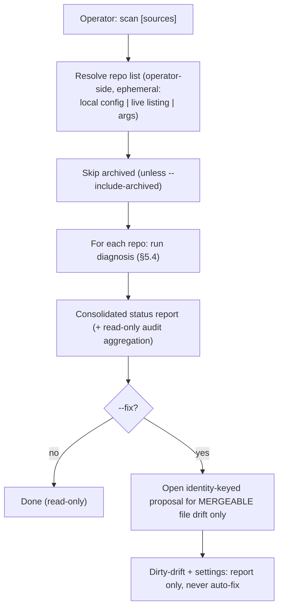

<!-- Split from REQUIREMENTS.md (2026-07-11) - section numbering preserved verbatim. Index: docs/requirements/README.md -->

### 5.11 Local fleet scan

**Trigger:** operator wants the status of many repositories at once.
**Actor:** operator (local CLI), read-only by default.
**Steps:** resolve a repository list from a **local, operator-side, ephemeral**
source (a local config, a live listing, or explicit arguments — this is never a
Library-held registry, §2.2); skip archived unless asked → for each, run
diagnosis (§5.4) and collect status → present a consolidated report → optionally,
for **mergeable** file drift only, open the identity-keyed proposal (§5.5);
**dirty-drift** and settings mutation are never auto-fixed by scan.
**Audit:** the operator aggregates, read-only, the per-Consumer audit trail that
already lives on each Consumer's tracking issues (§5.6/§5.7 leave issues open for
audit). This preserves §2.2 while giving fleet-level visibility.

