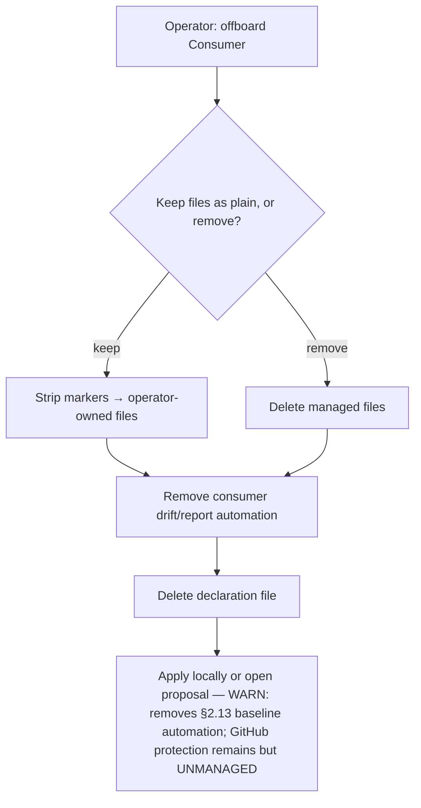

<!-- Split from REQUIREMENTS.md (2026-07-11) - section numbering preserved verbatim. Index: docs/requirements/README.md -->

### 5.13 Offboarding (leave Aviato)

**Trigger:** operator removes a Consumer from Aviato management.
**Actor:** operator (local CLI).
**Steps:** strip managed markers from managed files (converting them to plain
operator-owned files) **or** remove them per operator choice → remove the
Consumer automation (the scheduled drift/report workflows) → delete the
declaration file. The change may be applied to a local checkout (`--write`) or
surfaced as a reviewable removal proposal (`--open-pr`), mirroring onboarding.
**The result must carry an explicit warning that offboarding removes the
always-on §2.13 security-baseline automation and stops Aviato managing this
repository's protection** — mirroring the §5.12 backward-movement warning, since
offboarding is the *maximal* protection reduction. Note the scope precisely: any
GitHub branch protection and rulesets Aviato applied **remain in place but become
unmanaged**; offboarding does **not** tear them down (an unattended privileged
teardown is out of scope, §2.x) — the operator removes them manually if full
protection removal is desired. After offboarding, no Aviato automation runs and
no markers remain to drift-check.

