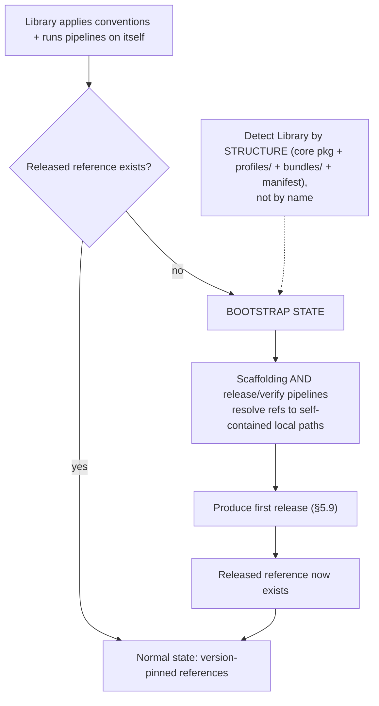

<!-- Split from REQUIREMENTS.md (2026-07-11) - section numbering preserved verbatim. Index: docs/requirements/README.md -->

### 5.10 Bootstrap / self-reference resolution

**Trigger:** the Library applies its own conventions and runs its own
pipelines before it has a release.
**Structural predicate (normative):** a repository is *the Library* iff it
contains all of: the core engine's source package (`aviato/core/`), the
module-source tree under `aviato/library/` (its `bundles/` and `scaffold/`
definition trees), and the packaged `policy.yml` (`aviato/library/policy.yml`) —
which serves as the manifest anchor *agnostically* (a language-specific build
manifest cannot be named in the agnostic core, §9b; `policy.yml` is the
distinctive Library artifact). `policy.yml` and the ruleset manifest/templates
live **inside** `aviato/library/` (not the repo root) so they ship in the wheel
for installed ruleset rendering (§5.6/§11.3). Detection is by this structure,
never by repository name (so forks/renames are unaffected): a **Consumer**
repository never vendors the `aviato/` package tree, so the predicate is false
for it. (The predicate is only ever evaluated against the operated-on repository
root — never the installed package in site-packages — so the fact that a
site-packages copy also contains `aviato/library/policy.yml` is immaterial.)
**Rule:** in bootstrap state, **all** self-applied automation — scaffolding,
verify, **and the release pipeline** — resolves its module/action references to
self-contained local paths. The first release the pipeline produces is what makes
released references exist; nothing in the bootstrap path may require one to
pre-exist.
The workflow-level `local-install` path is part of this bootstrap exception only:
it is valid only when the operated-on checkout satisfies the structural Library
predicate **and** its declaration sets `bootstrap: true`. If either condition is
false, the workflow fails before installing from the local checkout. This prevents
a Consumer from hand-editing `local-install: true` and executing unreviewed local
code in place of the pinned Library reference.

