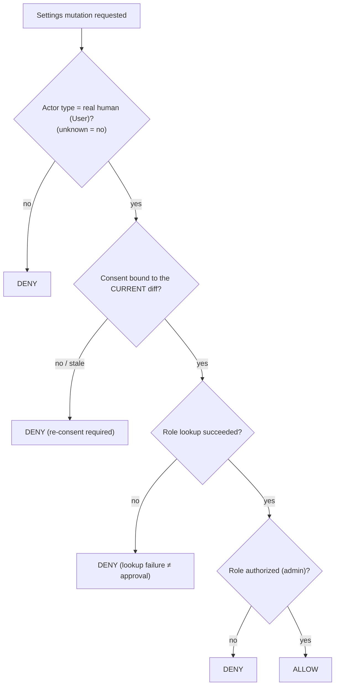

<!-- Split from REQUIREMENTS.md (2026-07-11) - section numbering preserved verbatim. Index: docs/requirements/README.md -->

### 5.8 Authorization gate (reused by §5.7 and any settings mutation)

**Rule:** deny by default (§2.7). A reusable decision, not duplicated per call
site.

