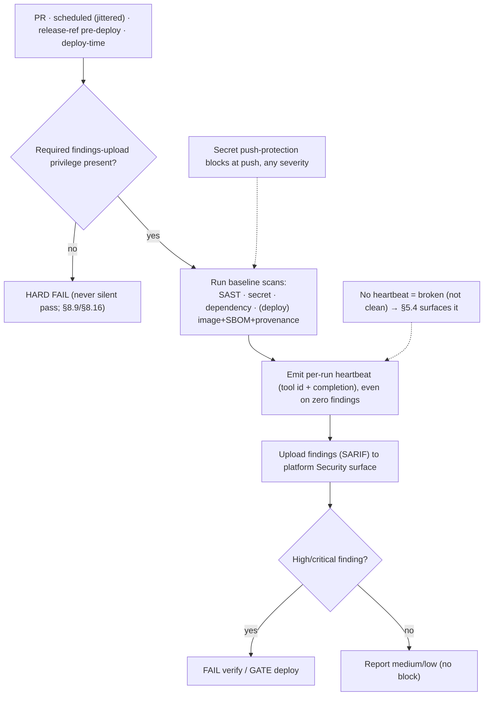

<!-- Split from REQUIREMENTS.md (2026-07-11) - section numbering preserved verbatim. Index: docs/requirements/README.md -->

### 5.14 Security scanning (baseline)

**Trigger:** SAST, secret, and dependency scans run on **pull requests**, on a
**jittered schedule** (§5.5), **and on the release ref immediately before any
deploy** (so the deploy gate is evaluated against the deployed code, not a stale PR
head); published-artifact security (image scan, SBOM, provenance) runs at **deploy
time** (§11.1) as a gate.
**Actor:** Consumer automation, read scope + `security-events: write`; **no stored
secret** (§2.13).
**Steps:** **probe the required findings-upload privilege at runtime — hard-fail if
absent** (a caller that did not grant it fails loudly, never silently passes;
§8.9/§8.16) → run each category's engine (supplied by the language/deploy plug-in,
§12/§13) → emit a **per-run heartbeat** (tool identity + completion marker) **even
on zero findings**, so §5.4 can distinguish *ran-clean* from *never-ran* → upload
findings as **SARIF to the platform Security surface** → apply the §2.13 gate:
**fail verify / gate deploy on high+critical**, report medium/low. Secret-scanning
**push protection** blocks at push regardless.
**Failure handling:** a scan that **cannot run** is a **failure surfaced in §5.4
diagnosis**, never a silent skip — a repo must not read "clean" while its
scanning is broken. **Absence of the per-run heartbeat reads as *broken*, not
*clean*** (§5.4), and a missing upload privilege is a hard pipeline failure (§8.16).

---
