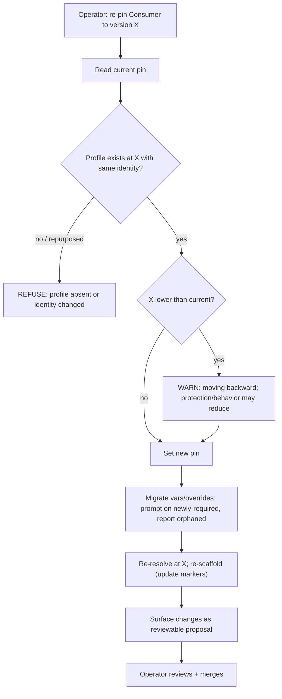

<!-- Split from REQUIREMENTS.md (2026-07-11) - section numbering preserved verbatim. Index: docs/requirements/README.md -->

### 5.12 Version upgrade / downgrade (re-pin)

**Trigger:** operator moves a Consumer to a different Library version.
**Actor:** operator (local CLI).
**Steps:** read the current pin → confirm the **profile exists and has the same
identity** at the target version (a profile name is a stable public identity;
§6.5) → set the new pin → re-resolve at the target version → **migrate variables
and overrides**: detect newly-**required** variables and prompt/fail with
guidance, detect **orphaned** overrides (keys no longer meaningful) and report
them → re-scaffold (§5.3, updating markers) → surface changes as a reviewable
proposal.
**Downgrade:** moving to a **lower** version is allowed but routed through this
same propose/review path **with an explicit "you are moving backward — protection
or behavior may be reduced" warning**.
**Failure handling:** if the target profile no longer exists, **or its name has
been repurposed to a different composition** (identity change), refuse and report.
The upgrade/downgrade path is the **only** sanctioned way a pin moves; drift
(§5.5) never advances it.
**Day-zero limitation:** the repurpose (identity-change) refusal requires resolving
the profile **at the target version**, which needs that version's definitions
present. The operator's installed CLI carries **one** Library version, so the
shipped re-pin confirms the profile still **resolves** but cannot compare its
identity *across* versions; cross-version repurpose detection (fetching the target
version's registry) is a post-day-zero refinement. The decision logic is implemented
and tested against a second registry; it is dormant in the single-installed-CLI flow.

