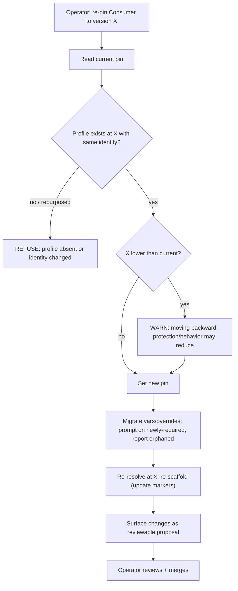

<!-- Split from REQUIREMENTS.md (2026-07-11) - section numbering preserved verbatim. Index: docs/requirements/README.md -->

### 5.12 Version upgrade / downgrade (re-pin)

**Trigger:** operator moves a Consumer to a different Library version.
**Actor:** operator (local CLI).
**Steps:** read the current pin and persisted `profile-identity` → resolve the
published target ref to one commit and safely fetch that commit's Library registry
→ confirm the **profile exists and has the same explicit identity** at the target
version (§6.5) → set the new pin → re-resolve using that same fetched registry → **migrate variables
and overrides**: detect newly-**required** variables and prompt/fail with
guidance, detect **orphaned** overrides (keys no longer meaningful) and report
them → re-scaffold (§5.3, updating markers) → surface changes as a reviewable
proposal.
**Downgrade:** moving to a **lower** version is allowed but routed through this
same propose/review path **with an explicit "you are moving backward — protection
or behavior may be reduced" warning**.
**Failure handling:** if the target profile no longer exists, **or its manifest has
a different explicit identity** (the name was repurposed), refuse and report before
changing the pin. Changes to templates, variables, settings, privileges, or version
sources with the same identity are legitimate evolution and proceed to migration checks.
The upgrade/downgrade path is the **only** sanctioned way a pin moves; drift
(§5.5) never advances it.
The fetched target registry is the sole source for identity verification, newly
required variables, orphaned overrides, and materialization in local and proposal
flows. A legacy declaration without `profile-identity` must first sync using the
registry fetched at its current declared pin; an unresolved pin or identity mismatch
must leave the declaration and managed files unchanged.

