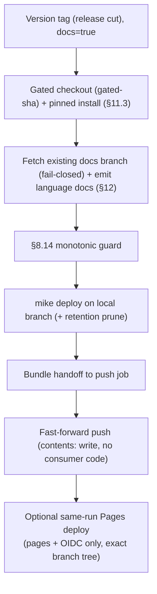

<!-- Split from REQUIREMENTS.md (2026-07-11) - section numbering preserved verbatim. Index: docs/requirements/README.md -->

### 13.3 Documentation site (Zensical → docs branch, multi-version)

**Applies to:** any profile with `docs: true` (§6.1); **opt-in, default off**. The
docs site is built with **Zensical** and versioned onto a dedicated **docs branch**
(default `gh-pages`) via a **mike fork**. **Trigger:** version tag only — each
policy-conformant release **adds a new docs version**; the **`latest` alias** moves
only when that release is the highest released version (§8.14). **Runner:** Linux.

**Inputs (the producer/consumer boundary, §2.9):** the deploy consumes **md/mdx
only** — both the repo's **authored** narrative docs and the **language-emitted**
md/mdx (§12), emitted before the mike deploy so the generated reference is captured
in that version's snapshot. It never inspects source directly and is therefore
language-agnostic. A language plug-in that emits no md/mdx still yields a valid
narrative-only site.

**Configuration (day-zero, fixed baseline):**
- **Toolchain:** `zensical` + a **mike fork**
  (`git+https://github.com/squidfunk/mike.git@2d4ad799442f4592db8ad53b179bfb33db8c69ac`),
  exact-pinned in `website/requirements.txt` per consumer — a VCS pin is a full commit
  SHA (§11.3). Dependabot bumps the `zensical` pin; the mike fork pin moves only when
  Zensical ships native multi-version support (tracked in the backlog).
- **Versioning & retention:** mike versions onto the docs branch — each release
  commits a version directory there, not into the source tree. **Retention (operator
  decision, 2026-06): every released version's docs are KEPT** — `docs-retention`
  defaults to 0 (unlimited); an operator may set N>0 to cap to the newest N versions,
  pruned via `mike delete` on each release.
- **Deploy target:** the `docs-branch` input (default `gh-pages`). The workflow
  refuses to target the repository default branch. `serve-pages` is a non-secret
  boolean, default false: false still builds and pushes the canonical branch;
  true additionally deploys that exact branch tree through Pages Actions.
- **Search:** Zensical's built-in search — no external search service, no Algolia
  configuration (superseded; see backlog).

#### Stages (implemented in `reusable-docs-pages.yml`)

1. Gated checkout of the release-gate-validated commit (C12-W2: build from the
   immutable `gated-sha`, never the mutable tag, and re-verify the tag still
   points at it).
2. Pinned install from `docs-requirements` (fails closed if the requirements
   file is missing, §11.3).
3. Authenticated fail-closed fetch of the existing docs branch (an unreadable
   remote refuses rather than building an orphan branch).
4. Emit language docs (consumer `eval`, read-only token, §12).
5. **§8.14 monotonic guard** (fail-closed: an unlistable tag set skips the
   deploy).
6. Refuse to target the default branch.
7. `mike deploy` on the local branch (every policy-conformant release deploys
   its own version; `latest` alias + `mike set-default` move only when this
   release is the highest).
8. Optional retention prune via `mike delete` when `docs-retention` > 0.
9. Bundle the local docs branch as a git-bundle artifact.
10. Materialize the exact `refs/heads/<docs-branch>` tree and reject escaping
    symlinks.
11. Handoff to the push job, which fast-forward-pushes it.

#### Auth (C12-W4, adapted for branch deploys)

Permissions are per-job — the build job runs the consumer's emit command and
holds only read scopes (`contents: read` plus the `pages: read` required by
`configure-pages`); only the separate push job, which runs **no consumer
code**, holds `contents: write` and verifies the bundle fast-forwards before
pushing (refuses on concurrent-deploy or rewritten-history mismatch). When
`serve-pages=true`, the read-only build configures and uploads the Pages
artifact; a second no-consumer-code deploy job runs only after build and push
succeed, holds only `pages: write` and `id-token: write`, and deploys to the
`github-pages` environment. No stored secret.

**Why a deployment plug-in:** publishing the docs branch is a privileged outward
write; modeling it under §13 (tag-gated, declared privileges) keeps it consistent
with "deployment runs only on a release tag" rather than escaping the deployment
interface.

**Operator prerequisite:** none to produce the docs branch. To serve it, set
`serve-pages: true` and configure Settings → Pages → Source as **GitHub Actions**
(`build_type=workflow`), never Deploy from a branch (§17).

**DoD:** always verifiable from the docs branch alone — after a release deploy, the
branch contains the new version's directory, and alias state is correct (`latest`
moved iff this release is the highest, per the monotonic guard). When the operator
has additionally enabled Pages to serve the branch: `latest` resolves at the site
root, Zensical's built-in search returns results, Mermaid diagrams render, and
`/sitemap.xml` is present on the served site.

