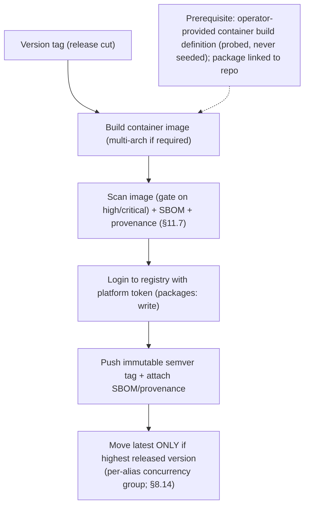

<!-- Split from REQUIREMENTS.md (2026-07-11) - section numbering preserved verbatim. Index: docs/requirements/README.md -->

### 13.2 GHCR (GitHub Container Registry)

**Applies to:** `python-service`, `node-service`. **Trigger:** version tag only.
**Runner:** Linux.
**Stages:** build the container image (multi-architecture where required) →
**scan the image for vulnerabilities (gate on high/critical, §11.7) + generate
SBOM + build provenance/attestation (keyless OIDC)** → authenticate to the
registry with the platform token → push the **immutable `semver` tag** with SBOM/
provenance attached → **move the mutable `latest` tag only if this release is the
highest released version** (monotonic guard), under a **per-alias deploy
concurrency group** so a slower older-release deploy cannot regress `latest`
(§8.14).
**Auth:** platform token, `packages: write` + `contents: read`; **no stored
secret**.
**Prerequisites:** a container build definition present (operator-provided and
PROBED — R5-6: Aviato never seeds one); package visibility/permissions set so the package
links to the repository.
**DoD:** a real push of a test image (dedicated test namespace, §11.6) and a real
release image on a production tag.

## Settled decisions — do not reopen

- GHCR stays single-job OIDC (R7-4, accepted documented scope with in-file rationale); only the byte-identity scan→push (promote the exact scanned OCI archives by digest, C12-W3) is in scope.
- §13.2 disposable-image proof PROVEN 2026-07-18 (single-arch): byte-identical scanned digest pushed on 3 independent releases, Trivy v0.72 SARIF + HIGH/CRITICAL gate clean, SBOM artifact present, provenance attestation verifies (`gh attestation verify` exit 0), release-tag manifest references only the scanned digest, and the monotonic `latest` alias correctly moved for a minor release and correctly stayed for a hand-tagged old-line patch. The 2026-07-16 Trivy v0.55→v0.72 pin bump surfaced a real regression (buildx `type=oci` tarball unreadable by Trivy 0.72's changed local-artifact detection) — fixed in aviato PR #85 (extract to an unpacked OCI layout dir before scanning). See [traceability §13.2](../../../../requirements/traceability.md) and the [2026-07-18 evidence record](../../../../requirements/evidence/2026-07-18-deploy-proofs.md).
