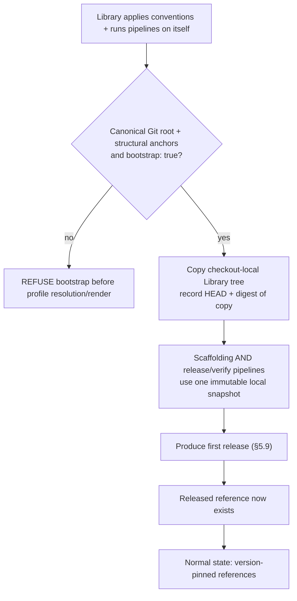

<!-- Split from REQUIREMENTS.md (2026-07-11) - section numbering preserved verbatim. Index: docs/requirements/README.md -->

### 5.10 Bootstrap / self-reference resolution

**Trigger:** the Library applies its own conventions and runs its own
pipelines before it has a release.
**Structural predicate (normative):** a repository is *the Library* iff it
contains all of: the core engine's source package (`aviato/core/`), the
module-source tree under `aviato/library/` (its `bundles/` and `scaffold/`
definition trees), and the packaged `policy.yml` (`aviato/library/policy.yml`) —
which serves as the manifest anchor *agnostically* (a language-specific build
manifest cannot be named in the agnostic core, §9b; `policy.yml` is the
distinctive Library artifact). `policy.yml` and the ruleset manifest/templates
live **inside** `aviato/library/` (not the repo root) so they ship in the wheel
for installed ruleset rendering (§5.6/§11.3). Detection is by this structure,
never by repository name (so forks/renames are unaffected): a **Consumer**
repository never vendors the `aviato/` package tree, so the predicate is false
for it. (The predicate is only ever evaluated against the operated-on repository
root — never the installed package in site-packages — so the fact that a
site-packages copy also contains `aviato/library/policy.yml` is immaterial.)
Every structural anchor is inspected component-by-component and a symlinked
anchor is rejected. The operated path must first pass the same canonical Git
root equality check as a Consumer operation.
**Rule:** in bootstrap state, **all** self-applied automation — scaffolding,
verify, **and the release pipeline** — resolves its module/action references to
self-contained local paths. The first release the pipeline produces is what makes
released references exist; nothing in the bootstrap path may require one to
pre-exist.
The workflow-level `local-install` path is part of this bootstrap exception only:
it is valid only when the operated-on checkout satisfies the structural Library
predicate **and** its declaration sets `bootstrap: true`. If either condition is
false, the workflow fails before installing from the local checkout. This prevents
a Consumer from hand-editing `local-install: true` and executing unreviewed local
code in place of the pinned Library reference.

Bootstrap source ownership is checkout-local and immutable for one operation.
After both gates above pass, Aviato copies the operated checkout's
`aviato/library` tree into a temporary snapshot, rejects links, hashes that same
copy deterministically, and records the checkout's Git HEAD. Registry and policy
reads use only the copy until the operation context closes and removes it. A
change to the live checkout after copying cannot change the in-flight operation.
Re-onboarding a structurally verified Library preserves an existing
`bootstrap: true`; no other repository may acquire or retain the exception.

