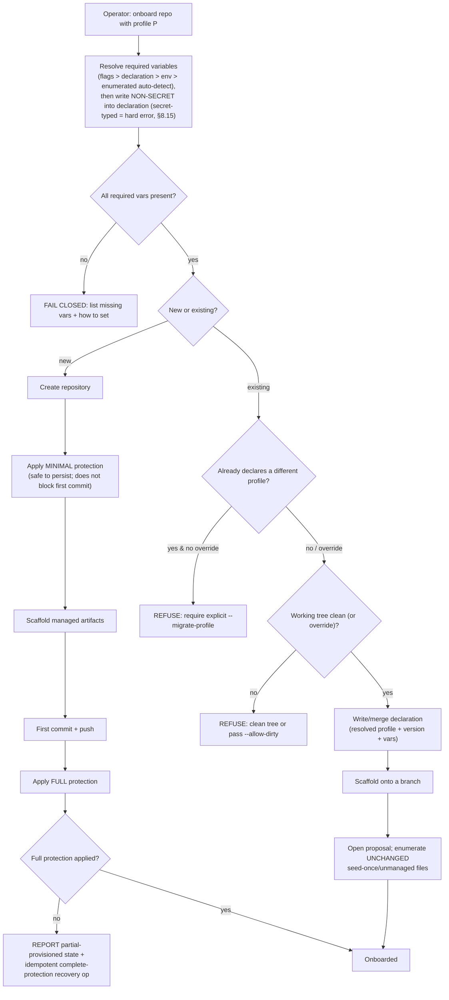

<!-- Split from REQUIREMENTS.md (2026-07-11) - section numbering preserved verbatim. Index: docs/requirements/README.md -->

### 5.2 Repository onboarding (provision-new and adopt-existing)

**Trigger:** operator wants a repository to follow a convention set.
**Actor:** operator (local CLI), own credentials.
**Variable resolution (impure):** required variables resolve by precedence
**flags > declaration file > environment > auto-detection**, then the resolved
set is **written into the declaration** for reproducibility — **except variables
typed `secret` (§6.6), which are NEVER written to the declaration**; resolving a
secret-typed variable into the persisted set is a **hard error** (§8.15), so the
declaration carries no secrets (§6.6/§11.4). "Auto-detection"
derives from a **defined, enumerated** set of host sources (e.g. repository
name, the platform's repository metadata, the operator's configured identity);
nothing outside that enumerated set is auto-detected. **Day-zero scope:** the
resolution honors the auto-detection tier (it is the lowest-precedence source in
`resolve_variables`), but **day-zero profiles deliberately auto-map no
identity-bearing variable** (distribution / import / image / project / bundle
names). Because a resolved variable is **persisted into the declaration** (above),
auto-detecting one would silently write a *guess* — and these identifiers need
language-specific normalization (a directory name is not a PyPI distribution name),
so a wrong guess is worse than failing closed. Day-zero therefore resolves these
from flag / declaration / environment and **fails closed** (lists the missing
variable) when unset; populating the auto-detection tier with safe, normalized
sources is a post-day-zero refinement.
**Preconditions:** every *required* variable resolves; for adopt, the working
tree is clean unless overridden. A fresh provision/adopt **must** record an
explicit Library pin supplied by the operator; the process never fabricates a
default pin. That pin must resolve to a published Library tag/branch before
write/provision proceeds. A dedicated unresolved-pin escape hatch is permitted
only for intentional offline/test scaffolds and must be named as such.
**Two paths, one shape:**
- *Provision-new*: create the repository, apply **minimal** protection (§2.11),
  scaffold, first commit, then apply **full** protection.
- *Adopt-existing*: write/merge the declaration, scaffold onto a branch, open a
  proposal for review.
**Guards:** never change an already-declared profile to a different one without
an explicit migrate override; enumerate files left untouched (seed-once,
unmanaged) in the proposal.
**Solo-maintainer review exception (normative):**
Full protection resolves its required-review count from the profile plus the
consumer declaration. The profile default remains one approval. A repository
may declare `overrides.settings.default_branch.required_reviews` as
`required_reviews: 0` only while it has no independent eligible reviewer and
the sole eligible reviewer cannot approve their own proposal. This is a
liveness exception, not bypass authority: the pull-request, required-check,
CodeQL, review-thread, stale-review, deletion, non-fast-forward,
active-enforcement, and no-bypass protections remain unchanged. Remove the
override before or in the same settings change that makes another reviewer
eligible, restoring the profile default of one approval without an unprotected
interval. All onboarding completion guidance uses
`--declaration .github/aviato.yml`, never `--profile`, so the apply path
preserves these repository-specific settings. Fresh previews sequence writing
or merging the declaration before that command.
For `python-library`, the managed CI caller includes the consumer-local `pypi`
environment job required by PyPI Trusted Publishing. Register that exact caller
path and environment with PyPI/TestPyPI after onboarding. The reusable build
workflow requires `consumer-publisher-present: true`; older callers fail loudly
with an `aviato sync` instruction instead of completing without publishing.
**Partially-provisioned state & recovery (normative):** between minimal and full
protection the repo is in a defined **partially-provisioned** state. Minimal
protection (no force-push, no deletion; no PR-required gate that would block the
first commit) is **safe to persist** indefinitely. If full protection fails after
the first commit, the process reports the partial state and exposes an
**idempotent `complete-protection` recovery operation** that re-applies full
protection and is safe to re-run any number of times.
When GitHub rejects the `tag_name_pattern` metadata restriction with an explicit
HTTP 422 unsupported-rule response, full-protection application retries exactly
once with only that rule omitted. The CLI reports the repository and omitted rule
as **DEGRADED**; deletion and non-fast-forward protections, conditions,
enforcement, and the no-bypass posture remain intact. No other API, authentication,
network, malformed-response, or validation failure is downgraded. A later failure
does not roll back earlier successful mutations, which are reported as they occur.
The correlated response may be a structured type-error object or a whole-entry
string inside `errors`. The observed literal was
`Invalid rule 'tag_name_pattern':`; the accepted whole-entry grammar is
`^\s*invalid\s+rule\s+["']tag_name_pattern["']\s*:\s*$`. Matching is
case-insensitive, accepts either single or double quotes, and permits
surrounding whitespace, including terminal whitespace after the colon. Matching
examines one error entry at a time and never combines entries.

