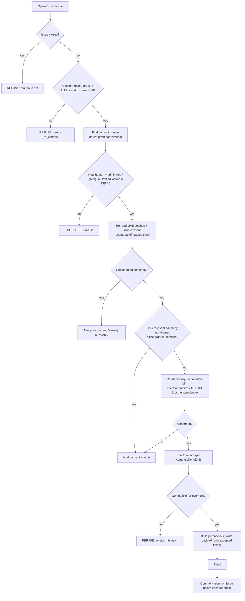

<!-- Split from REQUIREMENTS.md (2026-07-11) - section numbering preserved verbatim. Index: docs/requirements/README.md -->

### 5.7 Settings reconciliation (operator-gated apply)

**Trigger:** operator runs the reconcile command against a tracking issue.
**Actor:** operator, own elevated credentials.
**Scope (branch protection + repo security toggles):** this consent-gated path reconciles the
**flat default-branch protection and repo security toggles** only. **Named rulesets are
reconciled by the distinct operator-direct `apply-rulesets` command** — itself operator-gated
(§2.3: the operator runs it with their own credentials, with a dry-run preview before `--apply`),
and **idempotent** (it re-asserts the rendered desired payload, so it fixes both missing and
content-drifted rulesets). Rulesets are deliberately **not** folded into this consent-issue flow:
the two use different platform write surfaces (a wholesale branch-protection `PUT` vs a ruleset
upsert), and the dry-run-reviewed `apply-rulesets` is the sanctioned operator gate for them
(the same way provisioning/`complete-protection` apply protection operator-direct, outside the
consent-issue mechanism). §5.6 detects ruleset drift (presence + content) and directs the operator
to `apply-rulesets … --apply --declaration .github/aviato.yml`. The declaration-aware form is
mandatory once a declaration exists so repository-specific checks and settings overrides cannot
be silently reset to profile defaults during remediation.
**Steps:** fetch the issue; refuse if closed → confirm the consent record is
present and **bound to the current diff** (§6.4) → identify the human who granted
consent via the issue's authoritative event history (most recent grant not later
revoked) → **fail-closed authorize** (real human, §2.7; admin role; ambiguous or
failed lookup → DENY) → **re-read live state AND the issue/consent channel and
recompute the diff at apply time** (§2.8) → **render the locally-recomputed diff to
the operator and require explicit confirmation of *that* diff** — never the
bot-authored issue body (§6.4); if the recomputed diff is empty, no-op + comment;
if the issue or its consent record was edited by a non-`User` actor since the
granter was identified, **void consent and abort** → check **version-pin
compatibility** (§2.6) and refuse on mismatch unless overridden → construct a **purpose-built
write payload** (§2.9) and apply → comment the result on the issue (leave open
for audit).
**Concurrency:** the apply takes the same deterministic issue identity and
**re-validates the consent and diff at apply time** so a §5.6 update landing
mid-apply is detected, not silently overwritten.

