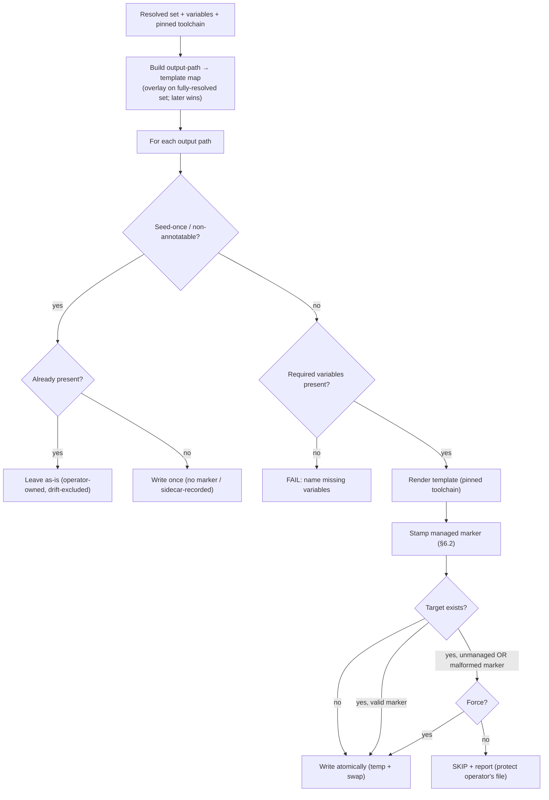

<!-- Split from REQUIREMENTS.md (2026-07-11) - section numbering preserved verbatim. Index: docs/requirements/README.md -->

### 5.3 Scaffolding / sync

**Trigger:** onboarding, an explicit sync, or drift remediation.
**Actor:** core engine.
**Steps:** from the resolved set, build a map of *output path → source template*,
where later/overlay sources override earlier ones for the same output (operating
on the fully-§4.2-resolved set) → render each template with the resolved
variables → stamp the **managed marker** (§6.2) → write **atomically** (render to
a temporary file, then atomic swap) so a crash never leaves a half-written file →
refusing to overwrite an **unmanaged** or **malformed-marker** file unless forced.
**Seed-once files (§6.3):** files that cannot host a marker, and operator-owned
build definitions/entrypoints, are written **only when absent** and never
overwritten or drift-checked.
**Determinism:** rendered output depends on the resolved toolchain (template
engine + any formatter). The toolchain identity is **part of the resolved set**
(pinned), and comparison normalizes line endings, so the same input yields
byte-identical output across runs.
**Self-reference (§2.10):** in bootstrap state, generated automation references
the Library by **self-contained local path**, not by a released reference.
**Failure handling:** a template whose required variables are missing fails
loudly (no silent placeholder); idempotent on a clean tree; atomic per file.
When an operator explicitly forces a managed rewrite, the marker is restamped
even if the rendered body is otherwise unchanged, so profile migrations and
re-pins cannot leave a valid body carrying stale management metadata.

## Settled decisions — do not reopen

- Templates are only ever regenerated via `scripts/regen-templates.py`; never hand-edited. `aviato validate` fails on template/scaffold parity drift.
- Swift/Xcode project and package manifests remain operator-owned and are not seeded (§12.3); the earlier backlog request for a Swift manifest fragment contradicted that settled contract and is closed as a non-defect.
