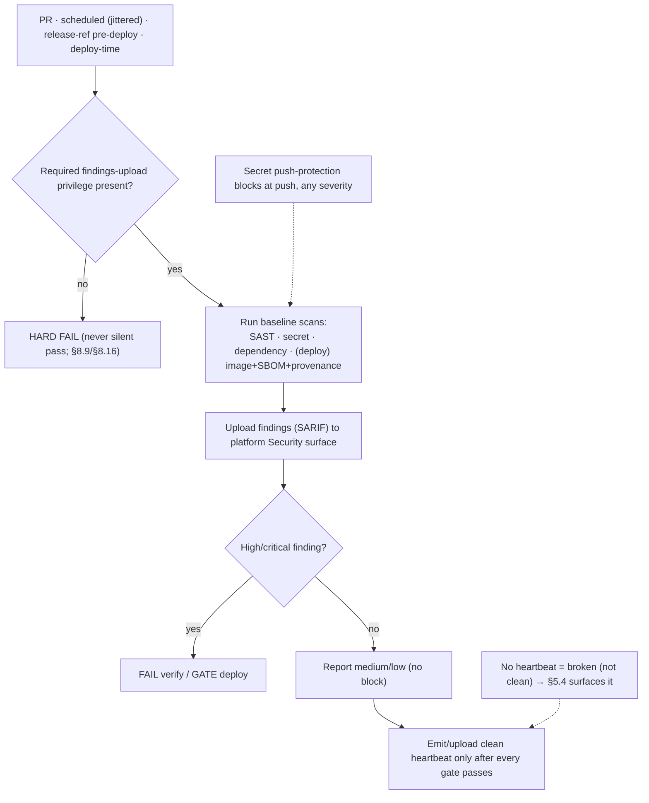

<!-- Split from REQUIREMENTS.md (2026-07-11) - section numbering preserved verbatim. Index: docs/requirements/README.md -->

### 5.14 Security scanning (baseline)

**Trigger:** SAST, secret, and dependency scans run on **pull requests**, on a
**jittered schedule** (§5.5), **and on the release ref immediately before any
deploy** (so the deploy gate is evaluated against the deployed code, not a stale PR
head); published-artifact security (image scan, SBOM, provenance) runs at **deploy
time** (§11.1) as a gate.
**Actor:** Consumer automation, read scope + `security-events: write`; **no stored
secret** (§2.13).
**Steps:** **probe the required findings-upload privilege at runtime — hard-fail if
absent** (a caller that did not grant it fails loudly, never silently passes;
§8.9/§8.16) → run each category's engine (supplied by the language/deploy plug-in,
§12/§13) → upload findings as **SARIF to the platform Security surface** → apply the
§2.13 gate: **fail verify / gate deploy on high+critical**, report medium/low → after
every gate passes, emit and upload a **per-run heartbeat** (tool identity + completion
marker) **even on zero findings**, so §5.4 can distinguish *ran-clean* from
*never-ran*. For CodeQL, the workflow paginates open alerts for the exact analyzed ref
and tool after processing and the branch ruleset independently enforces
`security_alerts_threshold=high_or_higher`; API or response ambiguity fails closed.
Secret-scanning
**push protection** blocks at push regardless.
**Failure handling:** a scan that **cannot run** is a **failure surfaced in §5.4
diagnosis**, never a silent skip — a repo must not read "clean" while its
scanning is broken. **Absence of the per-run heartbeat reads as *broken*, not
*clean*** (§5.4), and a missing upload privilege is a hard pipeline failure (§8.16).

## Settled decisions — do not reopen

- Solo-maintainer branch liveness uses only the declaration-scoped `required_reviews: 0` exception while no independent eligible reviewer exists. Do not replace it with standing bypass actors or recurring admin merges; remove the override when another reviewer becomes eligible. — trace: SEC-007
- §11.3 detector semantics are frozen: bashlex-AST taint, fail-closed, block-level verify. NO interpreter enumeration, any-word matching, order-aware verify, grep mirrors, or a second in-workflow checker (8d069f7, accf092, faaeb10, 66951ba, 9ccea23). The same impl runs in every consumer's CI via reusable-common-lint.yml — single implementation, no mirror to drift.
- zizmor scope decision (#18): the gate covers `unpinned-uses`, `unpinned-images`, and `template-injection`; `dangerous-triggers` stays non-gating (recorded in `zizmor.yml`, `docs/security/threat-model.md`, and §11.3).
- npm/Node hardening is only ever strengthened, never relaxed (S6).
- SEC-010's live proofs (canary ruleset block, Dependabot security updates, auto-merge baseline) are DONE and their durable evidence lives in the traceability SEC-010 row — do not re-run the canary or re-litigate the rollout here; completed-work detail belongs in traceability, not this backlog.

---
