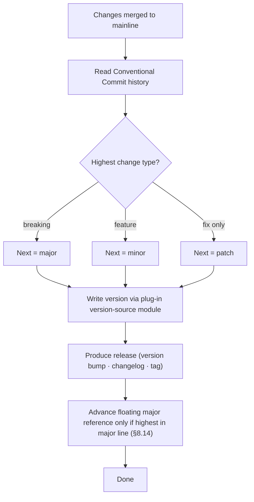

<!-- Split from REQUIREMENTS.md (2026-07-11) - section numbering preserved verbatim. Index: docs/requirements/README.md -->

### 5.9 Library versioning & release

**Trigger:** changes merged to the Library's mainline.
**Actor:** the Library's own automation + Conventional Commit history (the commit
convention and the tag/floating-ref mechanics are part of the hosting-platform
binding, §2.14).
**Steps:** derive the next semantic version from Conventional Commit history
(patch / minor / major) → write the version via each affected language plug-in's
**version-source module** (§3.3) — the core never hardcodes a version location →
produce release artifacts (version bump, changelog, tagged release) → **advance
the floating major reference to the new release without consulting consumers**
(it is a published pointer; the Library cannot and does not query who consumes
it, per §2.2), **guarded monotonically per §8.14** — an out-of-order or re-run
release of an OLDER version never regresses the pointer (`aviato is-highest`
gates the move within the major line). The release process must not depend on a not-yet-existing release (§2.10):
in bootstrap, the release pipeline resolves its own module/action references
locally.

The release gate derives its immutable commit identity from the release tag. When a
caller supplies `release-tag` (including in-run and `workflow_run` contexts), the gate
peels `refs/tags/<release-tag>^{commit}`; only a classic tag-triggered run falls back to
peeling the event `GITHUB_SHA^{commit}`. Every default-branch ancestry check, tag
equality check, merged-PR lookup, and required-workflow lookup uses that one resolved
commit. Default-branch membership remains an ancestry invariant
(`merge-base --is-ancestor`), not branch-tip equality, so a later mainline commit does
not invalidate an otherwise valid release.

The release proposal must be mergeable under the policy's own branch
protection: a branch pushed with the platform's automation token never triggers
CI on its own (the platform suppresses events from that token), so the propose
phase **dispatches the caller workflow at the release branch** — manual
dispatch is exempt from that suppression — making the release PR report the
same required status checks as any human branch. Required-status-check rulesets
therefore stay enforceable with **no bypass actors**. A caller that has not yet
adopted the dispatch trigger fails soft: the dispatch step warns, the PR's
checks stay visibly pending, and the operator remediates by re-syncing the
caller (§5.3).

Because dispatch-run checks are not themselves attached to the release PR, every
managed caller also runs a dispatch-only, no-checkout status bridge after its
verify, security, and common-lint jobs. The bridge has only `statuses: write` and
publishes success or failure for the profile's resolved required-check contexts
to the dispatched `github.sha`; skipped, cancelled, and failed dependencies all
publish failure. Context names are validated against pipeline-module
`status_check` data so caller text and branch protection cannot drift apart.

## Settled decisions — do not reopen

- Release gate keeps `merge-base --is-ancestor` (R6-4); fixes may ADD SHA-binding, never re-tighten to tip equality.
- Tag-only release publishing; no stored release PAT; fail-closed `aviato-ref` (no `main` default).
- C12-W1 release privilege split (FINDINGS #2) is implemented: derive job runs `contents: read` with no token; only the propose/tag job holds `contents: write` + `pull-requests: write`; top-level `permissions: {}` (reusable-release.yml:71-200). The accepted ambient-token residual is recorded in `docs/security/threat-model.md` and the workflow rationale. Do not reopen.
