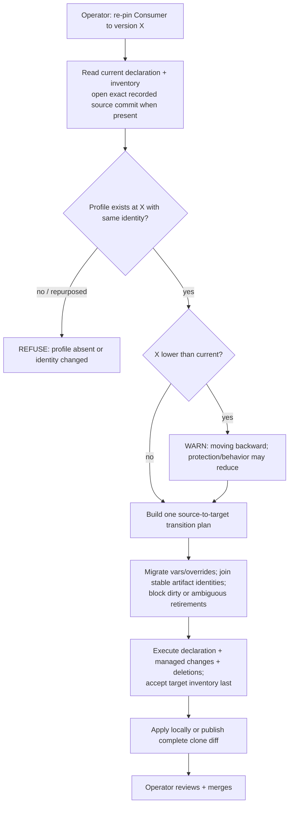

<!-- Split from REQUIREMENTS.md (2026-07-11) - section numbering preserved verbatim. Index: docs/requirements/README.md -->

### 5.12 Version upgrade / downgrade (re-pin)

**Trigger:** operator moves a Consumer to a different Library version.
**Actor:** operator (local CLI).
**Steps:** read the current pin and persisted `profile-identity` → resolve the
published target ref to one commit and safely fetch that commit's Library registry
→ confirm the **profile exists and has the same explicit identity** at the target
version (§6.5) → set the new pin → re-resolve using that same fetched registry → **migrate variables
and overrides**: detect newly-**required** variables and prompt/fail with
guidance, detect **orphaned** overrides (keys no longer meaningful) and report
them → re-scaffold (§5.3, updating markers) → surface changes as a reviewable
proposal.
**Downgrade:** moving to a **lower** version is allowed but routed through this
same propose/review path **with an explicit "you are moving backward — protection
or behavior may be reduced" warning**.
**Failure handling:** if the target profile no longer exists, **or its manifest has
a different explicit identity** (the name was repurposed), refuse and report before
changing the pin. Changes to templates, variables, settings, privileges, or version
sources with the same identity are legitimate evolution and proceed to migration checks.
The upgrade/downgrade path is the **only** sanctioned way a pin moves; drift
(§5.5) never advances it.
The fetched target registry is the sole source for identity verification, newly
required variables, orphaned overrides, and materialization in local and proposal
flows. Re-pin carries both source and target snapshot identities into one atomic
transition. When a v2 managed inventory exists, its recorded source commit SHA
is authoritative: if the old branch or tag has moved, migration metadata is
loaded from that exact immutable commit rather than from the newly resolved ref.
Stable artifact identities join source paths to target paths; old paths become
legacy aliases and are retired only when their marker, input hash, marker hash,
and body still match the prior receipt. Dirty, foreign, malformed, or ambiguous
aliases block the entire re-pin before the declaration moves.

Re-pin is also the v1-to-v2 migration boundary. With no managed inventory, it
combines the source declaration, seed sidecar, clean marker universe, and target
artifact receipts. The complete source artifact set remains retirement authority,
including stable identities that disappear entirely from the target snapshot.
Only a clean, known-version, unambiguous legacy artifact may be adopted or
retired. The existing seed sidecar is preserved, the declaration
and all managed changes execute in one recoverable transition, and the new v2
inventory is accepted last. Local and proposal re-pin execute the same plan;
proposal mode publishes its complete clone diff, including deletions. An invalid
existing inventory is not treated as v1 and fails closed.

